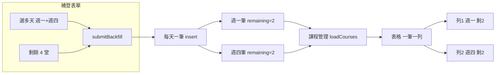

# 補登舊資料與排課邏輯修復

## 問題與根因

| 問題             | 根因                                                                                                                                                                |
| -------------- | ----------------------------------------------------------------------------------------------------------------------------------------------------------------- |
| 填剩餘 4 堂卻顯示 2 堂 | 補登選週一+週四時會建 **2 筆** student-class（每筆 `remaining_sessions = ceil(4/2)=2`）。課程管理表格是 **一筆一列**，每列只顯示該筆的 2，沒有做「同學生同科目同時段」的合併或加總。                                        |
| 排課時段只顯示星期一     | 同上：有兩列（週一、週四），但若使用者預期是「一列顯示週一+週四」，目前沒有合併；或列表 key/資料來源只出現一筆。                                                                                                       |
| 補登要填結束時間       | 表單有「開始時間」+「結束時間」兩欄，補登情境應只需開始時間 + 時長，結束時間由程式計算。                                                                                                                    |
| 費用 1500 變 1600 | 兩小時費率用 computed 雙向綁定，可能因 input step 或 setter 時序導致顯示/寫入不一致；需與 [ClassesList 費率修正](frontend/src/pages/ClassesList.vue) 一樣，以 **ref 存輸入值 + 送出前同步** 到 `rate_per_30min`。 |
| 補登沒考慮月結        | 補登目前固定 `payment_type: 'session'`，沒有「繳費方式」可選；月結學生不需堂數欄位，也不應寫入 `remaining_sessions` / `students.remaining_lessons`。                                                 |

## 架構與資料流（現狀）

目標：表格改為「同學生／同科目／同時段」多筆合併成一列，排課時段顯示「週一、週四」，剩餘堂數顯示加總 4。

---

## 一、補登舊資料表單與寫入

**檔案：** [frontend/src/pages/CourseManagement.vue](frontend/src/pages/CourseManagement.vue)

1. **繳費方式（月結／堂數制）**
  - 在「上課類型」或「一堂課費用」附近新增「繳費方式」：`堂數制` / `月結`（`backfillForm.payment_type`）。
  - 當選 **月結** 時：
    - 隱藏「堂數資料」整塊（已購買堂數、已上堂數、剩餘堂數）。
    - `submitBackfill` 內：若月結，每筆 insert 的 `payment_type: 'monthly'`，不寫 `sessions_purchased` / `remaining_sessions`（或寫 0／null 依 DB 欄位）；不呼叫 `students.update({ remaining_lessons })`。
  - 當選 **堂數制** 時：維持現有堂數區塊與寫入邏輯。
2. **結束時間改為自動帶出**
  - 表單移除「結束時間」輸入欄。
  - 以「開始時間」+「課程時長」用既有 `computeEndTime(start_time, duration_hours)` 計算結束時間。
  - `submitBackfill` 寫入每筆時：`end_time: computeEndTime(backfillForm.start_time, backfillForm.duration_hours)`，不再使用 `backfillForm.end_time`。
  - 若專案內已有共用的 `computeEndTime` 可抽到 util 再引用；否則在 CourseManagement 內實作相同邏輯即可。
3. **兩小時費用 1500 不跳格**
  - 比照 [ClassesList.vue](frontend/src/pages/ClassesList.vue) 作法：補登表單改為 **ref** 存兩小時金額（例如 `ratePer2hBackfillInput`），不用 computed 雙向綁定。
  - 開啟 modal 時從 `backfillForm.rate_per_30min` 算出 2h 寫入 ref；送出前由 ref 寫回 `backfillForm.rate_per_30min = Math.round(ratePer2hBackfillInput / 4)`，再組 payload，避免 1500 被錯誤四捨五入或未同步。
4. **補登預設與重置**
  - 預設 `payment_type: 'session'`；重置表單時一併還原 `payment_type`、不再帶入 `end_time`（結束時間僅計算用）。

---

## 二、課程管理列表：多筆合併顯示

**檔案：** [frontend/src/pages/CourseManagement.vue](frontend/src/pages/CourseManagement.vue)

- **資料來源不變**：`courses` 仍為 `student-classes` 一筆一筆的陣列（含週一、週四各一筆）。
- **顯示層合併**：
  - 新增 **computed**（例如 `coursesGroupedForDisplay`）：將 `courses` 依「學生 + 科目 + 老師 + 開始時間 + 結束時間」分組（同一時段、多天視為一組）。
  - 每組若只有一筆：排課時段 = `dayLabel(day_of_week) + start_time~end_time`，剩餘堂數 = 該筆 `remaining_sessions`，繳費方式 = 該筆。
  - 每組若多筆（同學生同科目同時段、多天）：
    - 排課時段：`週一、週四 16:00~18:00`（依 `day_of_week` 排序後用 `dayLabel` 串起來 + 同一 start_time~end_time）。
    - 剩餘堂數：該組所有筆的 `remaining_sessions` **加總**（堂數制）；月結顯示「—」或「月結」。
    - 繳費方式：取第一筆的 `payment_type`（同組應一致）。
  - 一堂課（2h）費率、類型、操作：取組內第一筆即可；「編輯」需決定是編輯整組還是單筆（建議先做「編輯第一筆」或每筆仍保留獨立編輯，列上可顯示「編輯」開 modal 帶入該組第一筆或選單筆，依產品需求再細調）。
- **表格**：`v-for="c in coursesGroupedForDisplay"`，`c` 為合併後的物件（含 `dayLabels`、`totalRemainingSessions`、`payment_type` 等），避免一列只看到「星期一」與 2 堂。

要點：合併僅限「同一學生、同一科目、同一 start_time/end_time」的多筆（多天），不同時段仍為不同列。

---

## 三、剩餘堂數語意一致

- **補登（堂數制）**：使用者輸入「剩餘 4 堂」表示 **該學生該科目總共剩 4 堂**。目前實作是平分到每個上課日（週一 2、週四 2），寫入兩筆各 2。
- **列表顯示**：合併後該列顯示 **加總 4**，與使用者認知一致。
- **students.remaining_lessons**：維持現狀，補登堂數制時寫入總剩餘堂數（例如 4），供其他報表或總覽使用；月結不更新此欄位。

不需改「每筆存 perDayRemaining」的寫入方式，只要列表合併顯示加總即可。

---

## 四、實作順序建議

1. **補登表單**：繳費方式（月結／堂數制）+ 月結時隱藏堂數區塊、不寫堂數與 remaining_lessons；結束時間改由開始時間+時長計算；兩小時費用改 ref + 送出前同步。
2. **課程管理列表**：實作 `coursesGroupedForDisplay` 與合併後排課時段、剩餘堂數、繳費方式顯示。
3. **補登預設/重置**：補齊 `payment_type`、移除 end_time 依賴。
4. **小測**：補登「週一+週四、剩餘 4 堂、1500 元、只填開始時間」→ 列表一列「週一、週四 …」、剩餘 4、費用 1500；補登月結→ 無堂數欄位、列表顯示月結。

---

## 五、不變更範圍

- 智慧排課、學生管理、其他頁面之排課或堂數邏輯不在此計畫改動。
- DB schema 不變（仍為一筆 student-class 一個 `day_of_week`）；合併僅在前端顯示層。

