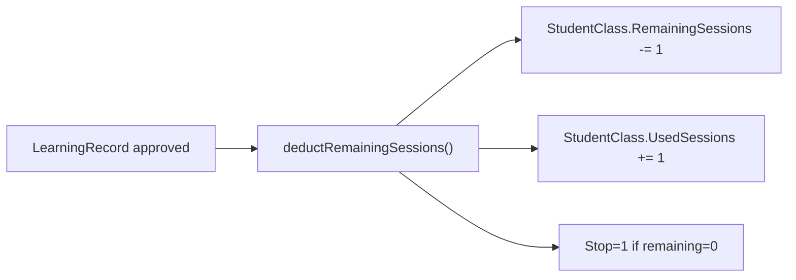
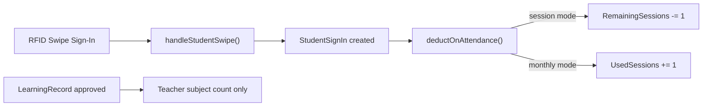
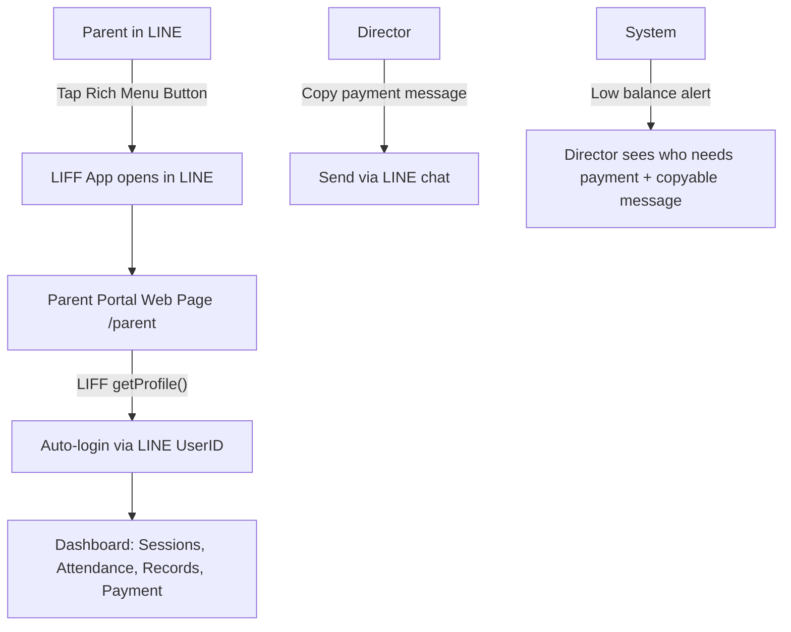

# Attendance-Based Session Deduction + LINE Parent Portal

## Part A: Attendance-Based Session Counting

### Current Architecture




### Target Architecture




### Changes

**1. Backend: `SwipeRfidController::handleStudentSwipe`** ([backend/app/Http/Controllers/SwipeRfidController.php](backend/app/Http/Controllers/SwipeRfidController.php))

- After creating `StudentSignIn` (sign-in, not sign-out), call a new `deductOnAttendance($studentClass)` method
- For session mode (`ScheduleMode = 'count'` or `SessionCount > 0`):
  - `RemainingSessions = max(0, RemainingSessions - 1)`
  - `UsedSessions += 1`
  - If `RemainingSessions <= 0`: set `Stop = 1`
  - If `RemainingSessions <= 2`: set `Paid = 0` (triggers tuition alert)
- For monthly mode: just `UsedSessions += 1`
- Sync `remaining_sessions` back to Supabase `student-classes` table

**2. Backend: `LearningRecordController::approve`** ([backend/app/Http/Controllers/LearningRecordController.php](backend/app/Http/Controllers/LearningRecordController.php))

- Remove `deductRemainingSessions()` call from `approve()`, `batchApprove()`, `backdoorApprove()`, `bulkBackdoorApprove()`
- Keep the teacher `TeachingSessionCount` increment (teacher subject count still driven by evaluations)
- Keep `UsedSessions` recalculation only for display (approved count), do NOT touch `RemainingSessions`

**3. Backend: New `deductOnAttendance()` helper** (in `SwipeRfidController` or a shared service)

```php
private function deductOnAttendance(StudentClass $sc): void
{
    $sc->lockForUpdate();
    $sc->UsedSessions = ($sc->UsedSessions ?? 0) + 1;
    if ($sc->SessionCount > 0) { // session mode
        $sc->RemainingSessions = max(0, ($sc->RemainingSessions ?? 0) - 1);
        if ($sc->RemainingSessions <= 0) $sc->Stop = 1;
        if ($sc->RemainingSessions <= 2) $sc->Paid = 0;
    }
    $sc->save();
}
```

**4. Frontend: AttendancePage.vue** ([frontend/src/pages/AttendancePage.vue](frontend/src/pages/AttendancePage.vue))

- After attendance records load, show a column indicating if session was deducted
- Show remaining sessions inline for each attendance entry

**5. Safeguard: Prevent double-deduct**

- Add a flag `SessionDeducted` (boolean, default 0) to `StudentSignIn` table
- Only deduct if `SessionDeducted = 0`; set to 1 after deduction
- This prevents re-deduction if the swipe logic runs twice

---

## Part B: LINE Official Account Integration

### Setup Requirements (manual, outside code)

1. Go to [LINE Developers Console](https://developers.line.biz/)
2. Create a Messaging API channel under the existing LINE Official Account
3. Get the **Channel Access Token** and **Channel Secret**
4. Set the webhook URL to `https://cram.teacher-check.com/api/v1/line/webhook`
5. Enable LIFF app for the parent portal page

### Architecture




### Changes

**6. Backend: LINE Webhook Controller** (new file `backend/app/Http/Controllers/LineWebhookController.php`)

- Handle LINE webhook events (follow, message)
- On `follow` event: prompt user to link their child's student ID
- On message: echo back a link to the parent portal LIFF page
- Store LINE `userId` in `Student.LineID` after verification

**7. Backend: Store LINE config** 

- Add env vars: `LINE_CHANNEL_ACCESS_TOKEN`, `LINE_CHANNEL_SECRET`, `LINE_LIFF_ID`
- Store in `Campus` table columns (`LineNotifyID`, `LIFFID`, `LIFF_URL` already exist)

**8. Backend: Parent Portal API enhancements** ([backend/app/Http/Controllers/ParentPortalController.php](backend/app/Http/Controllers/ParentPortalController.php))

- Add `loginWithLine` method: accepts LINE `userId`, finds student by `LineID`, creates `ParentSession`
- Enhance `dashboard` to return:
  - `payment_alerts`: courses with `RemainingSessions <= 2` or `Paid = 0`
  - `attendance_history`: recent `StudentSignIn` records
  - `learning_records`: approved `LearningRecord` with content
  - `remaining_sessions`: per-course breakdown
- Add `GET /api/v1/parent/payment-message/{studentId}` — generates copyable payment reminder text for directors

**9. Frontend: Standalone Parent Portal page** (new or refactored `ParentPortal.vue`)

- Make accessible at `/parent` route (not behind director login)
- Integrate LIFF SDK: auto-detect if opened inside LINE, get `userId` for auto-login
- Fallback: manual login via Student ID + Phone (current flow)
- Sections:
  - **Payment status**: show remaining sessions per course, highlight when low/zero, show "請繳費" banner
  - **Attendance history**: list of sign-in/sign-out records
  - **Learning records**: approved evaluations from teachers (read-only)
  - **Remaining sessions**: per-subject breakdown
- Mobile-first responsive design (most parents use phones)

**10. Frontend: Director payment notification helper**

- In `DirectorDashboard.vue` tuition alert section, add a "複製繳費通知" button per student
- Generates a formatted message like: "親愛的家長您好，{student_name} 的 {subject} 課程剩餘 {n} 堂，請盡速繳費。"
- Copy to clipboard for the director to paste into LINE chat

**11. Backend routes** ([backend/routes/api.php](backend/routes/api.php))

- `POST /api/v1/line/webhook` — LINE webhook (public)
- `POST /api/v1/parent/login-line` — LINE-based parent login
- `GET /api/v1/parent/payment-message/{studentId}` — copyable payment text (director auth)

**12. Frontend: App.vue routing** ([frontend/src/App.vue](frontend/src/App.vue))

- Detect URL hash `#/parent` or query param `?parent=1` to show ParentPortal directly (bypass director login)
- Or: use Vite to build a separate entry point for `/parent`

---

## Migration Summary


| Table           | Change                                            |
| --------------- | ------------------------------------------------- |
| `StudentSingIn` | Add `SessionDeducted` boolean column (default 0)  |
| `Student`       | Ensure `LineID` column exists (already in schema) |


## Deployment Order

1. Run migration for `SessionDeducted` column
2. Deploy backend changes (attendance deduction + LINE webhook + parent API)
3. Deploy frontend (parent portal + director copy-message)
4. Configure LINE Developers Console (manual): webhook URL, LIFF app
5. Set up Rich Menu in LINE Official Account with button linking to LIFF parent portal

