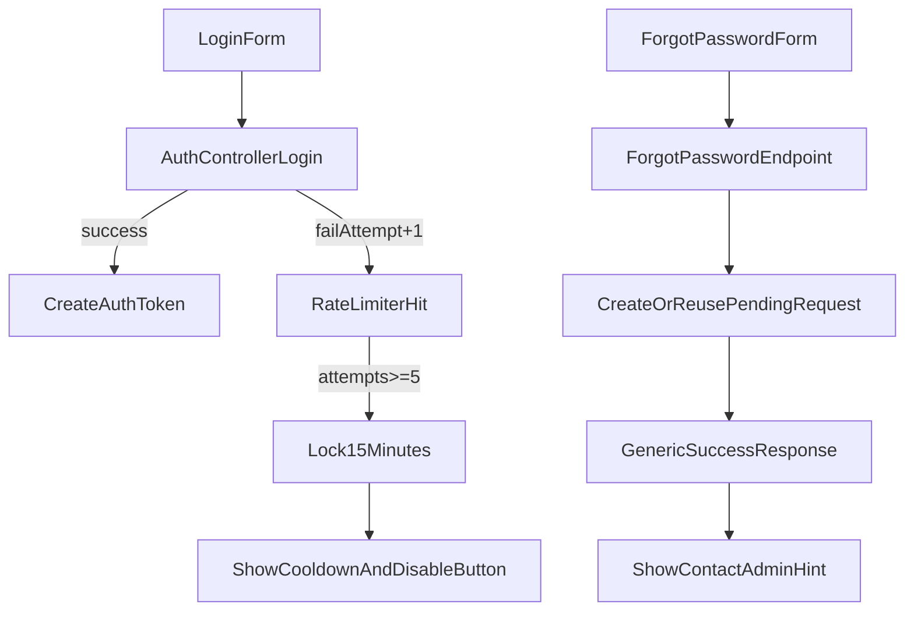

# 老師主任登入防護與忘記密碼 MVP

## 目標與範圍

- 登入防護：同一登入識別在 15 分鐘內錯誤 5 次即暫時鎖定，回傳可顯示的冷卻資訊。
- 忘記密碼：在登入頁提供「忘記密碼」入口，使用者可送出重設申請；後端記錄申請，前端顯示「已送出，請等待管理端處理」。
- 本次採用你指定方案：`5 次 / 15 分鐘` + `管理端人工重設申請`。

## 現況對應（將沿用的程式）

- 目前登入入口在 [AuthController.php](/home/admin/backend/app/Http/Controllers/AuthController.php) 的 `login()`，失敗只回 `401`，尚無鎖定邏輯。
- 登入 API 路由在 [api.php](/home/admin/backend/routes/api.php) 的 `POST /api/v1/auth/login`。
- 前端登入頁在 [Login.vue](/home/admin/frontend/src/pages/Login.vue)，錯誤訊息目前僅用單一 `error` 區塊顯示。
- 前端 auth client 在 [supabase.js](/home/admin/frontend/src/supabase.js) 的 `signInWithPassword()`。

## 實作計畫

### 1) 後端：登入失敗上限與冷卻時間

- 修改 [AuthController.php](/home/admin/backend/app/Http/Controllers/AuthController.php)：
  - 在 `login()` 前段加入 `RateLimiter` 檢查（5 次、15 分鐘）。
  - 失敗（帳號不存在/密碼錯誤）統一累計 attempts；成功登入則 `clear` attempts。
  - 鎖定時回傳 `429` + 結構化欄位（如 `message`, `retry_after_seconds`, `locked_until`），便於前端倒數。
  - 安全性微調：登入失敗訊息可改為較通用文案，降低帳號可枚舉性。
- 若需要更穩定 key：以 `account + role + ip` 組 key，避免不同帳號互相影響。

### 2) 後端：忘記密碼申請 API（MVP）

- 新增 migration：`password_reset_requests`（建議欄位）
  - `id`, `user_id(nullable)`, `account_input`, `role_input`, `status(pending/processed/rejected)`, `requested_ip`, `request_note`, `handled_by(nullable)`, `handled_at(nullable)`, `created_at`, `updated_at`。
- 新增 model/controller：
  - [backend/app/Models](/home/admin/backend/app/Models) 下新增 `PasswordResetRequest`。
  - 新增 controller（例如 `PasswordResetRequestController`）處理 `POST /api/v1/auth/forgot-password`。
- 路由調整於 [api.php](/home/admin/backend/routes/api.php)：
  - 公開路由新增 `POST /api/v1/auth/forgot-password`。
  - 回應統一成功文案（不透露帳號是否存在），避免帳號探測。
- 去重策略：短時間內同一識別 pending 時不重複建立，減少濫用。

### 3) 前端：登入頁鎖定提示與忘記密碼入口

- 修改 [supabase.js](/home/admin/frontend/src/supabase.js)：
  - `signInWithPassword()` 對 `429` 解析 `retry_after_seconds/locked_until` 並傳回標準化錯誤物件。
  - 新增 `auth.forgotPasswordRequest({ account, role, note })` 呼叫新 API。
- 修改 [Login.vue](/home/admin/frontend/src/pages/Login.vue)：
  - 增加「忘記密碼」按鈕/模式（可重用目前 `mode` 切換）。
  - 鎖定時顯示「剩餘冷卻秒數」並停用登入按鈕。
  - 新增送出重設申請表單（帳號、身分、補充說明）與成功/失敗回饋。

### 4) 管理端處理方式（MVP 落地）

- 本版先完成「申請提交 + 後端紀錄 + 使用者可見回饋」。
- 管理端人工重設先沿用既有更新密碼能力（如 [ProfileController.php](/home/admin/backend/app/Http/Controllers/ProfileController.php) 的 `update()` 可改 `password`），避免一次擴太大。
- 下一迭代可再加「申請列表 + 一鍵重設 + 通知整合」。

### 5) 測試與驗證

- 新增 Feature tests：
  - `AuthLoginThrottleTest`：連續錯誤第 5 次後觸發鎖定、`429` 欄位正確、冷卻後可再嘗試。
  - `ForgotPasswordRequestTest`：可送出申請、重複申請去重、回應不洩漏帳號存在性。
- 前端手測清單：
  - 連續輸錯 5 次後 UI 倒數與按鈕停用。
  - 冷卻結束可重新登入。
  - 忘記密碼流程可送出、成功文案正確、錯誤處理不暴露敏感資訊。

## 流程圖

## 風險與注意事項

- 目前允許同 email 多角色（teacher/director），鎖定 key 與忘記密碼申請都要納入 `role_input`，避免互相影響。
- 不可回傳「帳號不存在」等可枚舉訊息到 forgot API。
- 既有 `passwordMatches()` 含舊式比對（plain/md5）；本次先不動密碼遷移，只補防護與流程。
- 維持多校區與角色邏輯：forgot API 公開可呼叫，但管理端處理仍需既有權限控管。

