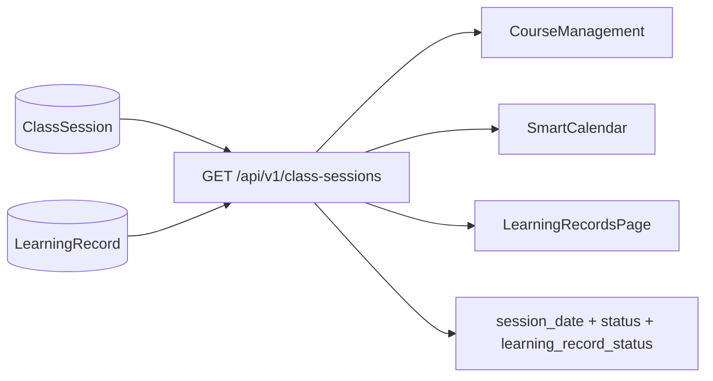

# Single Source of Truth Rollout (`ClassSession`)

## Scope and Decisions

- 採 **分階段** 路線：先保留 `LearningRecord.SessionDate/StartTime/EndTime` 作為衍生/相容欄位，等前後端完成切換後再移除。
- API 採 **新增端點漸進遷移**：新增 `/api/v1/class-sessions`，三個模組逐步改用，舊端點保留相容期。

## Current-State Facts (must honor)

- `LearningRecord` 目前已有 `ClassSessionID` 唯一索引（每堂最多一筆評量）：`[/home/admin/backend/database/migrations/2026_02_07_000016_create_learning_records_table.php](/home/admin/backend/database/migrations/2026_02_07_000016_create_learning_records_table.php)`
- `LearningRecord.SessionDate/StartTime/EndTime` 是後加欄位（可作相容欄位）：`[/home/admin/backend/database/migrations/2026_02_13_000005_add_fields_to_learning_records_table.php](/home/admin/backend/database/migrations/2026_02_13_000005_add_fields_to_learning_records_table.php)`
- `ClassSession` 為日期主表：`[/home/admin/backend/database/migrations/2026_02_07_000009_create_class_sessions_table.php](/home/admin/backend/database/migrations/2026_02_07_000009_create_class_sessions_table.php)`

## Target Data Contract

- 唯一日期來源：`ClassSession.SessionDate`。
- `LearningRecord` 必須綁定 `ClassSessionID`（最終 `NOT NULL + FK`）。
- 相容期規則：`LearningRecord.SessionDate/StartTime/EndTime` 由 `ClassSession` 單向同步，不可作主資料。

## Architecture/Data Flow

## Implementation Plan

### Phase 1: Backend Single-Source Read API

- 新增 `ClassSessionController@index`（或擴充既有 controller）提供 `/api/v1/class-sessions`。
- 回傳欄位至少含：`id`, `student_class_id`, `session_date`, `teacher_id`, `status`, `learning_record_id`, `learning_record_status`。
- 後端以 `ClassSession LEFT JOIN LearningRecord`（用 `ClassSessionID`）產生統一視圖。
- 需套用既有分校/角色約束（`branch_id`/`CampusID`/teacher scope）。
- 主要修改檔案：`[/home/admin/backend/routes/api.php](/home/admin/backend/routes/api.php)`, `[/home/admin/backend/app/Http/Controllers/StudentClassController.php](/home/admin/backend/app/Http/Controllers/StudentClassController.php)`, `[/home/admin/backend/app/Http/Controllers/LearningRecordController.php](/home/admin/backend/app/Http/Controllers/LearningRecordController.php)`

### Phase 2: DB Constraints and Guardrails

- 新增 migration：
  - 補 `LearningRecord.ClassSessionID` 外鍵到 `ClassSession.id`（先清理髒資料再加 FK）。
  - 視現況確認唯一鍵策略：保留既有 `unique(ClassSessionID)`（已可避免同堂多評量）；若需語義一致再補複合索引但避免重複約束。
- 服務端防線：所有建立/更新 `LearningRecord` 路徑皆強制 `SessionDate = ClassSession.SessionDate`（相容期）。

### Phase 3: `ensure-past` and Data Repair

- `ensure-past` 僅對 existing `ClassSession` 補建評量（不做日期推算）。
- 增加一次性修復 command/migration script：
  - 修復 `LearningRecord` 與 `ClassSession` 的日期/時間不一致。
  - 標記或隔離 `ClassSessionID` 遺失/無效資料，輸出報表供人工處理。
- 可放置：artisan command + SQL report，檔案建議於 `[/home/admin/backend/app/Console/Commands](/home/admin/backend/app/Console/Commands)`

### Phase 4: Frontend Migration (3 modules)

- `CourseManagement` 改讀 `/api/v1/class-sessions`，不再以 approved learning-record 反推「已上課日期」。
  - 檔案：`[/home/admin/frontend/src/pages/CourseManagement.vue](/home/admin/frontend/src/pages/CourseManagement.vue)`
- `SmartCalendar` 改用同一來源輸出上課日期（保留請假/調課展示但不再產生第二份日期真相）。
  - 檔案：`[/home/admin/frontend/src/pages/SmartCalendar.vue](/home/admin/frontend/src/pages/SmartCalendar.vue)`
- `LearningRecordsPage` 以 class sessions 清單驅動評量狀態顯示。
  - 檔案：`[/home/admin/frontend/src/pages/LearningRecordsPage.vue](/home/admin/frontend/src/pages/LearningRecordsPage.vue)`

### Phase 5: Observability and Drift Prevention

- 新增每日健康檢查 job：
  - `ClassSessionID IS NULL`、FK 破損、日期不一致計數。
  - 自動修復可修者，無法修復者通知管理員。
- 主要位置：`[/home/admin/backend/app/Console/Kernel.php](/home/admin/backend/app/Console/Kernel.php)`

### Phase 6: Decommission Legacy Date Fields

- 前端與 API 全部切到 `/api/v1/class-sessions` 後，移除 `LearningRecord.SessionDate/StartTime/EndTime` 寫入邏輯。
- 最終 migration 才 drop 舊欄位（或保留唯讀鏡像欄位，依營運需求決定）。

## Test Strategy

- Feature tests（後端）：
  - `/api/v1/class-sessions` 回傳正確 join 狀態。
  - `ensure-past` 只補 existing `ClassSession`。
  - `LearningRecord` 建立/更新後，日期與 `ClassSession` 一致。
- 迴歸頁面測試（前端）：
  - 課程管理/智慧排課/評量頁看到相同 session_date 集合。
- 主要測試檔可擴充：`[/home/admin/backend/tests/Feature/LearningRecordApprovalDeductionTest.php](/home/admin/backend/tests/Feature/LearningRecordApprovalDeductionTest.php)`

## Rollout / Rollback

- Rollout：先上新 API + 雙讀驗證（舊新並行），確認一致率後切前端。
- Rollback：前端可立即切回舊端點；DB 變更先「加約束前清理」避免不可逆失敗。

