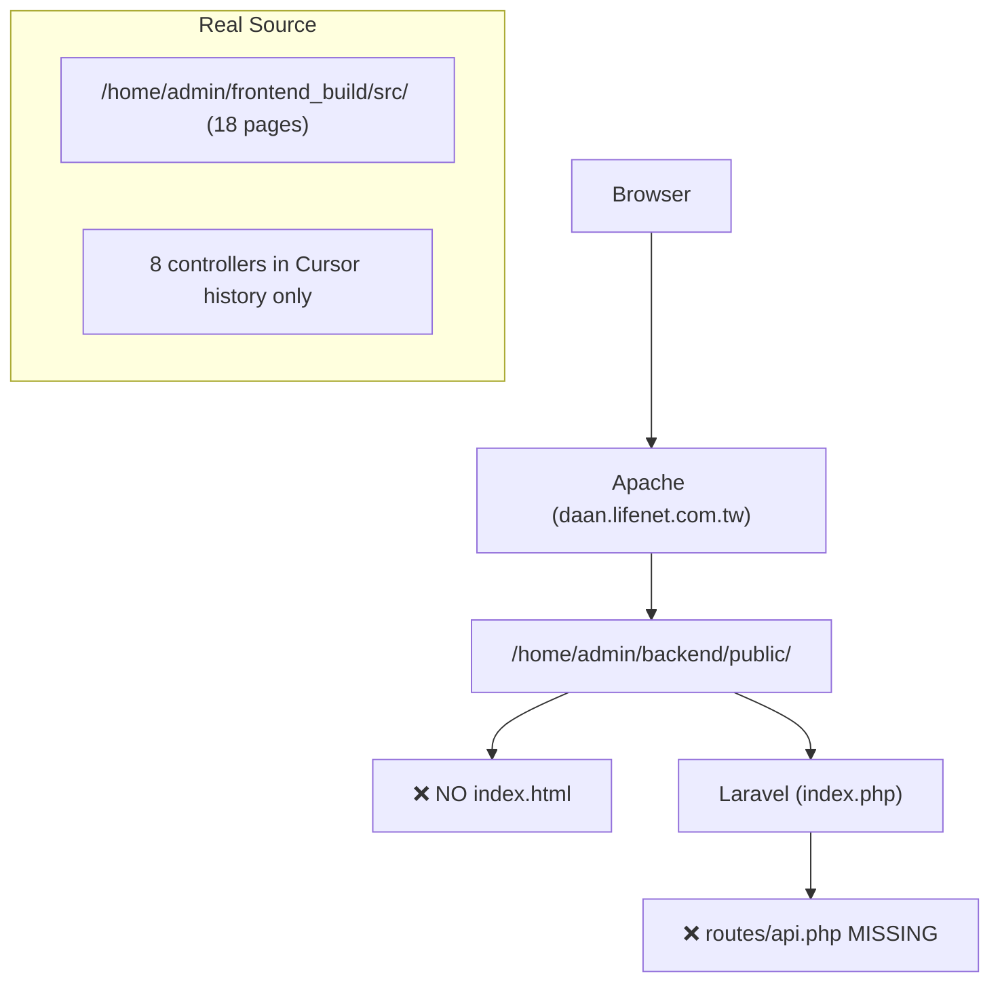

# Demo Readiness Audit & Fix

## CEO Assessment: Current State

The application is **not functional** right now. The Apache vhost serves from `/home/admin/backend/public` which has no `index.html` (SPA won't load), and `backend/routes/api.php` plus 8 controllers are missing from disk (their content survives in Cursor's edit history). The real source of truth is `/home/admin/frontend_build/src/`.



---

## Priority 1 — Critical: Restore Missing Files

All these files exist only in Cursor's edit history and must be restored to disk:

**Backend controllers to restore:**
- `LearningRecordController.php` — from `History/32f84b2/geUs.php` (579 lines)
- `StudentClassController.php` — from `History/4a767660/tlfJ.php` (1193 lines)
- `ParentPortalController.php` — from `History/-20e90fa7/mdMv.php` (297 lines)
- `LineWebhookController.php` — from `History/-15e6ed94/qQIk.php` (202 lines)
- `routes/api.php` — from `History/132348d3/DKc5.php` (213 lines)

**Still missing (not in history, must be recreated):** `AuthController`, `ProfileController`, `StudentController`, `FinanceController`, `AlertController` — but `api.php` history references them, so they need to be written.

**Frontend deploy:**
- Build and deploy from `/home/admin/frontend_build/` (has `scripts/copy-to-backend.cjs` and all 18 pages)
- `cd /home/admin/frontend_build && npm run deploy`

---

## Priority 2 — Feature: Director Can Edit Evaluation Forms

**Current behavior** (`frontend_build/src/pages/LearningRecordsPage.vue`):

```266:269:frontend_build/src/pages/LearningRecordsPage.vue
const isReadOnly = computed(() => {
  if (form.Status === 'approved') return true;
  return false;
});
```

Directors can already edit `pending` / `changes_requested` records (isReadOnly is false). The issue is:
- **`approved` records** are fully locked for everyone — directors should be able to edit them
- **Backend `update` method** in `LearningRecordController.php` must allow director role (currently only teachers owning the record can update)

**Frontend fix:**
- Change `isReadOnly` to `form.Status === 'approved' && props.userRole === 'teacher'`
- Directors see `approved` records as editable

**Backend fix** in `LearningRecordController.update()`:
- Remove or relax the `TeacherID` ownership check for `director` and `super_admin` roles

---

## Priority 3 — Demo Bugs to Fix

### Bug A: SmartCalendar 快速排課 button crashes (WHITE SCREEN)

`openQuickAdd()` (line 717 of `SmartCalendar.vue`) resets `modalForm` but omits `weeks`:

```717:727:frontend_build/src/pages/SmartCalendar.vue
modalForm.value = {
  student_id: '', subject: 'Math', ...
  // ❌ missing: weeks: [1,2,3,4,5]
};
```

Template line 159 does `modalForm.weeks.includes(w)` → TypeError → white screen.  
Fix: add `weeks: [1, 2, 3, 4, 5]` to the reset object (same as `onSlotClick` already does).

### Bug B: `canApprove` wrong role string

```463:466:frontend_build/src/pages/LearningRecordsPage.vue
const canApprove = (record) => {
  if (props.userRole !== 'director' && props.userRole !== 'admin') return false;
  //                                                        ↑ wrong! real role is 'super_admin'
```

Fix: change `'admin'` → `'super_admin'`.

### Bug C: DirectorDashboard pending evaluations always 0

`select('*')` query on `evaluations` table doesn't auto-join `schedules`, so `ev.schedules` is always `undefined` → every record filtered out.  
Fix: use `select('*, schedules(*)')` or filter by `branch_id` directly on the evaluations table.

### Bug D: DirectorDashboard today's recurring classes missing

`.eq('schedule_date', '')` won't match `NULL` values.  
Fix: use `.or('schedule_date.is.null,schedule_date.eq.' + todayISO)` or query by `day_of_week`.

---

## Priority 4 — Re-apply Lost Edits from Today

Today's session wrote to `frontend/src/pages/` (wrong directory — those files don't exist there). These changes need to be re-applied to `frontend_build/src/pages/`:

- **`CourseManagement.vue`**: Add `ensureClassSession()` helper and call it after 加課 and 調課
- **`SmartCalendar.vue`**: Call `reschedule-session` API after 調課
- **`LearningRecordsPage.vue`**: Add `bulkSessionDates` ref and fetch from `session-dates` API in `onBulkClassSelect` for accurate 一鍵補登 dates
- **`LearningRecordController.php`**: Upgrade `rescheduleSession()` to accept nullable `old_date`, `start_time`, `end_time`; create ClassSession if none found
- **`LearningRecordController.php`**: Fix sort order from `orderBy('id', 'desc')` → `orderBy('SessionDate', 'desc')`

---

## Execution Order

1. Restore backend controllers + api.php from Cursor history
2. Recreate missing controllers (AuthController, ProfileController, StudentController, FinanceController, AlertController)
3. Fix SmartCalendar `weeks` bug (A), `canApprove` bug (B)
4. Fix DirectorDashboard bugs (C, D)
5. Add director evaluation edit permission (frontend + backend)
6. Re-apply today's lost edits to `frontend_build/`
7. Build and deploy: `cd /home/admin/frontend_build && npm run deploy`
