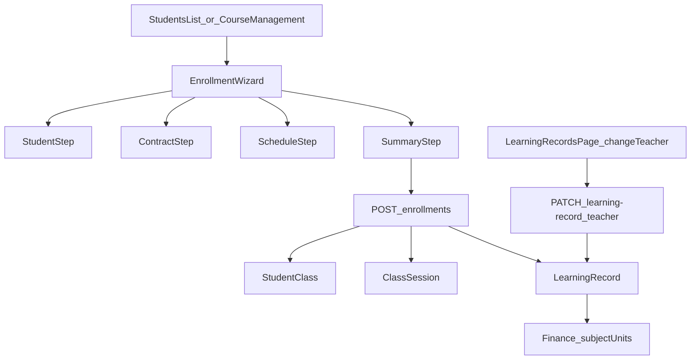

# 新生入班與月結/代課修正計畫

## 目標

- 在 [CourseManagement.vue](/home/admin/frontend/src/pages/CourseManagement.vue) 與 [StudentsList.vue](/home/admin/frontend/src/pages/StudentsList.vue) 共用一套「新生入班精靈」。
- 修正月結課程被 `SessionCount > 0` 誤判為堂數制的問題，重點落在 [SessionDeductionService.php](/home/admin/backend/app/Services/SessionDeductionService.php) 與 [ClassSessionController.php](/home/admin/backend/app/Http/Controllers/ClassSessionController.php)。
- 新增單堂更換授課老師能力，直接更新 [LearningRecordController.php](/home/admin/backend/app/Http/Controllers/LearningRecordController.php) 對應記錄與審計資訊，讓 [FinanceController.php](/home/admin/backend/app/Http/Controllers/FinanceController.php) 的 subject units 歸屬正確。

## 現況關鍵觀察

- 新課建立已經集中到 [ClassSessionController.php](/home/admin/backend/app/Http/Controllers/ClassSessionController.php) 的 `POST /api/v1/class-sessions/batch`；[StudentClassController.php](/home/admin/backend/app/Http/Controllers/StudentClassController.php) 的 `store` / `sync` 已退休，適合把入班流程建立在 `batch` 能力之上，而不是再走舊路。
- 月結問題的根源是 [SessionDeductionService.php](/home/admin/backend/app/Services/SessionDeductionService.php) 內 `deductOnAttendance()` 目前把 `ScheduleMode === 'count' || SessionCount > 0` 都當作堂數制；而 [ClassSessionController.php](/home/admin/backend/app/Http/Controllers/ClassSessionController.php) `batchStore` 對 monthly 仍寫入 `SessionCount` / `RemainingSessions`。
- 科目數統計直接看 [FinanceController.php](/home/admin/backend/app/Http/Controllers/FinanceController.php) `subjectUnits()` 內的 `LearningRecord.Status='approved'` 與 `LearningRecord.TeacherID`，所以代課修正的正確資料來源應是 LearningRecord，不是單純 `schedules.teacher_id`。
- 前端已有可重用的排課 UI：[UniversalClassScheduler.vue](/home/admin/frontend/src/components/UniversalClassScheduler.vue)，可作為入班精靈的排程步驟基礎；而單堂更換老師最自然的入口在 [LearningRecordsPage.vue](/home/admin/frontend/src/pages/LearningRecordsPage.vue) 的紀錄操作列。

## 實作策略

### 1. 共用新生入班精靈

- 新增一個共用元件，例如 `EnrollmentWizard`，放在 `frontend/src/components/`，由 [CourseManagement.vue](/home/admin/frontend/src/pages/CourseManagement.vue) 與 [StudentsList.vue](/home/admin/frontend/src/pages/StudentsList.vue) 共同呼叫。
- 精靈分 4 步：
  1. 選擇既有學生或內嵌建立學生。
  2. 設定課程主約：老師、科目、班型、付款模式、費率。
  3. 設定入班模式：從今日起排，或中途插班含補登。
  4. 顯示摘要並送出。
- 盡量重用 [UniversalClassScheduler.vue](/home/admin/frontend/src/components/UniversalClassScheduler.vue) 的日期選擇、老師/學生選單、開始時間與時長處理，但把付款模式、月結欄位與入班模式拉升到精靈層。

### 2. 後端建立正式 enrollment API

- 新增專用 API，例如 `POST /api/v1/enrollments`，由 controller/service 包一個 transaction：
  - 若需要，先建立學生。
  - 建立 `StudentClass`。
  - 建立初始 `ClassSession`。
  - 對過去堂次建立必要 `LearningRecord`（pending 或 approved，依輸入模式與既有 batch 規則）。
- 內部可重用 [ClassSessionController.php](/home/admin/backend/app/Http/Controllers/ClassSessionController.php) 既有 `batchStore` 的驗證與 `syncApprovedLearningRecord()` 思路，但避免把它硬塞成更多 if/else；較穩的做法是抽 service，讓 `batchStore` 與 enrollment API 共用。

### 3. 月結與堂數制徹底分流

- 後端：
  - 在 [SessionDeductionService.php](/home/admin/backend/app/Services/SessionDeductionService.php) 將扣堂判斷改為只信 `ScheduleMode === 'count'`。
  - 在 enrollment / batch create 時，monthly 不再寫入會觸發堂數制的 `SessionCount` / `RemainingSessions`，改以 `settlement_day` / `monthly_sessions` 等欄位承接月結資訊。
  - 檢查 [ClassSessionController.php](/home/admin/backend/app/Http/Controllers/ClassSessionController.php) `recalculateSessionCounters()`，避免它覆蓋 monthly 課的 counters。
- 前端：
  - 在 [SmartCalendar.vue](/home/admin/frontend/src/pages/SmartCalendar.vue) 與新的入班精靈中，payment_type=`monthly` 時隱藏堂數欄位，不再送 `sessions_purchased/sessions_used/remaining_sessions`。
  - 只在 `session` 模式顯示/驗證堂數欄位。

### 4. 單堂更換授課老師與審計

- 在 [LearningRecordsPage.vue](/home/admin/frontend/src/pages/LearningRecordsPage.vue) 的操作列加入「更換授課老師」入口，使用單獨對話框，不把一般內容編輯和老師調整混在一起。
- 新增 API：`PATCH /api/v1/learning-records/{id}/teacher`。
- 後端責任：
  - 驗證角色、分校、老師有效性。
  - 允許已核准記錄直接換老師。
  - 更新 `LearningRecord.TeacherID`。
  - 若該記錄已核准，調整 `User.TeachingSessionCount` 舊老師減 1、新老師加 1。
  - 留下審計紀錄（建議 migration + table，如 `learning_record_teacher_changes`，至少含 `learning_record_id`, `old_teacher_id`, `new_teacher_id`, `changed_by`, `reason`, `created_at`）。
- 這樣 [FinanceController.php](/home/admin/backend/app/Http/Controllers/FinanceController.php) 的 `subjectUnits()` 不需改統計來源，只要資料修正正確就會自然生效。

### 5. 代課資料流一致化

- 保留 [SmartCalendar.vue](/home/admin/frontend/src/pages/SmartCalendar.vue) 的 `schedules` 例外記錄作為排程來源，但不再期待它單獨決定科目數歸屬。
- 調課/加課如果有 teacher change：
  - `schedules.teacher_id` 用於排程可視化與衝堂。
  - 實際授課歸屬以單堂 `LearningRecord.TeacherID` 為準；若由排程例外直接產生該堂 LR，建立時就寫入正確 teacher。
- 規則上把「排課老師」與「實際授課老師」分清楚：課程主約層在 StudentClass，單堂例外層在 LearningRecord。

## 建議資料流

## 驗收與測試

- 擴充既有測試：
  - [ClassSessionBatchApiTest.php](/home/admin/backend/tests/Feature/ClassSessionBatchApiTest.php)：補 monthly/session 分流建立與 counter 行為。
  - [LearningRecordApprovalDeductionTest.php](/home/admin/backend/tests/Feature/LearningRecordApprovalDeductionTest.php)：補已核准記錄換老師、TeachingSessionCount 調整、不重複扣堂。
- 新增測試：
  - `FinanceSubjectUnitsTest.php`：驗證換老師後科目數從舊老師轉到新老師。
  - enrollment API feature test：新生入班、插班補登、分校越權阻擋。
- 手測腳本至少覆蓋：
  - 月結課點名後 RemainingSessions 不變。
  - 堂數課仍正常扣堂。
  - 已核准單堂換老師後，`SubjectUnitsPage` / `DirectorDashboard` 統計同步更新。
  - 兩個入口都能走同一套入班精靈。

## 分階段落地

- 第 1 階段：月結分流修正 + 單堂更換老師 API/前端最小入口。
- 第 2 階段：抽出共用 enrollment wizard，接到 StudentsList / CourseManagement 雙入口。
- 第 3 階段：補審計查詢、更多防呆（例如已結算月份限制）與營運文件。

