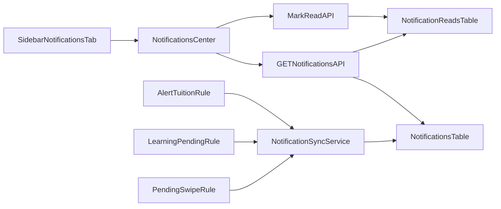

# 通知中心與左側收合計畫

## 目標與定位

- 保留總覽的「繳費提醒」當 KPI（快速看數字）。
- 新增「通知中心」當待辦清單（可追蹤、可標記已讀、可保留歷史）。
- 第一版通知類型：`繳費` + `待審評量` + `未識別刷卡`。
- 左側選單新增「通知」頁籤，並支援桌面版手動收合。

## 為什麼兩者都要留

- 「提醒」= 儀表板摘要，快讀狀態；
- 「通知」= 可操作事件（已讀/未讀、篩選、歷史）。
- 這樣可避免主任在總覽看過後，仍要回頭人工記憶要處理哪些案件。

## 現況依據（會沿用/調整）

- 側欄與頁面切換在 [App.vue](/home/admin/frontend/src/App.vue) 由 `active` 控制，尚無手動收合狀態。
- 總覽「繳費提醒」與「繳費通知」來源不一致，位於 [DirectorDashboard.vue](/home/admin/frontend/src/pages/DirectorDashboard.vue)：
  - `alerts/tuition`（後端）
  - `student-classes + payment_status`（前端 supabase 查詢）
- 現有可重用通知來源：
  - 繳費提醒：[AlertController.php](/home/admin/backend/app/Http/Controllers/AlertController.php)
  - 待審評量：[LearningRecordController.php](/home/admin/backend/app/Http/Controllers/LearningRecordController.php)
  - 未識別刷卡：[PendingSwipeController.php](/home/admin/backend/app/Http/Controllers/PendingSwipeController.php)

## 後端方案（通知資料與 API）

- 新增資料表（建議）
  - `Notifications`：`id`, `CampusID`, `Type`, `Severity`, `Title`, `Body`, `SourceType`, `SourceID`, `SourceKey`, `Payload(json)`, `OccurredAt`, `ResolvedAt`, `created_at`, `updated_at`
  - `NotificationReads`：`id`, `NotificationID`, `UserID`, `ReadAt`, `ArchivedAt`, `created_at`, `updated_at`
- 建立通知同步服務 `NotificationSyncService`
  - 來源 1：低堂數/未繳（可先沿用 `alerts/tuition` 規則，第二階段再補 invoice overdue）
  - 來源 2：`LearningRecord.Status in (pending, changes_requested)`
  - 來源 3：`PendingSwipe` 未匹配資料
  - 以 `SourceKey` 做 upsert，避免重複通知。
- 新增 API（`role:director, require_campus`）
  - `GET /api/v1/notifications?branch_id=&type=&read=&page=`
  - `POST /api/v1/notifications/sync`（先做手動觸發；後續可排程）
  - `POST /api/v1/notifications/{id}/read`
  - `POST /api/v1/notifications/read-all`
  - `POST /api/v1/notifications/{id}/archive`（可選，MVP 可先不做）
- 路由位置：更新 [api.php](/home/admin/backend/routes/api.php)

## 前端方案（通知頁與側欄收合）

- 新增頁面：`frontend/src/pages/NotificationsCenter.vue`
  - 區塊：未讀數、類型篩選（繳費/評量/刷卡）、通知列表、已讀/全部切換
  - 操作：單筆已讀、全部已讀、點通知跳轉對應頁（出缺勤/學習評量/課程或帳單）
- 修改 [App.vue](/home/admin/frontend/src/App.vue)
  - 側欄新增「通知中心」頁籤（顯示未讀 badge）
  - 新增 `isSidebarCollapsed` 狀態 + `localStorage` 持久化
  - 保持既有 `active` 切頁機制，不改路由架構
- 修改 [styles.css](/home/admin/frontend/src/styles.css)
  - 新增桌面收合 class（例如 `.sidebar.collapsed`）
  - 調整 `.main-content` 對應寬度
  - 與現有 `@media (max-width: 900px/640px)` 邏輯避免衝突
- 修改 [DirectorDashboard.vue](/home/admin/frontend/src/pages/DirectorDashboard.vue)
  - 保留「繳費提醒」卡
  - 將現有「💳 繳費通知」改為「通知中心摘要 + 前往按鈕」，避免重複邏輯

## 資料流（MVP）

## 測試與驗收

- 後端 Feature tests
  - 不同分校資料隔離（`branch_id`/token 校區）
  - `sync` 去重（同一 `SourceKey` 不重複）
  - `read/read-all` 僅影響當前使用者
- 前端驗收
  - 側欄收合/展開後仍能正常切頁
  - 通知未讀數即時更新（進頁、已讀後）
  - 行動版不破壞現有底部 tab 行為

## 交付順序（建議 2 期）

- 第 1 期（MVP）
  - 通知資料表 + sync + list + mark read
  - 新增通知中心頁 + 側欄通知 badge + 側欄收合
  - 總覽改成「摘要 + 前往通知中心」
- 第 2 期（強化）
  - 繳費通知加入 `Invoice DueDate` 逾期規則
  - 推播管道（LINE/站內）與通知歸檔策略
  - 背景排程自動 sync（cron / queue）

