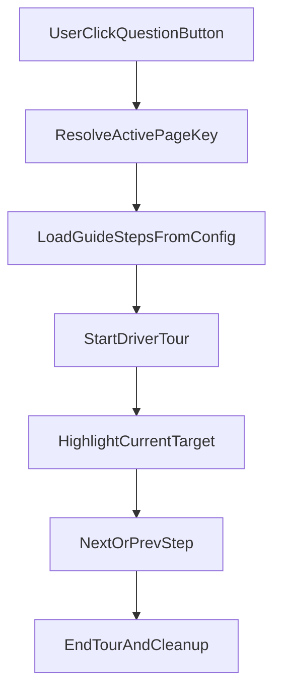

# 全站問號逐步導覽實作計畫

## 目標

- 建立全域「?」按鈕，點擊後啟動該頁逐步導覽（高亮元素、上一步/下一步/結束）。
- 以逐步導覽取代現有分散在各頁的 `HelpGuide` 說明區塊。
- 覆蓋 [App.vue](/home/admin/frontend/src/App.vue) 目前實際掛載的所有頁面（`director` 到 `director-accounts`），並包含 standalone [ParentPortal.vue](/home/admin/frontend/src/pages/ParentPortal.vue) 分支。

## 現況依據

- 頁面切換集中在 [App.vue](/home/admin/frontend/src/App.vue)，以 `active` ref + `v-if` 切頁，非 router。
- 現有說明元件為 [HelpGuide.vue](/home/admin/frontend/src/components/HelpGuide.vue)，是折疊文字說明，非逐步導覽。
- 前端目前未安裝導覽套件（見 [package.json](/home/admin/frontend/package.json)）。

## 實作設計

### 1) 導覽基礎層

- 新增 `driver.js`（或同級導覽庫）作為逐步高亮引擎。
- 建立 `usePageGuideTour` composable（建議：`/home/admin/frontend/src/lib/usePageGuideTour.js`）：
  - 讀取目前 page key。
  - 啟動/關閉 tour。
  - 處理頁面切換後的重新初始化與清理。
  - 若 selector 不存在，自動跳過該步，避免導覽中斷。

### 2) 全域問號入口

- 在 [App.vue](/home/admin/frontend/src/App.vue) 的 `main-content` 區域加入固定位置「?」按鈕。
- 問號按鈕呼叫 composable 的 `startTour(activePageKey)`。
- 注意兩種渲染分支都要可用：
  - `app-layout`（已登入主系統）
  - standalone parent 模式（`isStandaloneParent`）

### 3) 每頁導覽設定集中化

- 新增設定檔（建議：`/home/admin/frontend/src/lib/pageGuideConfig.js`）：
  - key 對齊 `App.vue` 的 `active` 值：`director`, `notifications`, `calendar`, `students`, `teachers`, `course-mgmt`, `classroom`, `subject-units`, `attendance`, `learning`, `profile`, `parent`, `director-accounts`。
  - 每個 key 定義 steps（target selector、標題、內容、順序）。
  - 允許 role 差異（如 teacher/director 看到不同步驟）。

### 4) 頁面錨點標記（穩定 selector）

- 在各頁關鍵互動區塊補上 `data-guide="..."`，避免依賴易變動 class 名稱。
- 優先標記：頁首主要動作列、核心表格/行事曆區、主要篩選器、提交按鈕。
- 目標頁面：
  - [DirectorDashboard.vue](/home/admin/frontend/src/pages/DirectorDashboard.vue)
  - [NotificationsCenter.vue](/home/admin/frontend/src/pages/NotificationsCenter.vue)
  - [SmartCalendar.vue](/home/admin/frontend/src/pages/SmartCalendar.vue)
  - [StudentsList.vue](/home/admin/frontend/src/pages/StudentsList.vue)
  - [TeachersList.vue](/home/admin/frontend/src/pages/TeachersList.vue)
  - [CourseManagement.vue](/home/admin/frontend/src/pages/CourseManagement.vue)
  - [ClassroomManagement.vue](/home/admin/frontend/src/pages/ClassroomManagement.vue)
  - [SubjectUnitsPage.vue](/home/admin/frontend/src/pages/SubjectUnitsPage.vue)
  - [AttendancePage.vue](/home/admin/frontend/src/pages/AttendancePage.vue)
  - [LearningRecordsPage.vue](/home/admin/frontend/src/pages/LearningRecordsPage.vue)
  - [ProfileCenterPage.vue](/home/admin/frontend/src/pages/ProfileCenterPage.vue)
  - [ParentPortal.vue](/home/admin/frontend/src/pages/ParentPortal.vue)
  - [DirectorAccountsPage.vue](/home/admin/frontend/src/pages/DirectorAccountsPage.vue)

### 5) 取代 HelpGuide

- 移除各頁 `HelpGuide` 使用與相關 import（保留元件檔案一版過渡期）。
- 若要降低風險，可先在 config 內復用原文案，確認導覽可用後再優化話術。

### 6) 驗證與回歸

- 手動驗證每頁：
  - 點問號可開啟導覽。
  - 可前後切步與結束。
  - 缺少目標元素時不當機。
  - 切換分校/角色不會出現錯頁步驟。
- 補一份 QA checklist 文件（建議更新既有 docs 風格）。

## 驗收標準

- 所有 `App.vue` 掛載頁面都有可啟動導覽。
- 使用者不再依賴頁內 `HelpGuide` 即可完成主要流程理解。
- 導覽在 director/teacher 與 standalone parent 模式都能穩定執行。
- 導覽不影響既有 API 與業務流程（排課/出缺勤/繳費/評量）。

## 風險與對策

- selector 失效：一律改用 `data-guide` 作為穩定錨點。
- 畫面條件渲染導致步驟找不到：加「不存在即跳過」策略。
- 大頁面導覽太長：每頁先做 4-7 步 MVP，後續再擴充進階步驟。
- 角色差異：以 `pageGuideConfig` 支援 role-based steps，避免 teacher 看到 director 專屬操作。

