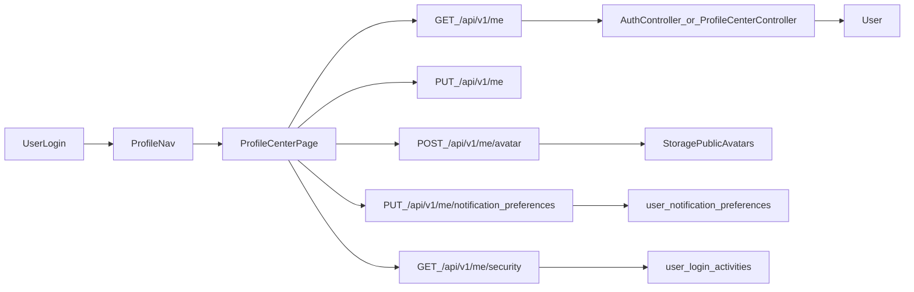

# 老師與主任個人資料管理中心（Enterprise）

## 目標與範圍
- 將老師與主任登入後的帳號設定整合為同一個「個人資料管理」頁面。
- 交付功能（你已確認）：
  - 基本資料（姓名/信箱/手機）
  - 修改密碼（必填目前密碼）
  - 頭像上傳（檔案上傳）
  - 通知偏好（先做儲存，不即時套用現有通知流程）
  - 安全面板（最近登入/裝置資訊）

## 現況重點（盤點）
- 前端目前為「老師頁面 + 主任彈窗」雙軌：
  - 老師有獨立頁：[`frontend/src/pages/TeacherProfilePage.vue`](frontend/src/pages/TeacherProfilePage.vue)
  - 主任仍用 `App.vue` 內的帳號設定 modal：[`frontend/src/App.vue`](frontend/src/App.vue)
- 後端已有 `GET/PUT /api/v1/me`：
  - 路由：[`backend/routes/api.php`](backend/routes/api.php)
  - 控制器：[`backend/app/Http/Controllers/AuthController.php`](backend/app/Http/Controllers/AuthController.php)
  - 已有密碼更新需 `current_password`（可延用）
- 尚缺：avatar、通知偏好、登入活動/裝置資料結構與 API。

## 實作設計

### 1) 前端：統一個人資料管理中心
- 導覽改造（老師/主任共用）
  - 在 [`frontend/src/App.vue`](frontend/src/App.vue) 統一新增/保留 `active='profile'` 入口。
  - 移除主任舊 modal 流程，改導向共用頁。
- 新頁面元件（建議新檔）
  - [`frontend/src/pages/ProfileCenterPage.vue`](frontend/src/pages/ProfileCenterPage.vue)
  - 區塊：
    - `ProfileTab`：基本資料 + 頭像
    - `SecurityTab`：改密碼 + 最近登入/裝置
    - `NotificationTab`：通知偏好
- 前端 API service（降低頁面耦合）
  - 新增 [`frontend/src/lib/profileService.js`](frontend/src/lib/profileService.js)
  - 封裝：`getMe`, `updateMe`, `uploadAvatar`, `getNotificationPrefs`, `updateNotificationPrefs`, `getSecuritySummary`

### 2) 後端：API 與資料模型擴充
- 現有 API 擴充（向下相容）
  - `GET /api/v1/me` 回傳新增欄位：`avatar_url`, `notification_preferences`, `security_summary`
  - `PUT /api/v1/me` 維持原邏輯，補強可更新 `avatar_url`（若走上傳 API 則僅由上傳 API 寫入）
- 新增 API
  - `POST /api/v1/me/avatar`：multipart 上傳、檔案驗證、回傳 `avatar_url`
  - `GET /api/v1/me/notification-preferences`
  - `PUT /api/v1/me/notification-preferences`
  - `GET /api/v1/me/security`（最近登入紀錄 + 近期裝置資訊）
- 建議檔案
  - 控制器可分離（建議）：
    - [`backend/app/Http/Controllers/ProfileCenterController.php`](backend/app/Http/Controllers/ProfileCenterController.php)
  - 或先收斂到 `AuthController`（較快，但可維護性較弱）

### 3) 資料庫設計（Migration）
- `User` 加頭像欄位（相容現有 PascalCase 風格）
  - 新增 `AvatarUrl`（nullable string）
- 通知偏好表（以 user 為核心）
  - 新增 `user_notification_preferences`
  - 核心欄位：`user_id`, `in_app_enabled`, `email_enabled`, `line_enabled`, `quiet_hours_start`, `quiet_hours_end`, `event_tuition`, `event_learning_review`, `event_attendance`, `event_system`
- 安全面板資料
  - 新增 `user_login_activities`
  - 欄位：`user_id`, `login_at`, `ip_address`, `user_agent`, `device_label`, `success`, `auth_token_id`(nullable)
- 登入時寫入活動
  - 在 [`backend/app/Http/Controllers/AuthController.php`](backend/app/Http/Controllers/AuthController.php) `login()` 成功後記錄登入活動

### 4) 檔案上傳規格
- 上傳路徑：`storage/app/public/avatars/{userId}/...`
- 回傳 URL：透過 Laravel `Storage::url(...)`
- 驗證：`image|mimes:jpg,jpeg,png,webp|max:2048`
- 覆蓋策略：保留最近 N 張或直接覆蓋（預設覆蓋，降低儲存壓力）

### 5) 測試策略
- Feature tests 新增：
  - [`backend/tests/Feature/ProfileCenterApiTest.php`](backend/tests/Feature/ProfileCenterApiTest.php)
  - 覆蓋：
    - 老師/主任可讀寫自己的資料
    - 改密碼需目前密碼、錯誤會 422
    - 頭像上傳成功/格式不合法失敗
    - 通知偏好讀寫成功
    - 安全面板只回傳當前使用者資料
- 既有測試延伸
  - [`backend/tests/Feature/AuthLoginThrottleTest.php`](backend/tests/Feature/AuthLoginThrottleTest.php) 可補一個「成功登入有寫入 login activity」斷言

## 執行順序
1. Migration + Model（先建立資料結構）
2. 後端 API（`/me` 擴充 + 新路由）
3. 前端頁面整併（老師/主任共用 ProfileCenter）
4. 串接頭像/通知偏好/安全面板
5. 補測試與回歸驗證

## 資料流

## 風險與注意事項
- 欄位命名需與現有 `User`/舊表風格相容，避免 ORM 對不到。
- 頭像 URL 若使用 `storage`，需確認部署環境已正確公開靜態連結。
- 通知偏好本期僅「儲存」，UI 必須清楚標示尚未套用到既有通知發送邏輯。
- 安全面板資料僅限本人可見，避免跨帳號資訊外洩。