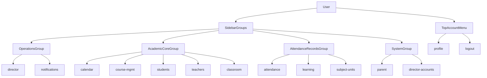

# Sidebar 戰略級重構計畫

## 目標與邊界

- 以 **不抽出 `Sidebar.vue`** 為前提，直接在 [App.vue](/home/admin/frontend/src/App.vue) 完成導航資訊架構重整。
- 導航分組改為你指定的四組：
  - A：營運總覽（Operations）
  - B：教務核心（Academic Core）
  - C：考勤與評量（Attendance & Records）
  - E：系統管理（System）
- 將「智慧排課」更名為「班級行事曆 / 課表」。
- 將「家長入口」從系統設定語義重命名為「家長入口管理」。
- 將「個人管理」移出側欄核心區，改為主內容頂部頭像下拉（你已確認此方案）。

## 目前關鍵現況（實作切入點）

- 導航資料源集中在 [App.vue](/home/admin/frontend/src/App.vue) 的 `sidebarNavGroups` computed，頁面切換靠 `active` key（例如 `calendar`、`course-mgmt`、`profile`）。
- 通知 badge 與跳轉都綁在 `page === 'notifications'` 與既有 emit target，因此 **只改 label/group，不改 page key** 可避免行為回歸風險。
- 導覽文案目前仍有「智慧排課」等舊稱，定義在 [pageGuideConfig.js](/home/admin/frontend/src/lib/pageGuideConfig.js)。

## 實作步驟

1. **重構側欄分組與命名（App 層）**
  - 修改 [App.vue](/home/admin/frontend/src/App.vue) 的 `sidebarNavGroups`：
    - A 組：`director`（總覽儀表板）、`notifications`（通知中心）
    - B 組：`calendar`（班級行事曆 / 課表）、`course-mgmt`（課程管理）、`students`（學生管理）、`teachers`（老師管理）、`classroom`（教室管理）
    - C 組：`attendance`（出缺勤管理）、`learning`（學習評量表）、`subject-units`（科目數統計）
    - E 組：`parent`（家長入口管理）、`director-accounts`（主任審核，super_admin only）
  - 保持 page key 不變，確保 `active` 判斷與跨頁 emit（`onNavigateFromNotifications`、`onNavigateToSchedule`）不受影響。
2. **圖標統一策略（扁平、單色、專業）**
  - 在 [App.vue](/home/admin/frontend/src/App.vue) 將 emoji icon 改為統一風格的單色 icon 方案（同一套 SVG/字形風格，不混用多色/擬物）。
  - 在 [styles.css](/home/admin/frontend/src/styles.css) 調整 `.nav-icon` 尺寸、對齊、色階與 active/hover 狀態，確保整體視覺一致。
3. **搬移「個人管理」到頂部頭像下拉**
  - 在 [App.vue](/home/admin/frontend/src/App.vue) 的 `.main-content` 頂部新增 account bar（頭像 + 使用者名稱 + 下拉選單）。
  - 下拉選單提供：
    - 個人管理（`setActivePage('profile')`）
    - 登出（`logout()`）
  - 側欄移除 `profile` 項目，避免核心導航被帳號設定干擾。
  - 密碼強制修改鎖定時，仍可直接導向 `profile`（維持既有安全流程）。
4. **同步導覽文案與語意一致性**
  - 更新 [pageGuideConfig.js](/home/admin/frontend/src/lib/pageGuideConfig.js) 中與舊稱衝突的標題/描述（例如「智慧排課」→「班級行事曆 / 課表」）。
  - 檢查 [App.vue](/home/admin/frontend/src/App.vue) 中密碼提示文案，將「個人管理」引用改成新入口語意（頂部頭像選單）。
5. **RWD 與可用性回歸**
  - 調整 [styles.css](/home/admin/frontend/src/styles.css) 手機版底部導航（`@media (max-width: 640px)`）的顯示密度，確保分組重排後仍可用。
  - 驗證通知 badge 在新分組下仍正常顯示（`notifications` 項目）。

## 導航流（重構後）

## 驗證清單

- 導航層級：四大分組與命名符合規格。
- 行為層級：
  - `notifications` unread badge 正常。
  - Teachers/Notifications 觸發的跨頁跳轉（`calendar`、`course-mgmt`、`learning`、`attendance`）正常。
  - super_admin 才看到「主任審核」。
- 安全層級：密碼強制變更時，非 `profile` 導航仍被鎖定。
- 響應式：手機底部導航仍可點擊且不遮擋主要操作。

## 風險與控制

- 風險：僅改 label 但漏改導覽文案，造成認知不一致。
  - 控制：同步更新 [pageGuideConfig.js](/home/admin/frontend/src/lib/pageGuideConfig.js) 相關標題敘述。
- 風險：移除側欄 `profile` 後，密碼鎖定流程入口不明顯。
  - 控制：頂部頭像選單固定可見，並調整鎖定提示文案指向新入口。
- 風險：手機版導航項目增多造成擁擠。
  - 控制：優化 icon/label 字級與間距，必要時保留橫向可捲。

