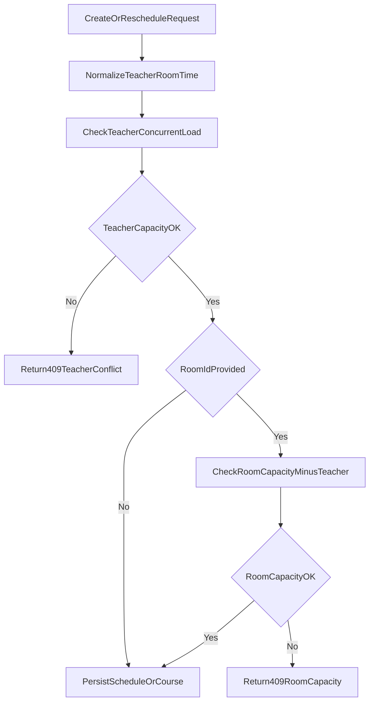

# 排課防呆與教室一致性計畫

## 目標
- 修正智慧排課出現「教室1」但與課程實際地點不一致的問題。
- 在「新增課程」與「調課」流程加上後端強制防呆：
  - 老師同時段超載（依課程類型上限）
  - 教室容量超載（你已確認：教室可不必填；有選教室才檢查）

## 現況確認（已讀程式）
- 智慧排課把教室顯示來源寫成 `RoomID || room_id`，且直接顯示 ID，造成視覺上常出現「教室1」：
  - [/home/admin/frontend/src/pages/SmartCalendar.vue](/home/admin/frontend/src/pages/SmartCalendar.vue)
- 後端 `student-classes` 目前只有新增時的老師重疊檢查，且是「任何重疊都擋」，沒有 class_type 容量規則；更新流程沒有同級防呆：
  - [/home/admin/backend/app/Http/Controllers/StudentClassController.php](/home/admin/backend/app/Http/Controllers/StudentClassController.php)
- `schedules`（調課/加課）建立 API 幾乎只有欄位驗證，沒有老師衝堂與教室容量檢查：
  - [/home/admin/backend/app/Http/Controllers/ScheduleController.php](/home/admin/backend/app/Http/Controllers/ScheduleController.php)

## 設計原則
- 規則以後端為準（前端只做即時提示，避免繞過）。
- 老師同時段上限沿用既有課程型態容量邏輯：
  - `one_on_one=1`、`one_on_two=2`、`one_on_three=3`、`tutoring=4`
- 教室容量採「總人數含老師」：可容納學生數 = `room.capacity - 1`。
- 你已選擇：教室「可選填」，未選教室只做老師衝堂檢查。

## 實作步驟
1. 建立排課防呆共用服務
- 新增服務（例如 `ScheduleGuardService`）集中計算：
  - 指定老師、星期/日期、時段的重疊課程數
  - class_type 上限判定（新課與既有課雙向限制）
  - 指定教室時的容量檢查（`capacity-1`）
- 主要檔案：
  - [/home/admin/backend/app/Services](/home/admin/backend/app/Services)
  - [/home/admin/backend/app/Models/StudentClass.php](/home/admin/backend/app/Models/StudentClass.php)
  - [/home/admin/backend/app/Models/Schedule.php](/home/admin/backend/app/Models/Schedule.php)

2. 接入新增/更新課程 API
- 在 `StudentClassController@store`、`@update` 進入寫入前呼叫 guard。
- `store`：依 `days_of_week + start_time + duration + teacher_id + room_id` 檢查。
- `update`：只要老師/時段/星期/教室有變更就檢查。
- 衝突回傳統一 `409` 與可讀錯誤訊息，前端可直接顯示。
- 主要檔案：
  - [/home/admin/backend/app/Http/Controllers/StudentClassController.php](/home/admin/backend/app/Http/Controllers/StudentClassController.php)

3. 接入調課 API
- 在 `ScheduleController@store`（至少 `status=scheduled` 的調入堂次）加入同樣 guard。
- 若 payload 含 `student_course_id`，先抓課程的 `room_id/class_type/teacher_id` 補齊檢查上下文。
- 補上 branch/campus 對應驗證，避免跨校資料混用。
- 主要檔案：
  - [/home/admin/backend/app/Http/Controllers/ScheduleController.php](/home/admin/backend/app/Http/Controllers/ScheduleController.php)

4. 修正智慧排課教室顯示一致性
- 智慧排課課程映射改為優先/僅使用 `room_id`（不要再用 `RoomID` 當顯示來源）。
- 教師欄位顯示 `room name`（由 `rooms` 清單轉譯），不顯示數字 ID。
- 保留課程地點顯示與課程管理一致（分校 + 教室名稱）。
- 主要檔案：
  - [/home/admin/frontend/src/pages/SmartCalendar.vue](/home/admin/frontend/src/pages/SmartCalendar.vue)
  - [/home/admin/frontend/src/pages/CourseManagement.vue](/home/admin/frontend/src/pages/CourseManagement.vue)

5. 前端錯誤提示整合
- 在新增課程/調課送出失敗時，優先顯示後端 `409` 的防呆訊息（老師滿載、教室容量不足）。
- 主要檔案：
  - [/home/admin/frontend/src/pages/StudentsList.vue](/home/admin/frontend/src/pages/StudentsList.vue)
  - [/home/admin/frontend/src/pages/CourseManagement.vue](/home/admin/frontend/src/pages/CourseManagement.vue)
  - [/home/admin/frontend/src/pages/SmartCalendar.vue](/home/admin/frontend/src/pages/SmartCalendar.vue)

6. 測試覆蓋
- 新增 Feature tests（Laravel）：
  - 新增課程：老師同時段一對二第 3 位學生被擋
  - 新增課程：既有一對一時，不可再塞一對二
  - 新增課程：教室容量 3 時，同時段最多 2 位學生（老師+學生不超過 3）
  - 調課：`/api/v1/schedules` 調入堂次超載時回 `409`
- 主要檔案：
  - [/home/admin/backend/tests/Feature](/home/admin/backend/tests/Feature)

## 流程圖（防呆判定）

## 風險與注意
- 既有資料可能 `room_id` 為空、但 `RoomID` 有值；本次先修「顯示」與「新資料防呆」，不做破壞性資料清洗。
- SmartCalendar 與 CourseManagement 目前有局部規則不一致，這次會把最終判斷收斂到後端，前端只顯示訊息。