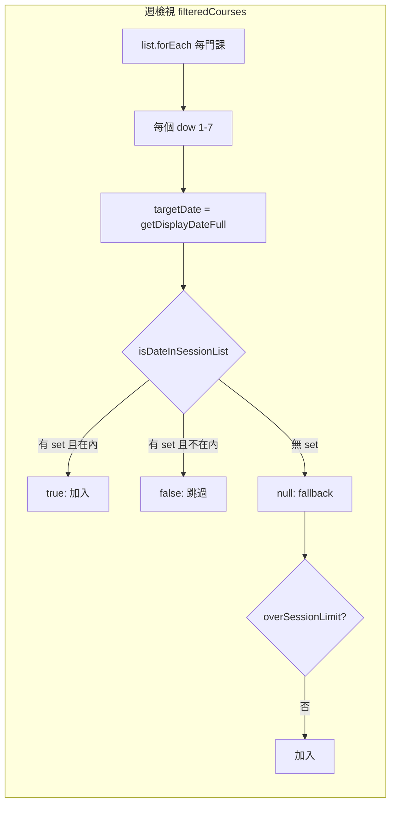

# 智慧排課只顯示已購買堂數（8 堂）修復計畫

## 問題摘要

- **現象**：課程管理正確顯示 8 筆課堂，但智慧排課的週檢視與日檢視可一直往後看到課堂，超過 8 堂。
- **預期**：買 8 堂就只在對應的 8 個上課日顯示 8 個區塊，不應再往後延伸。

## 根因分析

目前邏輯在 [SmartCalendar.vue](frontend/src/pages/SmartCalendar.vue) 中：

1. `**sessionDatesSetByCourseId**`（約 887–948 行）
  - 先用 API 的 session-dates 建「實際上課日」Set。  
  - 若某課程沒有 API 資料，再用前端迴圈依 `first_class_date`、`sessions_purchased`、`days_of_week`、請假/調課算出 N 堂並建 Set。  
  - 僅在 `dateSet.size > 0` 時才寫入 `out[cid]`；若迴圈因條件沒產出任何日期（例如 `days` 為空、`firstYmd` 異常、或邊界情況），該課程就不會有 set。
2. `**isDateInSessionList(courseId, targetDate)**`（約 952–956 行）
  - 若該課程沒有 set 或 set 為空，回傳 `**null**`（表示「未知」）。
3. **週檢視 `filteredCourses`**（約 1056–1078 行）
  - `inSessionList === true`：只在這一天顯示（正確）。  
  - `inSessionList === false`：不顯示（正確）。  
  - `**inSessionList === null**`：走 **fallback**，用「是否為首堂日/排課日 ＋ 未請假 ＋ 未超過 session 上限」決定是否顯示。  
  - fallback 依賴 `isOverSessionLimit`；若該課程沒有 `courseLastSessionDate`（或 2 年 cap 尚未到期），就會一直視為「未超過」，導致**每週的同一星期幾都顯示**，看起來超過 8 堂。
4. **日檢視 `dayFilteredCourses`**（約 1138–1155 行）
  - 同樣在 `inSessionList === null` 時走 fallback，邏輯與週檢視一致，故也會出現超過 8 堂的情況。

結論：  

- 堂數制課程若因故**沒有**在 `sessionDatesSetByCourseId` 裡建出「恰好 N 堂」的 set，就會變成「只靠 fallback ＋ isOverSessionLimit」顯示，容易在週/日檢視都超出 8 堂。  
- 要讓「買 8 堂就只顯示 8 堂」穩定成立，必須讓堂數制**只依「那 N 個日期的集合」顯示**，並在**沒有這份集合時不要用 fallback 顯示**。

## 修復方案

### 1. 確保堂數制課程一定有一份「N 堂日期」集合

**檔案**：[frontend/src/pages/SmartCalendar.vue](frontend/src/pages/SmartCalendar.vue)

- 在 `sessionDatesSetByCourseId` 的 fallback 迴圈中：
  - **放寬 `days` 的取得**：若 `days.length === 0` 且 `c.day_of_week` 在 1–7，使用 `[c.day_of_week]`，避免因 Laravel/API 只帶 `day_of_week` 沒帶 `days_of_week` 而跳過。
  - **放寬首日**：若沒有 `first_class_date`，一律用 `getNextWeekdayYmd(days[0])` 當起算日（已有則維持不變）。
  - **保證寫入 set**：迴圈結束後若 `dateSet.size === 0` 但 `purchased > 0` 且 `firstYmd` 有效，則至少依 `firstYmd` 與 `days` 再跑一輪簡化版計算（不考慮請假/調課），產出最多 `purchased` 筆日期並寫入 `out[cid]`，確保堂數制課程至少有一份「最多 N 堂」的 set，避免完全沒有 set 而一直走 fallback。

目標：所有「堂數制（purchased > 0）」的課程在 `sessionDatesSetByCourseId` 裡都有一份非空 set，且最多 N 個日期。

### 2. 堂數制僅依「日期集合」顯示，取消 fallback 的「重複每週顯示」

**檔案**：[frontend/src/pages/SmartCalendar.vue](frontend/src/pages/SmartCalendar.vue)

- **週檢視 `filteredCourses`**（約 1050–1080 行）：  
  - 對「堂數制」課程（例如 `payment_type === 'session'` 或 `sessions_purchased > 0`）：  
    - 若 `inSessionList === true`：照常加入。  
    - 若 `inSessionList === false` 或 `**inSessionList === null**`：**一律不加入**（不再用「isRecurringDay ＋ !overSessionLimit」的 fallback）。
  - 僅對**非堂數制**（月結或無購買堂數）保留現有 fallback（依星期＋首堂日＋overSessionLimit 等）。
- **日檢視 `dayFilteredCourses`**（約 1136–1165 行）：  
  - 同樣對堂數制課程：若 `inSessionList !== true`（含 `null`）則不加入；僅非堂數制保留 fallback。

效果：  

- 堂數制只會在「那 N 個日期」出現在週/日檢視，不會再因 fallback 而每週重複出現。  
- 若因資料異常導致某堂數制課程仍沒有 set，該課程在週/日檢視會暫時不顯示，而不是無限延伸。

### 3. 可選：除錯與一致性

- 若實作後仍有課程「應有 8 堂卻沒 set」：可在 `sessionDatesSetByCourseId` 的 fallback 中對 `courses.value` 的欄位做防呆（例如 `sessions_purchased` / `remaining_sessions` / `used_sessions` 的數字解析、預設 8 等），與課程管理顯示邏輯對齊。
- 不需改動 session-dates API 或後端；僅前端顯示與「實際上課日」集合的建構與使用方式。

## 實作要點

| 項目                 | 檔案                                            | 說明                                           |
| ------------------ | --------------------------------------------- | -------------------------------------------- |
| 放寬 days / 保證寫入 set | SmartCalendar.vue `sessionDatesSetByCourseId` | 堂數制必有一份最多 N 堂的 Set，避免無 set                   |
| 週檢視堂數制僅依 set       | SmartCalendar.vue `filteredCourses`           | `inSessionList === null` 時堂數制不加入，不走 fallback |
| 日檢視堂數制僅依 set       | SmartCalendar.vue `dayFilteredCourses`        | 同上                                           |

完成後：智慧排課週檢視與日檢視都會只顯示「已購買堂數」對應的那 N 個上課日，與課程管理的 8 筆一致，且不會再往後延伸。