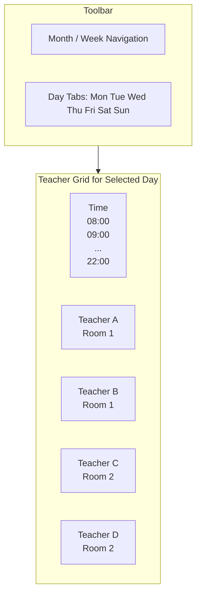
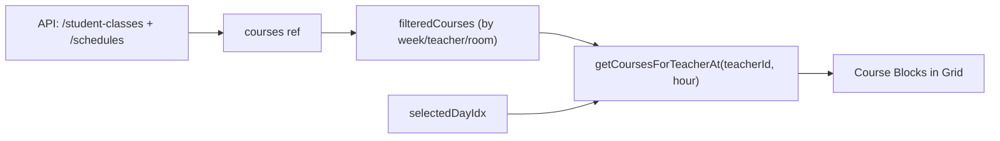

# Smart Calendar (智慧排課) UI/UX Redesign

## Problem

Current layout uses **days as columns (Mon-Sun)** x **hours as rows (8-22)**. When many courses overlap in the same day+hour, they squeeze side-by-side within narrow day columns, becoming unreadable with large data volumes.

## New Layout Design

Replace the day-column grid with a **teacher-column grid** within a **weekly tabbed-day** navigation:




- **Vertical axis**: Time slots (08:00 - 22:00), each row = 1 hour
- **Horizontal axis**: One column per teacher, column header shows `Teacher Name` + `Room ID`
- **Day tabs**: 7 clickable tabs (Mon-Sun) with dates and course count badges; clicking a tab shows that day's teacher-grid
- **Room grouping**: Teacher columns visually grouped by RoomID (shared sub-header row)
- **Horizontal scrolling**: For many teachers, the grid scrolls horizontally with sticky time column

## Interaction Design


| Action                 | Behavior                                                                 |
| ---------------------- | ------------------------------------------------------------------------ |
| **Click empty cell**   | Opens add-course modal, pre-filled with that teacher + time + date       |
| **Click course block** | Opens view/edit modal (existing behavior)                                |
| **Drag course**        | Drag to a different teacher column or time row -> opens reschedule modal |
| **Right-click course** | Context menu with Leave (請假) option                                      |
| **Quick add button**   | Opens blank add-course modal (existing behavior)                         |


## Files to Modify

### 1. [frontend/src/pages/SmartCalendar.vue](frontend/src/pages/SmartCalendar.vue) (primary - ~2900 lines)

This is the only file that needs major changes. All modifications happen here.

#### Template Section Changes

**A. Replace week-view grid (lines 73-107) with new teacher-grid:**

Current structure:

```html
<!-- Current: 7 day columns -->
<div class="week-grid">
  <div class="time-col">...</div>
  <div v-for="dayName in dayNames" class="day-col">
    <div v-for="h in hours" class="slot">
      <div v-for="course in getCoursesAt(day, h)" class="course-block">
```

New structure:

```html
<!-- New: Day tabs + teacher columns -->
<div class="day-tabs">
  <button v-for="(dayName, idx) in dayNames"
    :class="{ active: selectedDayIdx === idx }"
    @click="selectedDayIdx = idx">
    {{ dayName }} ({{ getDisplayDateString(idx+1) }})
    <span class="day-badge">{{ getDayCourseCount(idx+1) }}</span>
  </button>
</div>
<div class="teacher-grid-wrapper">
  <div class="teacher-grid" :style="gridTemplateStyle">
    <div class="time-col">...</div>
    <!-- Room group headers (optional row) -->
    <div v-for="teacher in visibleTeachers" class="teacher-col">
      <div class="teacher-col-header">
        {{ teacher.username }}
        <small>{{ teacher.roomLabel }}</small>
      </div>
      <div v-for="h in hours" class="slot"
        @click="onSlotClick(selectedDow, h, selectedDate, teacher.id)"
        @dragover.prevent @drop.prevent="onSlotDrop(selectedDow, h, selectedDate, teacher.id)"
        draggable-target>
        <div v-for="course in getCoursesForTeacherAt(teacher.id, h)"
          class="course-block" draggable
          @contextmenu.prevent="onCourseRightClick(...)">
        </div>
      </div>
    </div>
  </div>
</div>
```

**B. Update toolbar (lines 24-55):**

- Keep month/week navigation
- Replace teacher-filter dropdown with room-filter
- Add teacher search/filter input
- Show selected day's stats

**C. Keep existing modals unchanged** (lines 192-570): Quick add, leave, extra lesson, reschedule modals remain the same, only the pre-fill logic changes.

**D. Remove or simplify the old day-view and teacher-view** (lines 109-190): The new teacher-column grid replaces both. The old "teacher view" (collapsible cards) can be kept as an optional list mode.

#### Script Section Changes

**E. New reactive state:**

```javascript
const selectedDayIdx = ref(new Date().getDay() === 0 ? 6 : new Date().getDay() - 1);
const selectedDow = computed(() => selectedDayIdx.value + 1);
const selectedDate = computed(() => getDisplayDateFull(selectedDow.value));
const roomFilter = ref('');
const teacherSearch = ref('');
```

**F. New computed: `visibleTeachers`**

- Derives from `teachers` list
- Enriched with `roomLabel` from course data (extract unique RoomIDs from `courses` where teacher matches)
- Sorted by RoomID then teacher name
- Filtered by `roomFilter` and `teacherSearch`

**G. New function: `getCoursesForTeacherAt(teacherId, hour)`**

- Filters `filteredCourses` for the selected day + teacher + hour
- Similar to existing `getCoursesAt()` but adds `teacher_id` filter and uses `selectedDow`/`selectedDate`

**H. Updated `onSlotClick(dow, hour, date, teacherId)`:**

- Pre-fills modal with the clicked teacher in addition to day/hour/date

**I. Updated `onSlotDrop(dow, hour, date, teacherId)`:**

- Opens reschedule modal with new teacher + new time

**J. Updated `getCourseBlockStyle()`:**

- Within a teacher column, courses at the same hour are stacked (very rare since each teacher has limited slots)
- Height still based on `duration_hours`

**K. Updated conflict detection `checkConflict()` (lines 1428-1488):**

Current logic excludes tutoring. New rules:

```javascript
const checkConflict = () => {
  // ... existing field checks ...

  const overlapping = courses.value.filter(c => {
    if (c.id === editingCourseId.value) return false;
    if (c.teacher_id !== tid || c.day_of_week !== dow) return false;
    const cStart = parseHour(c.start_time);
    const cEnd = cStart + (c.duration_hours || 1);
    return startH < cEnd && endH > cStart;
  });

  // Capacity map: class_type -> max courses in same slot
  const capacityMap = {
    'one_on_one': 1,
    'one_on_two': 2,
    'one_on_three': 3,
    'tutoring': 1  // tutoring now counts as 1 slot
  };

  const maxSlots = capacityMap[modalForm.value.class_type] || 1;

  // Count total overlapping (including tutoring)
  if (overlapping.length >= maxSlots) {
    conflictWarning.value = `衝堂：該老師此時段已有 ${overlapping.length} 堂課...`;
    return;
  }

  // Also check: if any existing course is one_on_one, no more can be added
  if (overlapping.some(c => c.class_type === 'one_on_one')) {
    conflictWarning.value = '該時段已有一對一課程，無法再加課';
    return;
  }

  // Check mixed types: existing class_type capacity
  for (const existing of overlapping) {
    const existingMax = capacityMap[existing.class_type] || 1;
    if (overlapping.length >= existingMax) {
      conflictWarning.value = `衝堂：該老師此時段已達 ${existing.class_type} 上限`;
      return;
    }
  }

  conflictWarning.value = '';
};
```

**L. New helper: `getDayCourseCount(dow)`**

- Returns course count for a given day of week in current display context
- Used for day-tab badges

**M. New computed: `gridTemplateStyle`**

- Returns `grid-template-columns: 56px repeat(N, minmax(140px, 1fr))` based on visible teacher count

#### Style Section Changes

**N. New CSS for teacher-grid layout:**

- `.day-tabs` - horizontal tab bar for Mon-Sun, active tab highlighted, with badges
- `.teacher-grid-wrapper` - overflow-x: auto for horizontal scrolling
- `.teacher-grid` - CSS Grid with dynamic columns
- `.teacher-col` - individual teacher column
- `.teacher-col-header` - sticky top header with teacher name + room
- `.room-group-header` - visual separator/label for room groups
- `.time-col` - sticky left for time labels (position: sticky, left: 0)

**O. Update responsive styles:**

- Mobile: show fewer teachers, horizontal scroll
- Tablet: show 4-6 teachers
- Desktop: show all teachers

**P. Keep existing modal/context-menu styles unchanged.**

### 2. Backend - No changes required

The existing APIs and models support all needed data. `RoomID` is already available on `StudentClass`. No new endpoints are needed.

## Conflict Detection Rules (Updated)

For a given teacher + time slot:

- **one_on_one**: max 1 course (1 student)
- **one_on_two**: max 2 courses (2 students total)
- **one_on_three**: max 3 courses (3 students total)
- **tutoring**: now counts as 1 course (no longer exempt)
- If any existing course in the slot is `one_on_one`, no additional courses can be added
- Mixed class_type: the stricter limit applies (e.g., if 1 one_on_one exists, nothing else can be added)

## Data Flow




