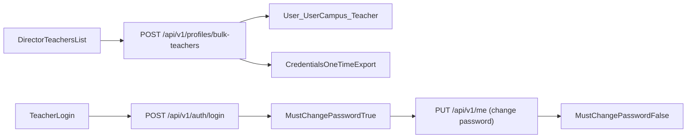

# 批量老師帳號與首登改密碼

## 目標與範圍

- 在老師管理提供「批次新增老師」流程，主任可一次建立多位老師帳號。
- 每位老師由系統自動產生隨機初始密碼（只顯示一次，提供匯出/複製）。
- 老師第一次登入後必須先改密碼，否則不可使用其他功能。

## 現況依據（關鍵檔案）

- 老師管理目前僅單筆建立，且預設密碼固定為 `teacher123`：`[/home/admin/frontend/src/pages/TeachersList.vue](/home/admin/frontend/src/pages/TeachersList.vue)`
- 登入回應目前已回傳 `session.user`（可擴充強制改密碼旗標）：`[/home/admin/backend/app/Http/Controllers/AuthController.php](/home/admin/backend/app/Http/Controllers/AuthController.php)`
- 個人資料頁已有改密碼流程（`PUT /api/v1/me` + `current_password`）：`[/home/admin/frontend/src/pages/ProfileCenterPage.vue](/home/admin/frontend/src/pages/ProfileCenterPage.vue)`、`[/home/admin/frontend/src/lib/profileService.js](/home/admin/frontend/src/lib/profileService.js)`
- API 路由分組與權限集中於：`[/home/admin/backend/routes/api.php](/home/admin/backend/routes/api.php)`

## 實作設計

### 1) 後端資料模型與欄位

- 新增 migration（`User` 表）：
  - `MustChangePassword` boolean default `false`
  - `PasswordChangedAt` nullable timestamp
  - （可選）`PasswordSetByUserID` nullable int（稽核）
- 更新模型可寫欄位：`[/home/admin/backend/app/Models/User.php](/home/admin/backend/app/Models/User.php)`

### 2) 後端 API：批量建立老師帳號

- 在 director + require_campus 群組新增：`POST /api/v1/profiles/bulk-teachers`（`[/home/admin/backend/routes/api.php](/home/admin/backend/routes/api.php)`）。
- 在 `[/home/admin/backend/app/Http/Controllers/ProfileController.php](/home/admin/backend/app/Http/Controllers/ProfileController.php)` 新增批量方法（或抽 service）：
  - 輸入：`teachers[]`（name/account/branch/subject/phone...）
  - 每筆動作：
    - 生成隨機密碼（後端產生，避免前端可預測）
    - 建立 `User` / `UserCampus` / `Teacher` / `teacher_subjects`
    - 設定 `MustChangePassword=true`
  - 回傳：`created[]`（含 `initial_password`）、`failed[]`（逐筆錯誤）
- 保持「部分成功可回報」格式，避免一筆錯誤導致全批失敗。

### 3) 後端強制改密碼機制

- 登入與 `me` 回傳加入 `must_change_password`：`[/home/admin/backend/app/Http/Controllers/AuthController.php](/home/admin/backend/app/Http/Controllers/AuthController.php)`
- 在 `updateMe` 密碼更新成功後：
  - `MustChangePassword=false`
  - `PasswordChangedAt=now()`
- 新增 middleware（例：`RequirePasswordChange`）並在 `[/home/admin/backend/app/Http/Kernel.php](/home/admin/backend/app/Http/Kernel.php)` 註冊：
  - 當 `MustChangePassword=true` 時，拒絕除 `GET/PUT /me`、`/auth/*`、必要公開路由外的請求
  - 錯誤碼固定（例如 `PASSWORD_CHANGE_REQUIRED`），前端可一致處理

### 4) 前端老師管理批量流程

- 在 `[/home/admin/frontend/src/pages/TeachersList.vue](/home/admin/frontend/src/pages/TeachersList.vue)`：
  - 新增「批次新增老師」按鈕與 modal（支援貼上或 CSV）
  - 呼叫 `POST /api/v1/profiles/bulk-teachers`
  - 成功後顯示可下載/複製的帳密清單（僅本次顯示）
  - 顯示逐筆失敗原因並可重新提交失敗筆

### 5) 前端首登強制導流

- 在 `[/home/admin/frontend/src/App.vue](/home/admin/frontend/src/App.vue)`：
  - 讀取 `session.user.must_change_password` 或 `/me` 對應欄位
  - 若為 true，強制 `active='profile'`，並阻擋側欄導頁
- 在 `[/home/admin/frontend/src/pages/ProfileCenterPage.vue](/home/admin/frontend/src/pages/ProfileCenterPage.vue)`：
  - 加入 `forcePasswordChange` 模式（直接開安全性 tab）
  - 密碼更新成功後通知 `App.vue` 解除鎖定

### 6) 測試與驗收

- 後端 Feature tests（新增於 `backend/tests/Feature/`）：
  - 批量建立老師：成功/部分失敗/帳號重複
  - 首登強制：被鎖用戶只能打 `/me`，其他路由返回指定錯誤
  - 改密碼成功後解鎖
- 前端手動驗收：
  - 主任批量建立 → 匯出帳密
  - 老師首登被導到安全性頁
  - 改密碼後可正常進入 learning / 其他功能

## 交付順序

1. 後端 migration + model 欄位
2. 批量 API + 回傳格式
3. 強制改密碼 middleware + AuthController 回傳/清除旗標
4. TeachersList 批量 UI
5. App/Profile 強制導流
6. 測試與回歸

## 風險與控制

- 帳密外洩風險：初始密碼只回傳一次；前端提示「請立即安全分發」。
- 權限風險：批量 API 僅 `role:director` 並受 `require_campus` 限制。
- 相容風險：先兼容單筆 `POST /profiles`，避免影響既有流程。

