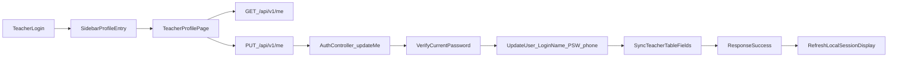

# 老師個人管理頁（信箱/密碼）

## 目標
- 老師登入後可從側欄進入獨立的「個人管理」頁。
- 可修改姓名、信箱、手機；修改密碼時必須輸入「目前密碼」。
- 沿用現有 `/api/v1/me`，但強化後端驗證，避免只靠前端檢查。

## 現況與缺口
- 前端已有帳號設定彈窗（位於 [frontend/src/App.vue](frontend/src/App.vue)），老師可用但不是獨立頁面。
- 後端個人資料更新在 [backend/app/Http/Controllers/AuthController.php](backend/app/Http/Controllers/AuthController.php) 的 `updateMe()`，目前可直接改 `password`，尚未要求 `current_password`。
- 路由已存在 [backend/routes/api.php](backend/routes/api.php) 的 `PUT /api/v1/me`。

## 實作方案
1. **前端導覽與頁面**
- 在 [frontend/src/App.vue](frontend/src/App.vue) 的老師側欄新增「個人管理」入口（例如 `active = 'profile'`）。
- 新增頁面元件 [frontend/src/pages/TeacherProfilePage.vue](frontend/src/pages/TeacherProfilePage.vue)：
  - 區塊 A：基本資料（姓名/信箱/手機）。
  - 區塊 B：密碼變更（目前密碼、新密碼、確認新密碼）。
  - 成功/失敗提示、送出中狀態、防重複提交。
- 進入頁面時先 `GET /api/v1/me` 預填資料；送出基本資料與密碼更新時皆走 `PUT /api/v1/me`。

2. **後端驗證與更新邏輯**
- 在 [backend/app/Http/Controllers/AuthController.php](backend/app/Http/Controllers/AuthController.php) 的 `updateMe()` 增加密碼更新規則：
  - 當請求包含新密碼（`password`）時，`current_password` 必填。
  - 驗證 `current_password` 必須與既有密碼相符（沿用同控制器既有密碼比對策略，含 hash/舊格式相容）。
  - 驗證 `password` 最小長度與 `password_confirmation` 一致（或前端維持 confirm，後端再做一致性驗證）。
- 保留既有 email 重複檢查與 teacher 同步欄位更新（`Teacher.Phone` / `Teacher.T_Name`）。
- 錯誤回應統一為可讀訊息（例：目前密碼錯誤、信箱已存在）。

3. **相容性與 UX**
- 既有彈窗行為保留給主任，避免同時改太多流程。
- 老師改完信箱後，更新前端 session 顯示資料（`localStorage.alltrue_session`）以避免側欄顯示舊值。

4. **測試補強**
- 新增 [backend/tests/Feature/TeacherProfileUpdateTest.php](backend/tests/Feature/TeacherProfileUpdateTest.php)：
  - 可更新姓名/信箱/手機（正常路徑）。
  - 新密碼但未帶 `current_password` 應失敗。
  - `current_password` 錯誤應失敗。
  - `current_password` 正確時可成功更新密碼。
  - 信箱衝突（同允許衝突規則）應回 409。

## 資料流（實作後）

## 驗收重點
- 老師可在登入後看到並進入「個人管理」頁。
- 修改信箱成功後即時反映在 UI。
- 未輸入或輸錯目前密碼時，密碼更新一定被拒絕。
- 不影響主任既有帳號設定流程。