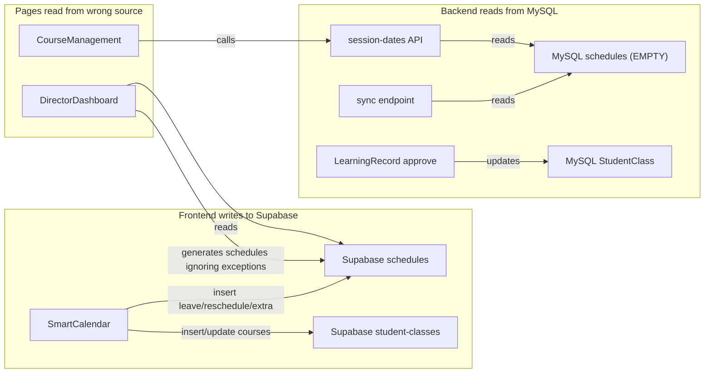
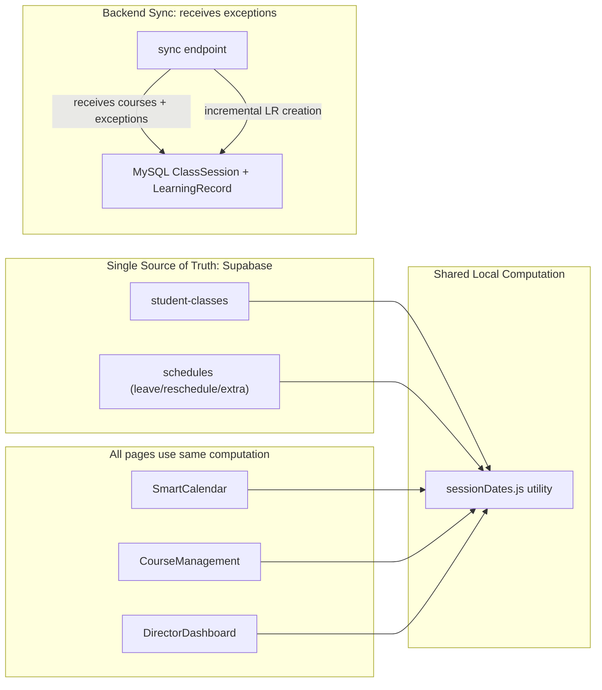
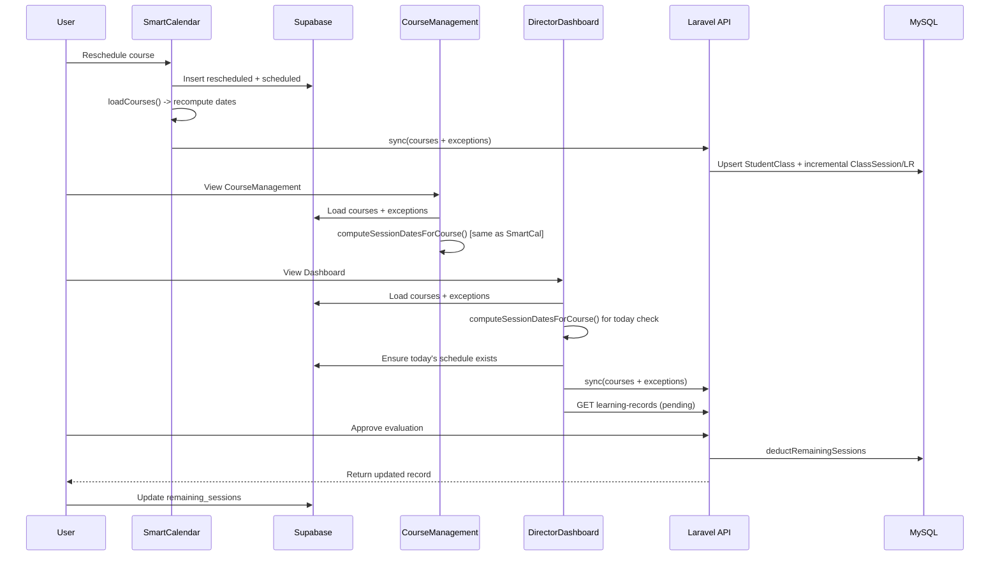

# Unified Calendar Architecture Fix

## Root Cause: Two Unsynchronized Data Systems

**The problem**: SmartCalendar writes reschedules/leaves to **Supabase** `schedules`, but CourseManagement reads session dates from **MySQL** `schedules` (via the backend API). MySQL `schedules` is empty/stale, so CourseManagement shows wrong dates and the sync creates wrong ClassSessions/LearningRecords.

## Target Architecture

---

## Changes

### 1. Extract shared session-date utility

Create [frontend/src/lib/sessionDates.js](frontend/src/lib/sessionDates.js) with the core `computeSessionDatesForCourse(course, exceptions)` function, extracted from SmartCalendar's `getSessionDateSetForCourse`. Both SmartCalendar and CourseManagement will import this.

Key logic (already exists in SmartCalendar lines 994-1069):

- Input: course object (`first_class_date`, `days_of_week`, `sessions_purchased`) + exceptions array
- Build `leaveDates` (leave + rescheduled) and `extraDates` (scheduled) from exceptions matching `student_course_id`
- Iterate from `first_class_date`, count regular days minus leaves plus extras, stop at `sessions_purchased`
- Return `Set<string>` of YYYY-MM-DD dates

### 2. Fix CourseManagement to use shared computation

File: [frontend/src/pages/CourseManagement.vue](frontend/src/pages/CourseManagement.vue)

- **Remove** the call to `/api/v1/student-classes/session-dates` (`loadSessionDates` at line 868)
- **Add** a Supabase query for `schedules` (exceptions) for the branch, same as SmartCalendar does
- **Replace** `getSessionDatesForRow(c)` (line 676) to use the shared `computeSessionDatesForCourse()` with loaded exceptions
- **Remove** `computeEstimatedSessionDates()` (line 512) since the shared utility handles this
- This ensures CourseManagement shows the exact same dates as SmartCalendar

### 3. Fix DirectorDashboard today's schedules

File: [frontend/src/pages/DirectorDashboard.vue](frontend/src/pages/DirectorDashboard.vue)

- **Rewrite `ensureSchedulesFromStudentClasses`** (line 193) to use the shared utility:
  - Import `computeSessionDatesForCourse`
  - Load exceptions from Supabase `schedules` for the branch
  - For each course, compute the full session date set
  - Only generate `schedules` entries for dates in the set (respecting leave/reschedule)
  - This prevents generating schedules for dates that are on leave or beyond session limit
- **Remove the "未繳費課程" section** (template lines 72-79, data loading lines 337-359, `unpaidCourses` ref)
- Keep "繳費提醒" as-is (from `/v1/alerts/tuition`)

### 4. Fix sync endpoint: pass exceptions, incremental LR creation

File: [backend/app/Http/Controllers/StudentClassController.php](backend/app/Http/Controllers/StudentClassController.php)

**Frontend change** (SmartCalendar + DirectorDashboard sync calls):

- Include exceptions in the sync payload: `{ courses: [...], exceptions: [...] }`
- Each exception: `{ student_course_id, schedule_date, status }`

**Backend change** (sync method, line 607):

- Accept `exceptions` from request, build per-course `leaveSet`/`scheduledSet` from them instead of MySQL `Schedule`
- **Make LR creation incremental**: instead of `if (!$hasSession)`, compare existing `ClassSession` dates with computed dates, create missing ones
- For each new `ClassSession` with `SessionDate <= today`, create a pending `LearningRecord`
- This ensures new session dates (from passing time) get LearningRecords created on each sync

### 5. Sync remaining_sessions back to Supabase after approval

File: [frontend/src/pages/LearningRecordsPage.vue](frontend/src/pages/LearningRecordsPage.vue) and [frontend/src/pages/DirectorDashboard.vue](frontend/src/pages/DirectorDashboard.vue)

After successfully calling the approve API:

- Fetch the updated `StudentClass` from MySQL via API to get `RemainingSessions`
- Update Supabase `student-classes.remaining_sessions` for the corresponding course
- This closes the loop: approval decreases MySQL remaining -> syncs back to Supabase -> CourseManagement shows correct count

### 6. SmartCalendar: use shared utility

File: [frontend/src/pages/SmartCalendar.vue](frontend/src/pages/SmartCalendar.vue)

- Import `computeSessionDatesForCourse` from shared utility
- Replace inline `getSessionDateSetForCourse` to delegate to shared utility (keeping the `sessionDatesSetByCourseId` cache layer)
- No behavior change, just deduplication

---

## Data Flow After Fix

