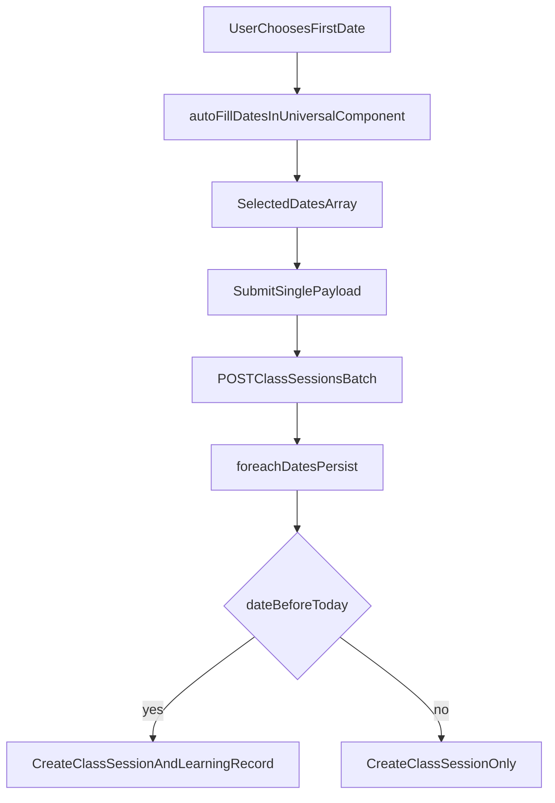

# Universal Scheduler Hard-Cut Refactor

## Goal

Replace all legacy schedule/backfill creation flows with one shared frontend component and one new backend write API:

- Frontend computes and submits `dates[]` (multi-select + weekly auto-fill)
- Backend only persists by iterating dates; no date generation logic
- Historical dates auto-create `LearningRecord`; future dates only create `ClassSession`

## Current Baseline (to replace)

- Frontend creation flows are fragmented across:
  - [StudentsList.vue](/home/admin/frontend/src/pages/StudentsList.vue)
  - [CourseManagement.vue](/home/admin/frontend/src/pages/CourseManagement.vue)
  - [SmartCalendar.vue](/home/admin/frontend/src/pages/SmartCalendar.vue)
  - Existing shared form: [CourseEditForm.vue](/home/admin/frontend/src/components/CourseEditForm.vue)
- Backend currently still generates sessions in [StudentClassController.php](/home/admin/backend/app/Http/Controllers/StudentClassController.php) (`buildSessionsFromWeeklySchedule`, `buildSessionsForCount`) and creates historical records in multiple endpoints.

## Target Architecture

## Implementation Plan

1. **Create shared scheduler component**
  - Add [UniversalClassScheduler.vue](/home/admin/frontend/src/components/UniversalClassScheduler.vue).
  - Unified fields: `selected_dates[]`, `total_classes`, `days_of_week[]`, `start_time`, `duration_minutes`, `teacher_id`, `student_id`, `subject`, `class_type`, `price_per_session`, `payment_type`, `room_id`.
  - End time is computed only (`start_time + duration_minutes`) and displayed read-only.
2. **Implement smart auto-fill algorithm in frontend**
  - In `UniversalClassScheduler`, implement `autoFillDates(startDate)`:
    - seed first date into `selected_dates`
    - iterate day-by-day forward, include dates whose weekday is in `days_of_week`
    - stop when `selected_dates.length === total_classes`
  - Keep dates user-editable after auto-fill (remove holiday date + add replacement date).
  - Define weekday convention explicitly as `1..7 (Mon..Sun)` to match existing UI usage.
3. **Create new hard-cut backend endpoint (single write contract)**
  - Add route in [api.php](/home/admin/backend/routes/api.php): `POST /api/v1/class-sessions/batch`.
  - New controller method in [ClassSessionController.php](/home/admin/backend/app/Http/Controllers/ClassSessionController.php) (or dedicated request/controller):
    - validate payload (including `dates` array)
    - create or link `StudentClass` record from form data (if required by current domain)
    - `foreach ($request->dates as $date)` create `ClassSession`
    - if historical date then also create corresponding `LearningRecord`
  - No weekly/date projection in backend.
4. **Remove legacy write paths from UI pages (hard cut)**
  - Replace old form sections and submit handlers with `UniversalClassScheduler` in:
    - [StudentsList.vue](/home/admin/frontend/src/pages/StudentsList.vue)
    - [CourseManagement.vue](/home/admin/frontend/src/pages/CourseManagement.vue)
    - [SmartCalendar.vue](/home/admin/frontend/src/pages/SmartCalendar.vue)
  - Eliminate old mixed writes (`/api/v1/student-classes` creation for scheduling, `bulk-backdoor-approve` for backfill, and Supabase direct inserts for scheduling creation).
5. **Deprecate old backend scheduling/backfill write endpoints in hard-cut mode**
  - Keep read endpoints unchanged.
  - Remove/disable creation entry points now superseded by batch API (at minimum stop frontend usage and guard old endpoints with clear `410/422` message for safety).
  - Explicitly stop backend date generation branches in `StudentClassController@store/sync` for scheduling creation path.
6. **Align contracts and mapping layer**
  - Add frontend API wrapper (e.g. `frontend/src/lib/universalSchedulerApi.js`) for the new endpoint.
  - Normalize duration unit (minutes) and storage conversion (`EndTime` from computed minutes).
  - Ensure branch/campus scoping and role guards remain enforced (`require_campus`, teacher/director rules).
7. **Regression tests (backend first)**
  - Add feature tests under [tests/Feature](/home/admin/backend/tests/Feature):
    - batch create with explicit `dates[]`
    - historical dates create LR, future dates do not
    - no backend auto-generated extra dates
    - branch authorization and teacher/director permission checks
  - Update/remove tests coupled to old creation semantics where intentionally retired.
8. **Frontend verification + lint pass**
  - Validate manual scenarios: first-click auto-fill, holiday manual replacement, partial manual edits, submit success/failure UX.
  - Run lint checks for touched Vue files and backend feature tests for new endpoint.

## Key Design Decisions Locked

- Rollout: **hard cut full replacement**
- API strategy: **new dedicated batch endpoint only**
- Date ownership: **frontend computes final `dates[]`; backend only writes**

## Migration Safety Notes

- Existing records remain untouched; only creation flow changes.
- Preserve read APIs (`/class-sessions`, dashboards, reports) to reduce blast radius.
- Add temporary guard responses on retired write routes so accidental calls fail fast with actionable messages.

