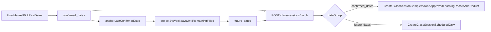

# UniversalClassScheduler Hybrid Refactor Plan

## Goal

Make the shared scheduler follow the new operating model exactly:

- Manual selection is only for already-taught historical dates.
- System projects remaining sessions into future dates by selected weekdays.
- Payload explicitly separates `confirmed_dates` and `future_dates`.
- Backend applies different write/audit/deduction behavior per group.

## Current Gaps To Close

- UI is still dense and single-flow (`selected_dates`) in [UniversalClassScheduler.vue](/home/admin/frontend/src/components/UniversalClassScheduler.vue).
- API contract still expects `dates[]` in [universalSchedulerApi.js](/home/admin/frontend/src/lib/universalSchedulerApi.js) and [ClassSessionController.php](/home/admin/backend/app/Http/Controllers/ClassSessionController.php).
- Backend historical handling currently creates `LearningRecord` as `pending`, not auto-approved + deduction.
- Existing tests in [ClassSessionBatchApiTest.php](/home/admin/backend/tests/Feature/ClassSessionBatchApiTest.php) validate old contract only.

## Target Flow

## Frontend Refactor

1. **Rebuild component layout and visual hierarchy** in [UniversalClassScheduler.vue](/home/admin/frontend/src/components/UniversalClassScheduler.vue)

- Use card-based sections with larger spacing.
- Split into two clear zones (left: field configuration, right: calendar preview/legend; mobile stacks vertically).
- Add distinct visual legend and chips for two date types.

1. **Update date interaction model** in [UniversalClassScheduler.vue](/home/admin/frontend/src/components/UniversalClassScheduler.vue)

- Calendar click toggles only `confirmed_dates`.
- Enforce manual picks as historical dates only (default rule: `<= today`; if date is future, block with message).
- Auto-calculate `future_dates` from max confirmed date + weekdays until `total_classes` is reached.
- Keep deterministic sorting and de-duplication.

1. **Visual distinction on calendar** in [UniversalClassScheduler.vue](/home/admin/frontend/src/components/UniversalClassScheduler.vue)

- `confirmed_dates`: green badge/state.
- `future_dates`: blue badge/state.
- Show counters: confirmed / projected / total.

1. **Time picker constraint** in [UniversalClassScheduler.vue](/home/admin/frontend/src/components/UniversalClassScheduler.vue)

- Keep `step=1800` and add normalization guard before submit to ensure only `:00` or `:30`.

1. **Switch API payload contract** in [universalSchedulerApi.js](/home/admin/frontend/src/lib/universalSchedulerApi.js) + submit block in [UniversalClassScheduler.vue](/home/admin/frontend/src/components/UniversalClassScheduler.vue)

- Send:
  - `confirmed_dates: string[]`
  - `future_dates: string[]`
  - `total_classes`
  - existing course metadata fields
- Client-side validate `confirmed + future === total_classes`.

## Backend Refactor

1. **Change request schema and processing path** in [ClassSessionController.php](/home/admin/backend/app/Http/Controllers/ClassSessionController.php)

- Replace required `dates[]` validation with required `confirmed_dates[]` and `future_dates[]`.
- Normalize + de-duplicate both arrays and reject overlaps.
- Validate count sum equals `total_classes`.

1. **Per-group write logic in one transaction** in [ClassSessionController.php](/home/admin/backend/app/Http/Controllers/ClassSessionController.php)

- `confirmed_dates`:
  - create `ClassSession` with attended/completed status.
  - create/update `LearningRecord` with approved status.
  - mark approval metadata (`ApprovedBy`, `ApprovedAt`) from current auth user.
  - execute deduction via existing approved-record deduction path (align with [SessionDeductionService.php](/home/admin/backend/app/Services/SessionDeductionService.php) behavior).
- `future_dates`:
  - create `ClassSession` with scheduled status.
  - never create `LearningRecord`.

1. **Subject-unit accounting alignment** in [ClassSessionController.php](/home/admin/backend/app/Http/Controllers/ClassSessionController.php)

- Ensure auto-approved records are counted by current subject-unit computation path (do not set exclusion flag used for “do not count” cases).
- Return response summary split by group (created confirmed sessions, created future sessions, created/approved learning records, deductions applied).

1. **Keep guardrails unchanged**

- Preserve role/campus/teacher restrictions already in [ClassSessionController.php](/home/admin/backend/app/Http/Controllers/ClassSessionController.php).
- Keep room-campus validation and student-campus consistency checks.

## Integration Touch Points

- Ensure all three entry pages still work without API drift:
  - [StudentsList.vue](/home/admin/frontend/src/pages/StudentsList.vue)
  - [CourseManagement.vue](/home/admin/frontend/src/pages/CourseManagement.vue)
  - [SmartCalendar.vue](/home/admin/frontend/src/pages/SmartCalendar.vue)
- These pages already mount the shared component; only callback messaging/count text may need minor adaptation.

## Test Plan

1. **Update/extend backend feature tests**

- Modify/add cases in [ClassSessionBatchApiTest.php](/home/admin/backend/tests/Feature/ClassSessionBatchApiTest.php):
  - accepts split payload (`confirmed_dates`, `future_dates`).
  - confirmed creates approved records + session deduction.
  - future creates scheduled sessions only.
  - overlap/mismatched counts rejected.
  - campus and teacher permission checks remain intact.

1. **Regression safety around deduction**

- Re-run and adapt relevant assertions in [LearningRecordApprovalDeductionTest.php](/home/admin/backend/tests/Feature/LearningRecordApprovalDeductionTest.php) to ensure no double-deduction regression.

1. **Frontend sanity validation**

- verify manual historical selection, projected future list, legend colors, and half-hour start-time enforcement.

## Risks & Mitigations

- **Deduction double-count risk**: reuse existing approved-record deduction guard (`SessionDeducted` + sign-in check) and add tests.
- **Status compatibility risk**: use session statuses already consumed by existing pages (`scheduled/attended/completed`) and verify list rendering.
- **Contract migration risk**: update frontend and backend in one change set; remove old `dates[]` dependency in tests.

