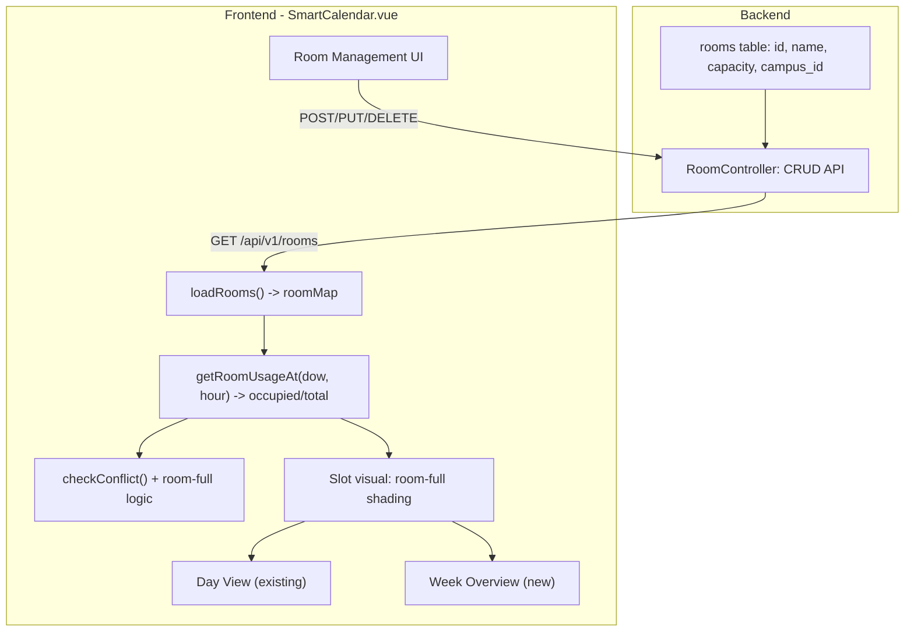

# Week Overview Mode + Room Capacity for Smart Calendar

## Problems

1. The current UI shows only one day at a time (via day tabs). When rescheduling, users cannot see which days/times are available across the week, making it hard to decide where to move a course.
2. There is no room capacity tracking -- users can schedule courses into a time slot even when all physical classrooms are full.

## Solution Overview

Two interconnected features:

- **Part A -- Room Capacity System**: A `rooms` table in the database with `name` and `capacity` (max simultaneous teachers). The frontend loads rooms, and checks room availability when adding/rescheduling. If all rooms are full at a time slot, the slot is visually marked and scheduling is blocked.
- **Part B -- Week Overview Mode**: A Day/Week toggle within the existing view. The week overview shows one selected teacher's full 7-day schedule, enabling direct cross-day drag-and-drop rescheduling. Room-full slots are visually indicated so users can instantly see where capacity is available.

## Architecture



---

## Part A: Room Capacity System

### A1. Backend -- Migration + Model + Controller + Routes

**Migration** (`backend/database/migrations/2026_03_03_000001_create_rooms_table.php`):

```php
Schema::create('rooms', function (Blueprint $table) {
    $table->id();
    $table->unsignedInteger('campus_id');
    $table->string('name', 64);
    $table->unsignedInteger('capacity')->default(1);
    $table->timestamps();
});
```

**Model** (`backend/app/Models/Room.php`): standard Eloquent with `fillable = ['campus_id', 'name', 'capacity']`.

**Controller** (`backend/app/Http/Controllers/RoomController.php`): basic CRUD scoped by `campus_id` (same as `branch_id`).

**Routes** in [backend/routes/api.php](backend/routes/api.php), inside the `role:director, require_campus` middleware group (line ~164):

```php
Route::get('rooms', [RoomController::class, 'index']);
Route::post('rooms', [RoomController::class, 'store']);
Route::put('rooms/{room}', [RoomController::class, 'update']);
Route::delete('rooms/{room}', [RoomController::class, 'destroy']);
```

### A2. Frontend -- Room Management UI

Add a small management section (collapsible panel or modal triggered from toolbar) in [SmartCalendar.vue](frontend/src/pages/SmartCalendar.vue):

- List existing rooms for the current branch (name + capacity + edit/delete buttons)
- "Add room" form: name input + capacity number input
- Uses `supabase.from('rooms')` calls (which proxy to the Laravel API)

### A3. Frontend -- Load Rooms + Room Map

In the `loadCourses` area (~line 1212), add `loadRooms()`:

```javascript
const rooms = ref([]);
const roomMap = computed(() => {
  const map = new Map();
  rooms.value.forEach(r => map.set(String(r.id), r));
  return map;
});

const loadRooms = async () => {
  const { data } = await supabase.from('rooms').select('*').eq('campus_id', props.branchId);
  rooms.value = data || [];
};
```

Call `loadRooms()` alongside `loadCourses()` in the existing `onMounted` / `watch`.

### A4. Frontend -- Room Capacity Check

**Core helper** -- count how many distinct teachers are teaching at a given day+hour across all courses, then compare against total room capacity:

```javascript
const getRoomUsageAt = (dow, hour) => {
  const totalCapacity = rooms.value.reduce((sum, r) => sum + r.capacity, 0);
  const teachersAtSlot = new Set();
  filteredCourses.value.forEach(c => {
    if (c.day_of_week !== dow) return;
    const cStart = parseHour(c.start_time);
    const cEnd = cStart + (c.duration_hours || 1);
    if (hour >= cStart && hour < cEnd) {
      teachersAtSlot.add(c.teacher_id);
    }
  });
  return { occupied: teachersAtSlot.size, totalCapacity, isFull: teachersAtSlot.size >= totalCapacity };
};
```

**Integrate into `checkConflict()`** (line ~1391): after the existing teacher-capacity check, add a room-full check:

```javascript
const usage = getRoomUsageAt(dow, startH);
if (usage.isFull && !existingTeachersAtSlot.has(tid)) {
  conflictWarning.value = `${dayLabel(dow)} ${modalForm.value.start_time} 所有教室已滿（${usage.occupied}/${usage.totalCapacity}），無法排課`;
  return;
}
```

**Visual indicator**: add a CSS class `.slot-room-full` (red-tinted background) to slots where `getRoomUsageAt().isFull` is true. This applies to both Day View and Week Overview.

---

## Part B: Week Overview Mode

### B1. New Reactive State

Add to script (~line 693):

```javascript
const isWeekOverview = ref(false);
const weekViewTeacherId = ref('');
```

With a `watch` to auto-select the first teacher:

```javascript
watch(isWeekOverview, (val) => {
  if (val && !weekViewTeacherId.value && visibleTeachers.value.length) {
    weekViewTeacherId.value = visibleTeachers.value[0].id;
  }
});
```

### B2. Toggle Button in Toolbar

Inside `.smart-cal-toolbar` (line ~23), add a Day/Week toggle:

```html
<div class="view-sub-toggle">
  <button :class="{ active: !isWeekOverview }" @click="isWeekOverview = false">日檢視</button>
  <button :class="{ active: isWeekOverview }" @click="isWeekOverview = true">週檢視</button>
</div>
```

When `isWeekOverview` is true, show a teacher dropdown instead of the room filter / teacher search:

```html
<select v-model="weekViewTeacherId" class="filter-select">
  <option v-for="t in visibleTeachers" :key="t.id" :value="t.id">
    {{ t.username }} ({{ t.roomLabel || '---' }})
  </option>
</select>
```

### B3. Week Overview Template

Within the `viewMode === 'week'` block, wrap the existing day-tabs + teacher-grid in `v-if="!isWeekOverview"` and add the week overview as `v-else`:

- **Grid**: CSS Grid with `60px` time column + `repeat(7, 1fr)` day columns
- **Day column headers**: day name + date + badge (course count for that teacher on that day)
- **Slots**: reuse existing `.slot` and `.course-block` styles. Each slot calls `getCoursesForWeekCell(dow, hour)`.
- **Room-full indicator**: slots where all rooms are full show `.slot-room-full` background
- **Drag-and-drop**: existing `onSlotDrop(dow, h, targetDate, teacherId)` already handles cross-day moves since each day column passes the correct `getDisplayDateFull(idx + 1)`
- **Click empty slot**: calls `onSlotClick(dow, h, dateStr, weekViewTeacherId)` to pre-fill the add modal
- **Right-click**: calls `onCourseRightClick` as before

### B4. Helper Functions

```javascript
const getCoursesForWeekCell = (dow, hour) => {
  return filteredCourses.value.filter(c =>
    c.teacher_id === weekViewTeacherId.value &&
    c.day_of_week === dow &&
    parseHour(c.start_time) === hour
  );
};

const getWeekTeacherDayCount = (dow) => {
  return filteredCourses.value.filter(c =>
    c.teacher_id === weekViewTeacherId.value && c.day_of_week === dow
  ).length;
};
```

### B5. CSS

- `.week-overview-grid`: `display: grid; grid-template-columns: 60px repeat(7, 1fr);`
- `.day-col-header`: 64px height, day name + date + badge
- `.day-col`: reuses `.slot` (56px height) and `.course-block` styles
- `.slot-room-full`: `background: repeating-linear-gradient(...)` subtle red hatch pattern to indicate full rooms
- `.view-sub-toggle`: pill-shaped toggle button group
- Sticky time column and horizontal scroll wrapper for narrow screens

