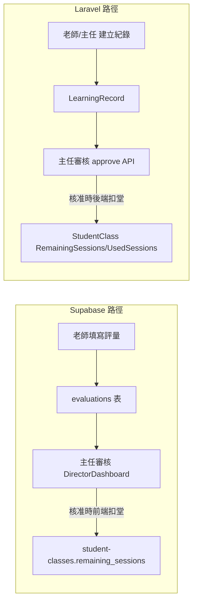

# 排課與評量／堂數邏輯檢查計畫

## 1. 目前架構：兩套評量與堂數來源

系統裡同時存在兩條互不串接的評量與扣堂路徑：

- **Supabase 路徑**：老師在 [TeacherEvaluation.vue](frontend/src/pages/TeacherEvaluation.vue) 依 `schedule_id` 填寫評量 → 寫入 `evaluations`（status: pending）→ 主任在 [DirectorDashboard.vue](frontend/src/pages/DirectorDashboard.vue) 核准 → **前端**在 `approveEvaluation` 裡扣 `student-classes.remaining_sessions`。
- **Laravel 路徑**：老師或主任在 [LearningRecordsPage.vue](frontend/src/pages/LearningRecordsPage.vue) 呼叫 `/api/v1/learning-records` 建立 LearningRecord（status: pending）→ 主任呼叫 `POST /api/v1/learning-records/{id}/approve` → **後端** [LearningRecordController::approve](backend/app/Http/Controllers/LearningRecordController.php) 內執行 `deductRemainingSessions()`，堂數制扣 `RemainingSessions`，月結只加 `UsedSessions`。

兩條路徑若對應不同資料庫（例如 Supabase 用 PostgreSQL、Laravel 用 MySQL），則「今日排課／評量審核」與「學習紀錄／科目數統計」的堂數會不一致，需先釐清是否要統一資料來源或做同步。

---

## 2. 需求對照與現況

| 需求                         | 現況                                                                                                                                                                                                                     | 結論                                                                    |
| -------------------------- | ---------------------------------------------------------------------------------------------------------------------------------------------------------------------------------------------------------------------- | --------------------------------------------------------------------- |
| **時間到要填寫評量表**              | 老師依 schedule 填寫評量，未檢查「是否已到該節課時間」                                                                                                                                                                                       | 可選：僅在「該節 schedule_date + end_time 已過」時才允許填寫或顯示填寫入口。                   |
| **補登：老師填無評量表 → 主任審核通過才扣堂** | 補登目前只有「主任專用補登」：LearningRecordsPage 的「補登空白評量」呼叫 `backdoor-approve`，**主任直接建立已核准紀錄並扣堂**，沒有老師提交、主任再審核的步驟。                                                                                                                  | **不符需求**。應改為：老師可提交一筆「無評量表／補登」的待審紀錄，主任審核通過後才觸發扣堂。                      |
| **堂數制：主任審核通過才扣堂**          | **Laravel**：`approve()` 內才呼叫 `deductRemainingSessions()`，扣堂僅在審核通過後。**Supabase**：`approveEvaluation` 在主任按核准後才扣 `remaining_sessions`。                                                                                    | **符合**。                                                               |
| **月結：主任審核過後才加課堂數**         | **Laravel**：`deductRemainingSessions()` 對所有審核通過的紀錄都會 `UsedSessions += 1`；僅當 `ScheduleMode === 'count'` 才扣 `RemainingSessions`。月結（ScheduleMode 非 count）已是「審核通過才計課」。                                                     | **符合**。                                                               |
| **Supabase 路徑的月結**         | [DirectorDashboard.vue](frontend/src/pages/DirectorDashboard.vue) 的 `approveEvaluation` **一律**依 `schedule.student_course_id` 或 student_id+subject 扣 `student-classes.remaining_sessions`，**未區分 payment_type（堂數制／月結）**。 | **不符**。月結課程不應扣 `remaining_sessions`，僅應「計課」（若有 UsedSessions 或等同欄位再考慮）。 |

---

## 3. 後端邏輯重點（Laravel）

- **扣堂／計課時機**  
  - [LearningRecordController::approve](backend/app/Http/Controllers/LearningRecordController.php)（約 229–257 行）：僅在主任審核通過時呼叫 `deductRemainingSessions()` 並增加老師業績。  
  - [deductRemainingSessions](backend/app/Http/Controllers/LearningRecordController.php)（343–375 行）：  
    - 每筆審核通過都會 `UsedSessions += 1`（月結等同「主任審核過後才加課堂數」）。  
    - 僅當 `ScheduleMode === 'count'` 時才扣 `RemainingSessions`。
- **補登後門**  
  - [backdoorApprove](backend/app/Http/Controllers/LearningRecordController.php)（260–301 行）：主任一次完成建立 ClassSession、LearningRecord（已核准）並扣堂，**沒有老師填寫、主任再審核**的流程，與「老師填無評量表，主任審核通過才扣堂」不符。

---

## 4. 建議修正項目

### 4.1 補登：改為「老師填無評量表 → 主任審核才扣堂」

- **選項 A（沿用 Laravel 學習紀錄）**  
  - 新增「老師端補登／無評量表」流程：老師可建立一筆 **pending** LearningRecord（內容為「無評量表／補登」或固定說明），不呼叫 `backdoor-approve`。  
  - 主任在既有學習紀錄審核列表核准該筆 → 現有 `approve()` 會觸發 `deductRemainingSessions()`，達成「主任審核通過後才扣堂」。  
  - `backdoor-approve` 保留給「主任代補登、不經老師」的特殊情境（例如異常曠課強制扣堂），並在 API/UI 註明用途。
- **選項 B（沿用 Supabase 評量）**  
  - 若實際使用以 DirectorDashboard + evaluations 為主：可讓老師對某個 schedule 提交「補登／無評量表」（例如勾選「無評量表」或內容可為空），寫入 `evaluations` 且 status pending。  
  - 主任在總覽核准後，沿用現有 `approveEvaluation` 扣堂邏輯，但需同時區分月結（見下）。

實作時需擇定以 **Laravel** 或 **Supabase** 為單一真相來源，或明確定義兩者對應關係，避免堂數雙邊不一致。

### 4.2 Supabase 路徑：月結不扣 remaining_sessions

- 在 [DirectorDashboard.vue](frontend/src/pages/DirectorDashboard.vue) 的 `approveEvaluation` 中，取得對應的 `student-classes` 時一併讀取 `payment_type`。  
- 僅當 `payment_type === 'session'`（堂數制）時才執行 `remaining_sessions` 的減少。  
- 月結（`payment_type === 'monthly'`）：不更新 `remaining_sessions`；若 Supabase 有「已上課堂數」或等同欄位，可於審核通過時加 1，否則僅更新 schedule 狀態亦可。

### 4.3 時間到才填評量（可選）

- **Supabase**：老師填寫評量時，可依 `schedule.schedule_date` + `schedule.end_time` 判斷是否已過該節結束時間，僅在「已過」時允許送出或顯示填寫入口。  
- **Laravel**：若學習紀錄有對應的 ClassSession/SessionDate，可同樣以「該節結束時間已過」為條件限制建立或顯示。

---

## 5. 小結與建議實作順序

1. **強烈建議**
  - **月結**：Supabase 路徑的 `approveEvaluation` 區分 `payment_type`，月結不扣 `remaining_sessions`。  
  - **補登**：改為「老師提交無評量表（pending）→ 主任審核通過才扣堂」；若用 Laravel，則新增老師建立補登用 LearningRecord 的入口，並保留 backdoor 僅供主任代補登。
2. **建議釐清**
  - 實際對外使用的評量與堂數是 **Supabase（evaluations + student-classes）** 還是 **Laravel（LearningRecord + StudentClass）**，或兩者並存但需同步。這會決定補登與月結邏輯要優先改哪一條路徑、以及是否要做雙邊同步。
3. **可選**
  - 「時間到才可填寫評量表」：在前端或後端加上「該節結束時間已過」的檢查。

以上為後端與前後端聯動的排課／評量／堂數邏輯檢查與修正方向，未改動任何程式碼，僅供實作前確認與排程。

---

## 6. 已實作：點名後扣課 + 評量通過加科目數

規格已定並完成實作（見 plan「點名後扣課與評量科目數」）：

- **點名規則**：老師、主任可點名；僅**該節結束後**才可點名；點名可先做，評量可後補。
- **扣堂規則**：**點名成功才扣堂**（唯一觸發點）。堂數制扣 `RemainingSessions`，月結只加 `UsedSessions`。扣堂邏輯共用於 [SessionDeductionService](backend/app/Services/SessionDeductionService.php)，由 [AttendanceController::store](backend/app/Http/Controllers/AttendanceController.php)（手動點名）與 [SwipeRfidController](backend/app/Http/Controllers/SwipeRfidController.php)（刷卡）觸發。
- **評量審核**：主任審核評量通過時**不扣堂**，僅增加老師科目數（`User.TeachingSessionCount`），見 [LearningRecordController::approve](backend/app/Http/Controllers/LearningRecordController.php)。

前端「依節次點名」：出缺勤管理頁 [AttendancePage.vue](frontend/src/pages/AttendancePage.vue) 提供「依節次點名」入口，呼叫 `GET /api/v1/attendance/ended-sessions` 取得已結束且尚未點名節次，送出時 `POST /api/v1/attendance` 帶 `ClassSessionID`、`StudentID`、`StudentClassID`、`Status`，後端驗證該節已結束後才寫入並觸發扣堂。