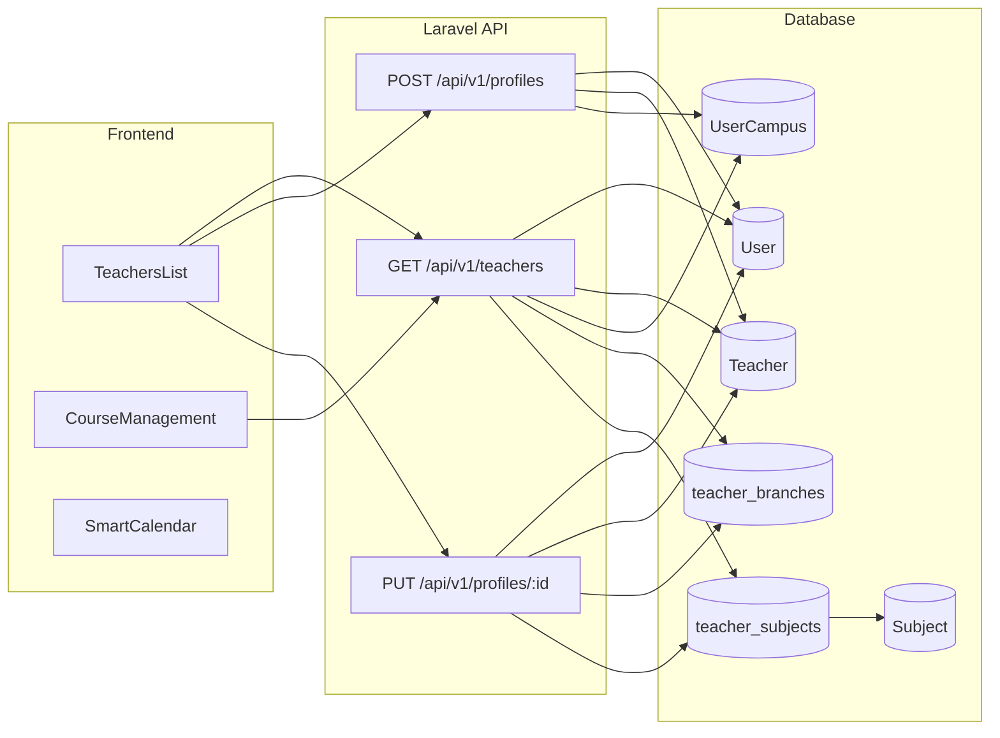

# 老師管理改為 Laravel 單一資料源

## 現況摘要

- **前端** [TeachersList.vue](frontend/src/pages/TeachersList.vue)：老師列表與新增/編輯主要讀寫 **Supabase** `profiles`（role=teacher）與 `teacher_branches`；RFID 另打 Laravel `GET/PUT /api/v1/profiles`。有分校切換、正式/待審核分頁、主分校與跨校支援、核准。
- **後端**：`GET /api/v1/teachers` 為 [ProfileController::index](backend/app/Http/Controllers/ProfileController.php) 別名（role=teacher）。[ProfileController](backend/app/Http/Controllers/ProfileController.php) 的 index 回傳 id、username、role、branch_id、branch_ids、status、phone、teaching_session_count；store/update 處理 User + UserCampus + Teacher（僅 T_Name）、multi_branches 寫入 `teacher_branches`。**未**回傳/寫入：rfid、line_id、可授課科目；update 未寫入 Teacher.RFID。
- **資料**：老師主體在 Laravel `User` + `Teacher`（[Teacher](backend/app/Models/Teacher.php) 表含 Phone、LineID、RFID）+ `UserCampus` + `teacher_branches`。科目為 [Subject](backend/database/migrations/2026_02_07_000006_create_subjects_table.php) 表；目前**無**老師–科目關聯表。
- **課程/日曆**：[CourseManagement.vue](frontend/src/pages/CourseManagement.vue) 老師下拉來自 Supabase `profiles`；[SmartCalendar.vue](frontend/src/pages/SmartCalendar.vue) 使用課程中的 teacher_id。兩頁皆無「從外部帶入預設老師」的 prop。

## 一、後端：API 與資料

### 1.1 可授課科目

- 新增 migration：`teacher_subjects`（`teacher_id` FK to User.id，`subject_id` FK to Subject.id，unique(teacher_id, subject_id)）。
- [ProfileController::index](backend/app/Http/Controllers/ProfileController.php)：對老師（type=T）查詢 `teacher_subjects` 與 `Subject`，在 transform 中加上 `subject_ids`（陣列）、`subject_names`（陣列，供列表顯示）。支援 query 參數 `subject_id`（篩選可教該科目的老師）。
- [ProfileController::store](backend/app/Http/Controllers/ProfileController.php)：接受選填 `subject_ids`（陣列），建立老師後寫入 `teacher_subjects`。
- [ProfileController::update](backend/app/Http/Controllers/ProfileController.php)：接受選填 `subject_ids`，以 sync 邏輯更新 `teacher_subjects`（僅限 type=T）。

### 1.2 電話、Line、RFID

- [ProfileController::index](backend/app/Http/Controllers/ProfileController.php)：對 type=T 左連接 `Teacher`，回傳 `phone`（Teacher.Phone 或 User.phone 後備）、`line_id`（Teacher.LineID）、`rfid`（Teacher.RFID）。
- [ProfileController::store](backend/app/Http/Controllers/ProfileController.php)：接受選填 `phone`、`line_id`；建立 Teacher 時寫入 Phone、LineID。
- [ProfileController::update](backend/app/Http/Controllers/ProfileController.php)：接受選填 `phone`、`line_id`、`rfid`；若 type=T，更新 `Teacher` 表對應欄位（RFID 目前未在 update 中寫入，需補上）。

### 1.3 列表篩選與搜尋

- [ProfileController::index](backend/app/Http/Controllers/ProfileController.php) 已支援 `username__ilike`、`role`、campus 過濾。新增：
  - `q`：搜尋姓名（Name）或電話（Teacher.Phone / User.phone），任一符合即保留。
  - `status`：依 User.status 篩選（active / pending / suspended）。
  - `subject_id`：依 `teacher_subjects` 篩選可教該科目的老師。
- 回傳格式保持與現有一致，僅增加欄位；`branch_ids` 需為該老師所有可授課分校（UserCampus 的 CampusID 集合），與現有權限一致。

### 1.4 權限與一致性

- 列表與寫入皆沿用現有 `auth_campus_ids` / `require_campus`；排課與 StudentClass 的 TeacherID 仍對應 User.id，不需改動。

## 二、前端：TeachersList 改打 Laravel

### 2.1 資料來源改為 Laravel

- [TeachersList.vue](frontend/src/pages/TeachersList.vue)：移除對 Supabase `profiles`、`teacher_branches` 的讀寫。
- **列表**：改為 `GET /api/v1/teachers`（或 `GET /api/v1/profiles?role=teacher`）並帶入 `branch_id`（當前分校）、`q`、`status`、`subject_id`。回傳已含 branch_id、branch_ids、phone、line_id、rfid、subject_ids、subject_names、status。
- **新增老師**：改為 `POST /api/v1/profiles`，body 含 name、email、password、role=teacher、campus_id（主分校）、branch_id、multi_branches（陣列）、status、phone、line_id、subject_ids、rfid（若後端接受）。主分校與跨校邏輯與現有 [ProfileController::store](backend/app/Http/Controllers/ProfileController.php) 一致（campus_id + UserCampus + teacher_branches）；需在 store 中支援 multi_branches、phone、line_id、subject_ids。
- **編輯**：改為 `PUT /api/v1/profiles/{id}`，body 含 username、branch_id、multi_branches、status、phone、line_id、subject_ids、rfid。
- **核准**：改為 `PUT /api/v1/profiles/{id}`，只送 `status: 'active'`（或後端提供專用欄位）。

### 2.2 列表 UI

- 表格欄位：姓名、主分校、跨校支援、**電話**、**可授課科目**（subject_names 顯示）、RFID、狀態、操作（編輯、核准、綁定 RFID）。
- 上方新增：**搜尋框**（v-model 綁定 `q`，請求時帶入）、**篩選**：分校（沿用現有 branchId）、狀態（全部/active/pending/suspended）、**科目**（下拉，選自 Subject 列表；呼叫 `GET /api/v1/...` 取得科目列表，若現有 API 無則後端新增簡易 `GET /api/v1/subjects`）。
- 保留正式/待審核分頁；RFID 綁定流程可沿用現有 temp-rfid 取得方式，僅將寫入改為 PUT profiles。

### 2.3 編輯表單

- 在現有姓名、主分校、跨校支援、狀態、RFID 外，新增欄位：**電話**、**Line**（對應 line_id）、**可授課科目**（多選，選項來自 Subject API）。

### 2.4 「課表」連結

- 在每列操作區新增按鈕「課表」（或「課程」）。
- 點擊時：切換到課程管理或智慧排課，並**預設篩選該老師**。因 [App.vue](frontend/src/App.vue) 以 `active` 切換頁面、無 Vue Router，做法建議：
  - 在 App.vue 新增 ref（例如 `initialTeacherIdForNav`）與切換函式（例如 `navigateToSchedule(teacherId, target: 'course-mgmt' | 'calendar')`），由 TeachersList 透過 **emit** 或 **provide/inject** 呼叫。
  - 切換時設定 `active = 'course-mgmt'` 或 `active = 'calendar'`，並設定 `initialTeacherIdForNav = teacherId`。
  - [CourseManagement.vue](frontend/src/pages/CourseManagement.vue) 與 [SmartCalendar.vue](frontend/src/pages/SmartCalendar.vue) 新增 prop（例如 `initialTeacherId`），接收後在 onMounted/watch 將 filters.teacher_id 或對應篩選設為該值，並可選擇清空 `initialTeacherIdForNav` 避免下次進入仍強制篩選。

## 三、其他依賴老師列表的頁面

- [CourseManagement.vue](frontend/src/pages/CourseManagement.vue)：目前從 Supabase `profiles` 載入老師下拉。改為 `GET /api/v1/teachers`（或 profiles?role=teacher）取得列表，以維持與老師管理同一資料源。
- [StudentsList.vue](frontend/src/pages/StudentsList.vue)、[SmartCalendar.vue](frontend/src/pages/SmartCalendar.vue)、[LearningRecordsPage.vue](frontend/src/pages/LearningRecordsPage.vue) 等若有用到老師名單，一併改為從 Laravel API 取得（共用同一 API 與權限）。

## 四、資料流示意

## 五、實作順序建議

1. **後端**：migration `teacher_subjects`；擴充 ProfileController index（join Teacher、teacher_subjects + Subject，回傳 phone、line_id、rfid、subject_ids、subject_names，支援 q、status、subject_id）；擴充 store/update（phone、line_id、rfid、subject_ids，並在 update 寫入 Teacher.RFID）。若有需要，新增 `GET /api/v1/subjects` 供前端科目下拉。
2. **前端 TeachersList**：改為僅呼叫 Laravel；加搜尋、狀態/科目篩選；表格與表單加入電話、科目、Line；保留分校、跨校、RFID、核准流程。
3. **課表連結**：App.vue 增加 initialTeacherIdForNav 與 navigateToSchedule；TeachersList 發起導向；CourseManagement、SmartCalendar 接受 initialTeacherId 並預設篩選。
4. **CourseManagement（及必要時其他頁）**：老師下拉改為 GET /api/v1/teachers。

## 六、關鍵檔案

| 用途            | 檔案                                                                          |
| ------------- | --------------------------------------------------------------------------- |
| 老師–科目關聯       | 新 migration `teacher_subjects`                                              |
| 老師 API 擴充     | [ProfileController.php](backend/app/Http/Controllers/ProfileController.php) |
| 科目列表 API（若新增） | [api.php](backend/routes/api.php) + 新或既有 Controller                         |
| 老師管理頁         | [TeachersList.vue](frontend/src/pages/TeachersList.vue)                     |
| 導航與預設老師       | [App.vue](frontend/src/App.vue)                                             |
| 課程管理老師篩選      | [CourseManagement.vue](frontend/src/pages/CourseManagement.vue)             |
| 日曆老師篩選        | [SmartCalendar.vue](frontend/src/pages/SmartCalendar.vue)                   |

