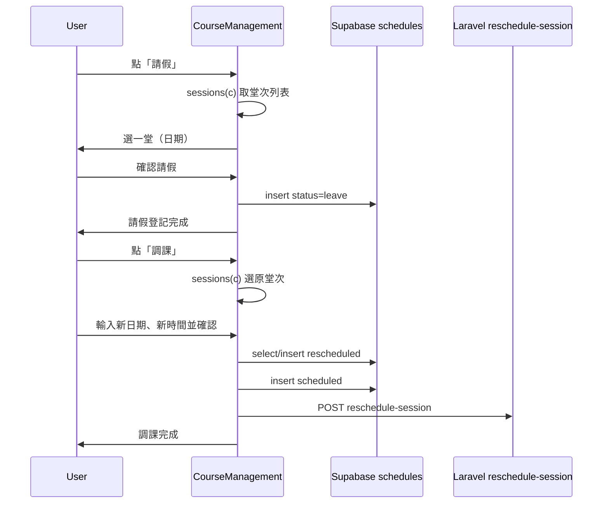

# 課程管理新增請假與調課

## 現況

- **課程管理** [frontend/src/pages/CourseManagement.vue](frontend/src/pages/CourseManagement.vue)：列表顯示所有課程，操作列僅有「編輯」「刪除」與「查看」上課日期；已有 `sessions(c)`（依 [sessionDates.js](frontend/src/lib/sessionDates.js) 計算每門課的實際上課日）、`branchId`、Supabase 與課程欄位。
- **智慧排課** [frontend/src/pages/SmartCalendar.vue](frontend/src/pages/SmartCalendar.vue)：請假寫入 `supabase.from('schedules').insert`（status: `leave`，deduction: 0）；調課寫入兩筆（原日 status: `rescheduled`，新日 status: `scheduled`，含 `original_schedule_id`），並可呼叫 `/api/v1/learning-records/reschedule-session` 同步 ClassSession。

## 設計要點

- **操作入口**：在課程表格的操作欄（目前為「編輯」「刪除」）新增「請假」「調課」兩顆按鈕；不改變現有編輯/刪除/查看行為。
- **請假流程**：點「請假」→ 開 modal「選擇要請假的堂次」→ 以該課程的 `sessions(c)` 列出選項（例：第 1 堂 2026-03-05、第 2 堂 2026-03-08…）→ 選一堂後顯示學生/科目/原時段（唯讀）、請假日期已帶入 → 確認後寫入 `schedules`（與 SmartCalendar 相同欄位），成功後關閉 modal、可選擇重新載入課程列表或僅提示完成。
- **調課流程**：點「調課」→ 開 modal「選擇要調動的堂次」→ 同樣用 `sessions(c)` 選一堂 → 顯示原日期/原時段（唯讀）、輸入「新日期」「新開始時間」→ 確認後先查詢是否已有該 course + 原日期的 `rescheduled` 列；若無則 insert 原日 rescheduled 並取得 id，若有則沿用既有 id，再 insert 新日 scheduled（帶 `original_schedule_id`）；若有 Laravel token 則呼叫 `reschedule-session`。邏輯與 SmartCalendar 的 `submitReschedule` 對齊，僅資料來源改為課程管理選中的課程與堂次。
- **資料與 API**：不新增後端 API；仍寫入 Supabase `schedules`（branch_id、student_course_id、schedule_date、status、student_id、teacher_id、subject、day_of_week、start_time、end_time、duration_hours、class_type 等），與智慧排課一致。若未來要改為 Laravel 寫入，可再抽共用或改打既有 Schedule API。

## 實作步驟

1. **操作列 UI**
  在 [CourseManagement.vue](frontend/src/pages/CourseManagement.vue) 表格操作欄的 `action-btns` 內，在「編輯」「刪除」前或後加入「請假」「調課」按鈕（例如 `small ghost` 樣式），點擊時帶入當前列課程 `c`。
2. **請假 Modal 與狀態**
  - 新增 `showLeaveModal`、`leaveForm`（含 student_id, subject, teacher_id, day_of_week, start_time, end_time, duration_hours, class_type, schedule_date, course_id）。  
  - 點「請假」時：先由 `sessions(c)` 取得堂次列表；若為空則提示「無可請假堂次」並 return；否則開第一層或單一 modal，讓使用者選擇「哪一堂」（顯示日期或「第 N 堂 YYYY-MM-DD」）。  
  - 選定後將該堂日期寫入 `leaveForm.schedule_date`，並從課程 `c` 帶入其餘欄位，顯示學生名、科目、原時段（可沿用既有 `dayLabel`、`getSubjectLabel`、學生名從 `c.student_name` 或依 student_id 查）。  
  - 送出時：`supabase.from('schedules').insert([{ ...leaveForm, status: 'leave', type: 'normal', deduction: 0, branch_id: props.branchId }])`，成功後關閉 modal、可 `loadCourses()` 更新列表（可選）、alert「請假登記完成」。
3. **調課 Modal 與狀態**
  - 新增 `showRescheduleModal`、`rescheduleForm`（含 student_id, teacher_id, subject, class_type, duration_hours, course_id, original_date, original_day, original_start, original_end, new_date, new_start）。  
  - 點「調課」時：同樣用 `sessions(c)` 選一堂；若為空則提示並 return。選定後帶入原日期、原 day_of_week（由 original_date 算出）、原 start/end、course_id 等。  
  - Modal 內容：學生、科目、原時段唯讀；新日期（input type="date"）、新開始時間（select 半小時一格，與編輯表單一致）；新結束時間以 `computeEndTime(new_start, duration_hours)` 顯示。  
  - 送出時：  
    - 查詢是否已有 `student_course_id === course_id && schedule_date === original_date && status === 'rescheduled'`（Supabase `schedules`）；若有則取該筆 id 為 originalId，若無則 insert 原日 rescheduled 一筆並取回 id。  
    - Insert 新日一筆（status: `scheduled`，deduction: 1，`original_schedule_id`: originalId，new_date, new_start, new_end, day_of_week 由 new_date 計算）。  
    - 若有 token，POST `/api/v1/learning-records/reschedule-session`（body 含 student_class_id, old_date, new_date, start_time, end_time）。
  - 成功後關閉 modal、可 `loadCourses()`、alert「調課完成」。
4. **共用與細節**
  - 時間選項可沿用 CourseManagement 既有的 `TIME_OPTIONS_30` 或與 SmartCalendar 相同之半小時格。  
  - `dayOfWeekFromDate`（由日期算星期幾）若 CourseManagement 尚未有，可從 SmartCalendar 複製或抽到共用 util。  
  - 日期比較若涉及 API 回傳值，可沿用 SmartCalendar 的 `toYmd` 概念，確保與 YYYY-MM-DD 字串比對一致。
5. **無需變更**
  - 後端不需新增 endpoint；智慧排課的請假/調課邏輯保留不刪，僅在課程管理多一份入口與 modal。  
  - 課程管理現有「查看」上課日期、編輯、刪除、補登等流程均不變。

## 流程概覽

## 檔案清單

| 項目  | 檔案                                                                                                                    |
| --- | --------------------------------------------------------------------------------------------------------------------- |
| 修改  | [frontend/src/pages/CourseManagement.vue](frontend/src/pages/CourseManagement.vue)（操作列、請假/調課 modal、form 狀態、submit 邏輯） |
| 可選  | 若將 `dayOfWeekFromDate`、`toYmd` 等抽成共用，可放在 `frontend/src/lib/` 再於兩頁 import                                              |

以上完成後，使用者可在課程管理頁直接對任一課程執行請假或調課，不必切到智慧排課；資料與智慧排課共用同一 `schedules` 表，兩邊行為一致。