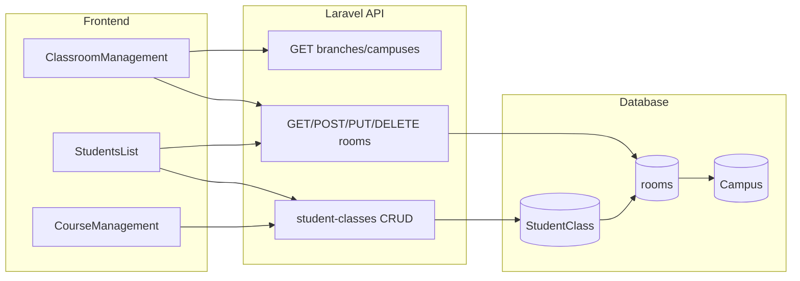

# 課程與教室管理前後端設計

## 現況摘要

- **前端**：Vue 3 + Vite，[App.vue](frontend/src/App.vue) 以 `active` 切換頁面（無 Vue Router）。課程列表與新增課程目前寫入 **Supabase** `student-classes`；學生/老師等則呼叫 Laravel `/api/v1/`*。
- **後端**：Laravel，[StudentClassController](backend/app/Http/Controllers/StudentClassController.php) 提供 `student-classes` CRUD、session-dates、sync。課程表 `StudentClass` 已有 `StartDate`、`ScheduleMode`（date/count）、`SessionCount`、`RemainingSessions`、`RoomID`（字串）；**無** 結算日、每月堂數、與 `rooms` 的關聯。
- **教室**：已有 [Room](backend/app/Models/Room.php)（`rooms` 表，`campus_id`、`name`、`capacity`）、[RoomController](backend/app/Http/Controllers/RoomController.php) CRUD，以及 [Campus](backend/app/Models/Campus.php)（分校）。教室尚無「備註、啟用狀態」欄位。

---

## 一、資料模型與 API

### 1.1 分校與教室（沿用並擴充）

- **分校**：沿用 `Campus`，不需改表。前端已用 [useBranches](frontend/src/lib/useBranches.js) 呼叫 `GET /api/v1/branches`（或 `campuses`）。
- **教室**：
  - 新增 migration：在 `rooms` 表加上 `memo`（nullable string）、`is_active`（boolean，預設 true）。
  - 更新 [Room](backend/app/Models/Room.php) 的 `$fillable` 與 `$casts`；[RoomController](backend/app/Http/Controllers/RoomController.php) 的 `store`/`update` 允許 `memo`、`is_active`。
  - 列表回傳已支援 `branch_id` 篩選（`GET /api/v1/rooms?branch_id=1`），無需改路由。

### 1.2 課程（StudentClass）擴充

- **新增欄位**（migration）：
  - `room_id`：nullable unsignedBigInteger，FK 到 `rooms.id`（教室；選填，相容既有 `RoomID`）。
  - `settlement_day`：nullable tinyInteger（1–28），月結「每月幾號結算」。
  - `monthly_sessions`：nullable unsignedInteger，月結「每月堂數」（選填）。
- **既有欄位**：`StartDate` 作為開課日；`ScheduleMode` 的 `date` = 月結、`count` = 堂數制；`SessionCount` / `RemainingSessions` 堂數制用；`Rate` 單價。
- **關聯**：StudentClass 新增 `belongsTo(Room::class)`；若存在 `room_id`，可透過 `room.campus` 取得分校名。

### 1.3 課程 API 行為

- **建立/更新**（[StudentClassController](backend/app/Http/Controllers/StudentClassController.php)）：
  - 接受 `room_id`（選填）、`settlement_day`（月結時必填）、`monthly_sessions`（選填）。
  - 驗證：當 `ScheduleMode === 'date'`（月結）時，`settlement_day` 必填、1–28。
  - [mapFrontendPayload](backend/app/Http/Controllers/StudentClassController.php) 將前端的 `room_id`、`settlement_day`、`monthly_sessions`、`first_class_date` 寫入對應欄位（StartDate 已有）；不再強制 `RoomID = '1'`，改為依 `room_id` 寫入或保留原值。
- **列表/詳情**：
  - `index`/`show` 時 `with(['student', 'room'])`，並在 transform 中加上 `branch_id`、`branch_name`（由 `room.campus_id` / `Campus.name`）、`room_name`（`room.name`），供前臺顯示「分校名 - 教室名」。
- **權限**：若傳入 `room_id`，須檢查該 `rooms.campus_id` 在當前使用者的 `auth_campus_ids` 內（與現有學生分校檢查一致）。

---

## 二、前端頁面與表單

### 2.1 教室管理頁（新增）

- **路由/入口**：在 [App.vue](frontend/src/App.vue) 新增 `active === 'classroom'`，側欄主任選單加一按鈕「教室管理」，對應載入新頁面元件。
- **元件**：新增 `frontend/src/pages/ClassroomManagement.vue`。
  - 上方：分校切換（與現有 `currentBranch` / `branches` 一致），只顯示當前分校的教室。
  - 列表：呼叫 `GET /api/v1/rooms?branch_id={currentBranch}`，顯示教室名稱、備註、啟用狀態、容量（選用）。
  - 操作：新增教室（表單：名稱、容量、備註、啟用）、編輯、停用/啟用（更新 `is_active`）、刪除（呼叫現有 `DELETE /api/v1/rooms/{id}`）。
  - 需有權限：僅主任（與現有 `isDirector` 一致）。

### 2.2 新增課程表單（以方便為主）

- **位置**：維持在 [StudentsList.vue](frontend/src/pages/StudentsList.vue) 的「為 {學生} 新增課程」modal（或課程管理頁的補登/新增流程），依現有產品流程二擇一或並存。
- **必填**：科目、學生、老師、**開課日**、計費方式（堂數/月結）、每週固定上課日、開始時間、上課時長。
- **堂數制**：購買堂數（預設 8）、單價（預設 1500）。
- **月結制**：**結算日**（每月幾號，1–28）必填、單價必填；**每月堂數**選填。
- **地點**：選擇 **分校 + 教室**（先選分校或沿用當前 `currentBranch`，再選該分校的 `GET /api/v1/rooms?branch_id=...`）；可加一欄「備註」補充說明。
- **選填**：課程名稱/備註、結束日。
- **表單順序**：人（學生、老師）→ 開課日 → 計費方式與金額/堂數/結算日 → 每週星期幾、開始時間、時長 → 地點（分校+教室）、備註，以減少來回操作。

**實作注意**：目前新增課程是寫入 Supabase `student-classes`。可擇一實作方向：

- **A**：新增課程改為呼叫 Laravel `POST /api/v1/student-classes`，並在 sync 時保留由 Laravel 為主的資料（推薦，避免雙寫邏輯）。
- **B**：繼續寫 Supabase，但 Supabase 表需新增 `room_id`、`settlement_day`、`monthly_sessions`、`first_class_date` 等欄位，且 sync 邏輯要寫入 Laravel 的對應欄位。

### 2.3 課程列表與詳情顯示

- **課程管理頁** [CourseManagement.vue](frontend/src/pages/CourseManagement.vue)：若資料來源改為 Laravel，列表多加「地點」欄（`branch_name - room_name`）、月結時顯示「結算日」；若仍用 Supabase，需在 Supabase 表與 sync 中帶入並顯示相同欄位。
- **學生列表**中展開的課程卡片：若有地點與結算日，一併顯示。

---

## 三、資料流示意

---

## 四、實作順序建議

1. **後端**
  - 教室：migration `rooms` 加 `memo`、`is_active`；Room model 與 RoomController 更新。  
  - 課程：migration `StudentClass` 加 `room_id`、`settlement_day`、`monthly_sessions`；StudentClass model 關聯 Room；StudentClassController 的 store/update/mapFrontendPayload 與 index/show 的 transform 支援新欄位與「分校名 - 教室名」。
2. **前端**
  - 教室管理：App.vue 新增 active 與導航；ClassroomManagement.vue 呼叫 rooms + branches，做該分校下教室的 CRUD。  
  - 新增課程表單：開課日、地點（分校+教室）、月結結算日與每月堂數（選填）；表單流程與預設值依上節。  
  - 課程列表/詳情：顯示地點與（月結）結算日。
3. **整合**
  - 若採用「新增課程改打 Laravel」：StudentsList（及 CourseManagement 補登）改為呼叫 `POST /api/v1/student-classes`，並視需要保留或簡化 Supabase sync。  
  - 若沿用 Supabase：在 Supabase 表與 sync 邏輯中對齊上述新欄位，確保列表與詳情有地點與結算日。

---

## 五、關鍵檔案清單

| 用途           | 檔案                                                                                                                                    |
| ------------ | ------------------------------------------------------------------------------------------------------------------------------------- |
| 教室 migration | `backend/database/migrations/xxxx_add_memo_and_is_active_to_rooms_table.php`（新）                                                       |
| 課程 migration | `backend/database/migrations/xxxx_add_room_settlement_to_student_class_table.php`（新）                                                  |
| 教室 CRUD      | [RoomController](backend/app/Http/Controllers/RoomController.php)、[Room](backend/app/Models/Room.php)                                 |
| 課程 CRUD 與對應  | [StudentClassController](backend/app/Http/Controllers/StudentClassController.php)、[StudentClass](backend/app/Models/StudentClass.php) |
| 前端路由與導航      | [App.vue](frontend/src/App.vue)                                                                                                       |
| 教室管理頁        | `frontend/src/pages/ClassroomManagement.vue`（新）                                                                                       |
| 新增課程表單       | [StudentsList.vue](frontend/src/pages/StudentsList.vue)（或 CourseManagement 補登流程）                                                      |
| 課程列表與地點顯示    | [CourseManagement.vue](frontend/src/pages/CourseManagement.vue)                                                                       |
| 分校資料         | [useBranches.js](frontend/src/lib/useBranches.js)、`GET /api/v1/rooms?branch_id=`                                                      |

以上涵蓋「教室管理頁（分校＋多教室）」、「新增課程表單（開課日、地點＝分校＋教室、月結結算日／每月堂數）」、「課程 API 與列表／詳情顯示」的前後端設計，可直接依此實作。