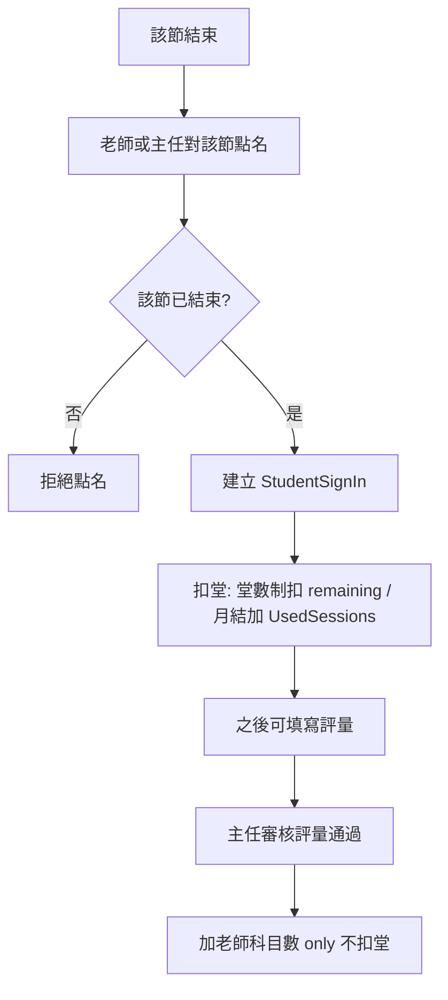

# 點名後扣課與評量科目數實作計畫

## 規格摘要（已定）

| 項目      | 決定                   |
| ------- | -------------------- |
| 點名與評量順序 | 點名可先做（當天或課後），評量可後補   |
| 誰可點名    | 老師、主任（無櫃檯角色）         |
| 點名時點    | 僅能「該節結束後」才能點名        |
| 扣堂觸發    | 點名成功才扣堂（點名 = 唯一扣堂觸發） |
| 評量審核通過  | 不扣堂；改為「加老師的科目數」      |

## 流程關係

---

## 現況與落差

**評量審核（已符合規格）**

- [DirectorDashboard.vue](frontend/src/pages/DirectorDashboard.vue) 核准評量時呼叫 Laravel `POST /api/v1/learning-records/{id}/approve`。
- [LearningRecordController::approve](backend/app/Http/Controllers/LearningRecordController.php)（約 280–307 行）已改為：**不扣堂**，僅 `User::where('id', $learningRecord->TeacherID)->increment('TeachingSessionCount')`（老師科目數）。batchApprove 同理。
- 結論：評量通過「加老師科目數」、不扣堂，已實作完成。

**扣堂目前觸發點**

- **SwipeRfidController**（約 273–298 行）：`deductOnAttendance()` 在**刷卡簽到**時扣堂（堂數制扣 `RemainingSessions`，月結只加 `UsedSessions`）。符合「點名成功才扣堂」，但僅限 RFID 刷卡。
- **AttendanceController::store**（手動登記）：建立 `StudentSignIn` 與 `ClassSession`，只呼叫 `applyAttendanceEffects()` 更新 `ClassSession.Status`，**沒有扣堂**。
- **AttendanceController::swipe**（API 刷卡）：同上，無扣堂。
- 落差：老師/主任在「出缺勤管理」手動點名時，沒有觸發扣堂；且目前**沒有**「該節結束後才能點名」的檢查。

**「該節」的定義**

- 一節課 = `ClassSession`（或可還原為 `StudentClassID` + `SessionDate` + 該課的 `StartTime`/`EndTime`）。
- 「該節結束」= `session_date + end_time` 已過（以伺服器時間或約定時區判斷）。

---

## 實作方向

### 1. 後端：扣堂邏輯共用 + 點名時觸發

- **抽出扣堂邏輯**：將 [SwipeRfidController::deductOnAttendance](backend/app/Http/Controllers/SwipeRfidController.php)（273–298 行）抽成可共用的方法（例如放在 `AttendanceController` 內 private、或獨立 Service），依 `StudentClass` 的 `ScheduleMode`/`SessionCount`：堂數制扣 `RemainingSessions`，月結只加 `UsedSessions`。
- **在「點名成功」時呼叫**：
  - **SwipeRfidController**：維持現狀，改為呼叫共用扣堂方法。
  - **AttendanceController::store**：當請求代表「對某一節」點名（有 `ClassSessionID` 或可唯一決定一節的 `StudentClassID` + `SessionDate` + 時間），且狀態為 `present` 或 `late` 時，在建立 `StudentSignIn` 後呼叫同一套扣堂邏輯（傳入對應的 `StudentClass`）。
- 若目前 `store` 的參數不足以唯一對應「一節」（例如缺少 `StudentClassID` 或 `SessionDate`），需在 API 契約中補齊（見下）。

### 2. 後端：「該節結束後才能點名」檢查

- 在 **AttendanceController::store** 中，若請求帶有 `ClassSessionID`：  
查詢 `ClassSession`，計算 `SessionDate + EndTime`，若 **未** 小於等於當前時間，回傳 422（例如：「該節尚未結束，無法點名」）。
- 若請求以 `StudentClassID` + `SessionDate`（及必要時 `StartTime`/`EndTime`）建立/對應一節：  
在建立或取得 `ClassSession` 後，同樣以該節的 `SessionDate` + `EndTime` 做「已結束」檢查，未過則不允許點名。
- 權限：老師僅能點名自己任課的班（現有 `store` 已有老師身份檢查）；主任可點名所屬分校。維持現有 role / campus 檢查即可。

### 3. 前端：點名入口與「依節次」操作（可選但建議）

- 目前 [AttendancePage.vue](frontend/src/pages/AttendancePage.vue) 手動登記為「人員 + 日期 + 時間 + 狀態」，未綁定「哪一節課」。若後端改為強制「依節次點名」才能扣堂，前端需配合：
  - 取得「已結束且尚未點名」的節次列表（例如呼叫既有或新增 API：依 branch、老師篩選，回傳 `StudentClassID`、`SessionDate`、`StartTime`/`EndTime`、學生/科目名等）。
  - 點名 UI：選擇「一節」後再送單筆點名（帶 `StudentID`、`StudentClassID`、`SessionDate`、`StartTime`、`EndTime` 或 `ClassSessionID`）；或保留既有自由登記，但僅「依節次」的請求才會在後端觸發扣堂與結束時間檢查。
- 若短期不改前端，可僅在後端：當請求已帶足夠欄位可還原「一節」且該節已結束時，才執行扣堂；其餘手動登記不扣堂（維持現狀）。

### 4. 月結與堂數制

- 共用扣堂邏輯需與 [SwipeRfidController::deductOnAttendance](backend/app/Http/Controllers/SwipeRfidController.php) 一致：  
堂數制（`ScheduleMode === 'count'` 或 `SessionCount > 0`）：扣 `RemainingSessions`，必要時更新 `Stop`/`Paid`；月結：只加 `UsedSessions`，不扣 `RemainingSessions`。

### 5. 不需變更的部分

- **評量審核**：DirectorDashboard 與 LearningRecordController 已改為不扣堂、只加 TeachingSessionCount；無需再改。
- **backdoorApprove / bulkBackdoorApprove**：若已改為不扣堂（僅建立紀錄），維持不扣堂；補登情境若需扣堂，應改為「先點名（觸發扣堂）再補評量」流程，不在 backdoor 內扣堂。

---

## 實作待辦（建議順序）

1. **後端**：自 SwipeRfidController 抽出扣堂邏輯為共用方法（同一個 Controller 內 private 或 Service），SwipeRfidController 改為呼叫該方法。
2. **後端**：在 AttendanceController::store 中新增「該節結束」檢查（依 ClassSessionID 或可還原的 StudentClassID + SessionDate + EndTime）；僅當 status 為 present/late 且該節已結束時，在建立 StudentSignIn 後呼叫共用扣堂方法。
3. **後端**：確認 store 的 request 契約能唯一對應一節（必要時新增/要求 ClassSessionID 或 StudentClassID + SessionDate + StartTime + EndTime）。
4. **前端（可選）**：出缺勤管理頁新增「依節次點名」流程（列出已結束未點名節次、選節後送出），或調整既有手動登記表單改送「節次」欄位，以配合後端扣堂與結束時間檢查。
5. **文件/Plan**：在既有排課或評量 plan 中補上「點名後扣課 + 評量通過加科目數」規格與本實作摘要，方便後續對齊。

---

## 涉及檔案摘要

| 區塊          | 檔案                                                                                                                                                                 |
| ----------- | ------------------------------------------------------------------------------------------------------------------------------------------------------------------ |
| 扣堂共用 + 點名觸發 | [AttendanceController.php](backend/app/Http/Controllers/AttendanceController.php), [SwipeRfidController.php](backend/app/Http/Controllers/SwipeRfidController.php) |
| 評量審核（僅確認）   | [LearningRecordController.php](backend/app/Http/Controllers/LearningRecordController.php), [DirectorDashboard.vue](frontend/src/pages/DirectorDashboard.vue)       |
| 點名 UI（可選）   | [AttendancePage.vue](frontend/src/pages/AttendancePage.vue)                                                                                                        |
| 老師科目數       | [User](backend/app/Models/User.php) `TeachingSessionCount`, [ProfileController](backend/app/Http/Controllers/ProfileController.php) 回傳 `teaching_session_count`    |

