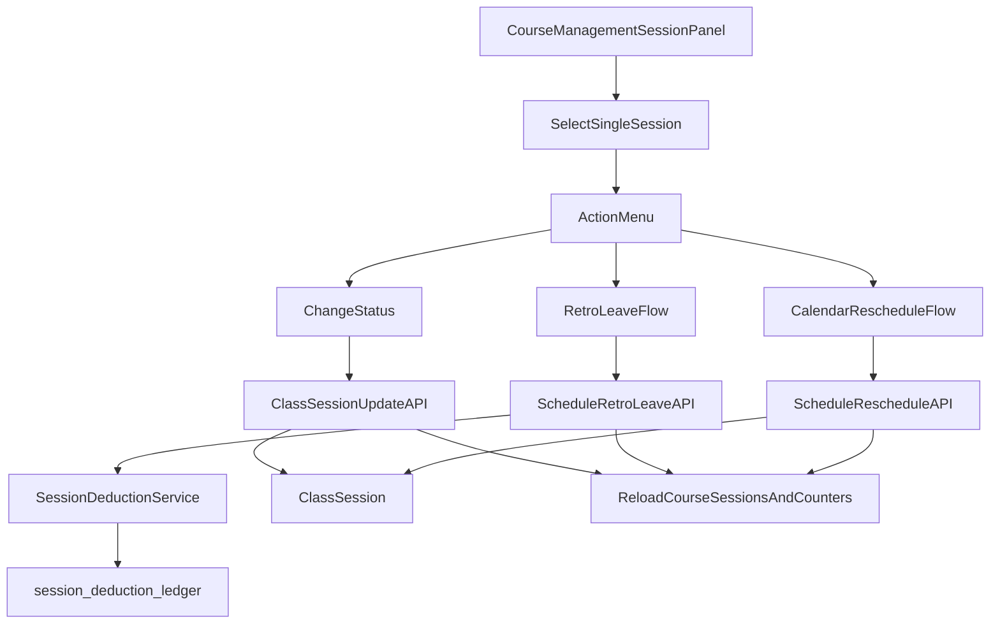

# 課程管理單堂課編輯計畫

## 目標
在 `CourseManagement` 右側日期列表提供「單堂課操作面板」，可直接對該堂課做狀態調整與調課；並採用行事曆式選時段，對齊 `SmartCalendar` 使用體驗。

## 範圍與原則
- 開放完整狀態調整（依你選擇 `full_status`），但後端仍用狀態機與驗證守住資料一致性。
- 已上課改請假走既有補請假底層（void + reverse ledger + `leave_adjusted`），不做硬刪。
- 先以 `CourseManagement` 為主入口，保留既有頁面流程，待穩定後再逐步替代。

## 主要變更檔案
- 前端
  - [frontend/src/pages/CourseManagement.vue](/home/admin/frontend/src/pages/CourseManagement.vue)
  - [frontend/src/pages/SmartCalendar.vue](/home/admin/frontend/src/pages/SmartCalendar.vue)
  - [frontend/src/lib/constants.js](/home/admin/frontend/src/lib/constants.js)
- 後端
  - [backend/app/Http/Controllers/ClassSessionController.php](/home/admin/backend/app/Http/Controllers/ClassSessionController.php)
  - [backend/app/Http/Controllers/ScheduleController.php](/home/admin/backend/app/Http/Controllers/ScheduleController.php)
  - [backend/app/Services/SessionDeductionService.php](/home/admin/backend/app/Services/SessionDeductionService.php)
  - [backend/routes/api.php](/home/admin/backend/routes/api.php)
- 測試
  - [backend/tests/Feature/ScheduleLeaveCascadeTest.php](/home/admin/backend/tests/Feature/ScheduleLeaveCascadeTest.php)
  - 新增單堂課編輯相關 Feature Test（同目錄）

## 資料流與互動設計

## 實作步驟
1. 單堂課操作面板 UI（CourseManagement）
- 在右側「上課日期」每列加入可點擊行為，打開 `SessionEditModal`。
- Modal 顯示：目前狀態、日期時間、老師、教室、評量/點名概況、可執行動作。
- 動作區分：
  - 直接改狀態（全狀態可選）
  - 補請假（若該堂已上）
  - 調課（開啟行事曆式時段挑選）

2. 行事曆式調課選時段
- 抽取 `SmartCalendar` 可重用邏輯（時段可用性、衝堂判斷、容量）為共用函式/子元件。
- 在 `CourseManagement` 的單堂課調課視窗中嵌入簡化版行事曆挑時段（先聚焦單堂，不做整週批次）。
- 提交後走既有調課 API（必要時補參數），並刷新該課 `classSessionsByCourse`。

3. 後端單堂課狀態變更 API 正規化
- 在 `ClassSessionController` 新增/整理單堂更新入口（例如 `PATCH /api/v1/class-sessions/{id}`）。
- 建立狀態轉移守則：
  - `scheduled -> attended/late/absent/excused/leave/cancelled`
  - `attended/... -> leave_adjusted` 需走補請假流程（禁止直接覆寫）
  - 已 `leave_adjusted` 再次變更需權限與防呆
- 若使用者從 UI 選「已上 -> 請假」，後端自動轉導/提示使用 `retro-leave` 流程。

4. 補請假與扣堂一致性整合
- `ScheduleController@retroLeave` 作為單一真源，處理 void + reverse ledger + 順延。
- `SessionDeductionService` 保持 ledger 驅動重算，所有單堂課操作後都觸發 counter refresh。
- `StudentClassController` 回傳維持 ledger 彙總，避免 UI 顯示舊計算來源。

5. 權限與稽核
- 角色限制：`director/admin/super_admin` 可做補請假與強制狀態調整；`teacher` 僅可編輯有限狀態（若你要我後續再放寬可另開）。
- 寫入稽核欄位：操作者、原因、時間（沿用 `VoidReason` + ledger metadata）。

6. 測試與回歸
- 新增 Feature Tests：
  - 單堂課狀態更新成功/非法轉移 422
  - 已上改請假會走 retro-leave 並產生 reverse
  - 行事曆調課後堂次日期時間正確、堂數不漂移
  - 權限：teacher 禁止高風險操作
- 回歸現有 `ScheduleLeaveCascadeTest`，確認舊流程不回歸。

## 風險與控管
- 風險1：全狀態可改容易造成非法轉移。對策：狀態機驗證在後端，前端只做引導。
- 風險2：調課與補請假都會動到堂數。對策：統一交給 ledger + recompute，禁止前端自行推算。
- 風險3：兩套入口（課程管理/行事曆）行為不一致。對策：抽共用 service 與 API contract，避免各頁面分支邏輯。

## 驗收標準
- 在 `CourseManagement` 右側可對任一堂課完成：改狀態、補請假、調課（含行事曆挑時段）。
- 已上改請假後：堂次保留、狀態 `leave_adjusted`、點名/評量作廢、ledger 有 reverse、剩餘堂數正確回補。
- 不需跳到其他頁面也能完成常見單堂調整流程。