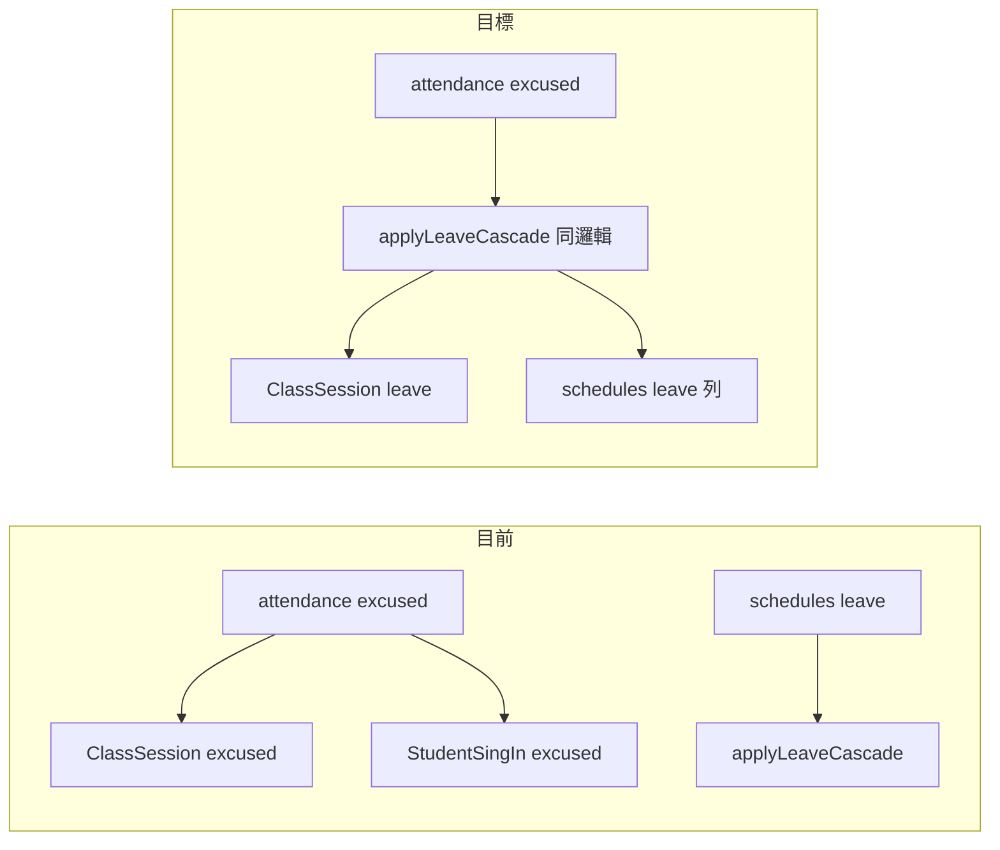

# 老師出缺勤「請假」觸發與課程管理相同順延

## 現況與落差

- [`ScheduleController::store`](backend/app/Http/Controllers/ScheduleController.php)：`status === 'leave'` 時會 `Schedule::create`，再執行 [`applyLeaveCascade`](backend/app/Http/Controllers/ScheduleController.php)（該堂 `ClassSession` → `leave`、作廢該堂 `LearningRecord`／`StudentSingIn`、[`shiftAndAppendAfterLeave`](backend/app/Http/Controllers/ScheduleController.php) 遞延後續堂次並補一堂、`StudentClass.EndDate` 更新）。
- [`AttendanceController::store`](backend/app/Http/Controllers/AttendanceController.php)：請假為 `excused`，建立 `StudentSingIn` + [`applyAttendanceEffects`](backend/app/Http/Controllers/AttendanceController.php) 把 `ClassSession` 設成 `excused`，**不寫 `schedules`**，也**不執行**上述順延。

## 建議實作策略

### 1. 抽出共用服務（避免複製貼上、單元測試可對準）

- 新增例如 [`backend/app/Services/CourseLeaveCascadeService.php`](backend/app/Services/CourseLeaveCascadeService.php)，將下列邏輯自 `ScheduleController` **原樣搬移**（含 `lockForUpdate`、例外訊息）：
  - `applyLeaveCascade`
  - `shiftAndAppendAfterLeave`
  - 僅被上述兩者使用的 private 輔助方法（如 `resolveCourseWeekdays`、`nextRecurringDate`、`syncLearningRecordSessionDate`、`maxDateKey`、`appendNote`、`fetchCourseSessionRows` 等；以 grep 確認依賴閉包）。
- [`ScheduleController`](backend/app/Http/Controllers/ScheduleController.php)：`status === 'leave'` 分支改為 `Schedule::create($data)` 後呼叫 `CourseLeaveCascadeService::applyLeaveCascade(...)`，維持現有 JSON 回應形狀與 HTTP 碼。
- 確保 **retro-leave**、**bulk-leave** 等若直接呼叫 private 方法，改為呼叫新 service（grep `applyLeaveCascade` / `shiftAndAppendAfterLeave`）。

### 2. 在 `AttendanceController::store` 分支處理 `excused`

在既有 `DB::transaction` 內、**建立 `StudentSignIn` 之前**（約 275 行「已點名」檢查之後）插入邏輯：

**條件（建議）：**

- `$status === 'excused'`
- 請求帶有效 `ClassSessionID`（與現有 `classSession` 一致）
- 可選：`StudentClass` 為堂數制且 `ClassSession::where(StudentClassID)->count() > 0`（與 `applyLeaveCascade` 前置一致；若無堂次則維持舊的純 `excused` 行為並回傳清楚錯誤）

**行為：**

1. 組出與 [`ScheduleController::store` leave 分支](backend/app/Http/Controllers/ScheduleController.php) 相容的 `schedules` 欄位：`branch_id`（學生 `CampusID`）、`student_id`、`teacher_id`（與現有 effective teacher 規則一致）、`student_course_id`、`schedule_date`（該堂 `SessionDate` 日期）、`day_of_week`（由日期算 ISO 1–7，與 store 驗證一致）、`start_time`/`end_time`、`class_type`、`status=leave`、`type=normal`、`deduction=0`；`subject` 可依課程／科目表與現有請假 API 慣例填寫（可對照課程管理前端 [`CourseManagement.vue`](frontend/src/pages/CourseManagement.vue) 送出的欄位）。
2. **衝突檢查**：若專案對 `scheduled` 有 `scheduleGuardService` 檢查，對 `leave` 可沿用 store 現況（目前 leave 不跑 guard）；若建立 `schedules` 列會與唯一索引衝突，應在 transaction 內 catch 並回傳 409/422。
3. `Schedule::create(...)` 後呼叫 `CourseLeaveCascadeService::applyLeaveCascade($courseId, $leaveDate)`。
4. **成功後提早 return**：回應 body 建議對齊 schedule leave（至少 `message`、`leave_session_date`、`extended_end_date`、`class_sessions`），讓前端可顯示「已順延」；**不要**再建立 `excused` 的 `StudentSingIn`、不要呼叫 `applyAttendanceEffects(excused)`（與正式請假一致：該堂無有效出席列、堂次為 `leave`）。

**失敗時：**

- `InvalidArgumentException`（例如「該堂已有核准評量」「找不到可請假的堂次」）→ 整筆 transaction 回滾，回傳 **422** 與既有中文訊息，與 `POST /api/v1/schedules` leave 一致。

**仍走舊路徑的情況：**

- `excused` 但無 `ClassSessionID`（僅 `StudentClassID`+時間新建堂次等邊界）、或 cascade 不適用 → 保留現有「`StudentSingIn` + `ClassSession` excused」行為（並在註解說明與課程請假不同）。

### 3. 小風險與一併檢查

- **「已點名」檢查**（`StudentSignIn::where('ClassSessionID')->first()`）未排除 `VoidedAt`；若歷史資料曾作廢但仍占列，可能誤判 409。可選：改為 `whereNull('VoidedAt')`（獨立小修正，與本需求可分開）。
- **同日多段課**：`applyLeaveCascade` 以「該日第一堂符合條件的 `ClassSession`」為準，為既有行為；不在此計畫擴張。

### 4. 測試

- 延伸或新增 Feature 測試（參考 [`backend/tests/Feature/ScheduleLeaveCascadeTest.php`](backend/tests/Feature/ScheduleLeaveCascadeTest.php)）：
  - 以 **teacher** token（`auth_teacher_id` 與課程 `TeacherID` 一致）呼叫 `POST /api/v1/attendance`，`Status=excused`、`ClassSessionID`、必要欄位、`mark_mode=arrival`。
  - 斷言：該堂 `ClassSession.Status === 'leave'`、存在 `schedules.status=leave` 且日期正確、後續堂次日期遞延、`StudentClass.EndDate` 更新、該堂無 active `StudentSingIn`（或僅作廢列，與 schedule leave 一致）。
- 回歸：既有一則 director `POST /api/v1/schedules` leave cascade 測試仍通過（確保重構無行為差異）。

### 5. 前端（選配）

- [`AttendancePage.vue`](frontend/src/pages/AttendancePage.vue) `submitPendingMark`：若回傳含 `extended_end_date` / `class_sessions`，成功訊息可顯示「已請假並順延」；非必須，因 `res.ok` + refresh 已可接受。

## 不在此計畫範圍

- 修改家長請假、retro-leave 權限、或 `sessionDates` 公式本身（cascade 已涵蓋 `schedules` + `ClassSession`）。
