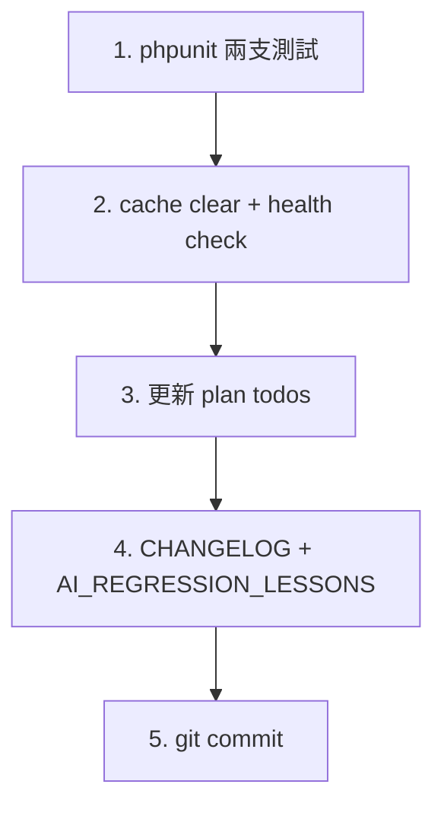

# B2 驗收與收尾

## 現狀確認（已完成，無需修改）

- [backend/app/Http/Controllers/AttendanceController.php](backend/app/Http/Controllers/AttendanceController.php) lines 271–300：Feature B whereExists 過濾已實作（comment "Bug fix 2026-04-21"）
- [backend/app/Http/Controllers/ClassSessionController.php](backend/app/Http/Controllers/ClassSessionController.php) lines 152–177：Feature A（role=teacher 分支 + teacher_id query 參數）已實作
- [backend/tests/Feature/AttendanceEndedSessionsSubstituteTest.php](backend/tests/Feature/AttendanceEndedSessionsSubstituteTest.php)：4 個 case（AC-B1~B4）已撰寫
- [backend/tests/Feature/ClassSessionsTeacherVisibilityAfterSubstituteTest.php](backend/tests/Feature/ClassSessionsTeacherVisibilityAfterSubstituteTest.php)：4 個 case（2 原生 + 2 teacher_id query）已撰寫
- Migration `2026_04_21_000001_add_schedules_composite_index`：已 run（batch 72）

## 待執行項目

### 1. test-run：跑兩支測試並確認全綠

```bash
cd /home/admin/backend
./vendor/bin/phpunit tests/Feature/ClassSessionsTeacherVisibilityAfterSubstituteTest.php
./vendor/bin/phpunit tests/Feature/AttendanceEndedSessionsSubstituteTest.php
```

若有 failure → 根據錯誤訊息修正 controller 或 test seed，直到 0 failures。

Revert-proof check（確認測試有真正覆蓋 bug）：

```bash
# 暫時把 Feature B whereExists 區塊 comment out → 至少 AC-B1 應 fail
# 還原後再跑確認全綠
```

### 2. ops：清 Laravel cache + health check

```bash
php /home/admin/backend/artisan config:clear
php /home/admin/backend/artisan route:clear
curl -sk https://daan.lifenet.com.tw/api/v1/health
```

預期回傳 `{"status":"ok",...}` HTTP 200。

### 3. plan 更新：將 feature-b / test-a / test-b / test-run 標為 completed

更新 [.cursor/plans/a+b_代課可見性修正_d2f91b5e.plan.md](.cursor/plans/a+b_代課可見性修正_d2f91b5e.plan.md) 中的 todos 狀態。

### 4. docs：更新 CHANGELOG 與 AI_REGRESSION_LESSONS

- [docs/CHANGELOG.md](docs/CHANGELOG.md)：在 2026-04-21 下新增 A+B 兩項修正條目
- [docs/AI_REGRESSION_LESSONS.md](docs/AI_REGRESSION_LESSONS.md)：新增「代課可見性（A+B）」防再犯小節

### 5. commit

```
fix(substitute): A+B 代課可見性修正——ClassSessionController teacher_id 過濾 + AttendanceController endedSessions 堂次級守衛
```

## 流程圖


