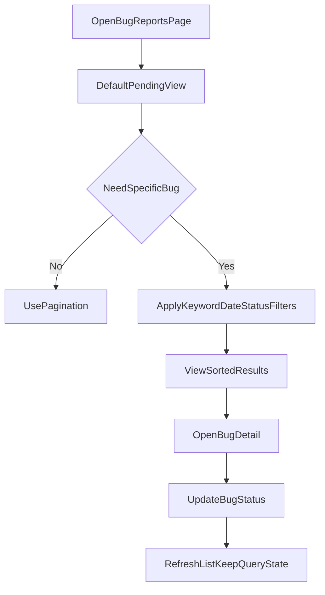

# Bug回報頁面擴充管理計畫

## 目標
讓主任/管理者在 Bug 回報數量增加時，能快速找到待處理案件，不再需要持續往下滑尋找舊單。

## CTO Gate（先決條件）
- 不變更既有 Bug 狀態生命週期（`new/triaged/in_progress/resolved/closed`）與轉移規則。
- 不破壞既有 API 合約；所有新增查詢參數需向下相容（不帶參數仍維持現行結果）。
- 多校區資料隔離不退步：一般角色僅可查詢授權範圍，`super_admin` 才能跨範圍檢視。
- 定義效能目標：在 10,000 筆級別資料下，列表查詢 P95 <= 800ms（同分校、常用篩選條件）。

## 現況觀察
- 前端頁面 [`/home/admin/frontend/src/pages/BugReportsPage.vue`](/home/admin/frontend/src/pages/BugReportsPage.vue) 有狀態/嚴重度篩選，但缺少完整分頁操作、關鍵字搜尋與排序控制。
- API 封裝 [`/home/admin/frontend/src/lib/bugReportsApi.js`](/home/admin/frontend/src/lib/bugReportsApi.js) 已固定傳 `per_page=20`，但缺少 `page` 操作的 UI 鏈路。
- 後端列表 API（[`/home/admin/backend/app/Http/Controllers/BugReportController.php`](/home/admin/backend/app/Http/Controllers/BugReportController.php)、[`/home/admin/backend/app/Services/BugReportService.php`](/home/admin/backend/app/Services/BugReportService.php)）已支援 `paginate`、`status`、`severity`、`reporter`，可直接擴充前端。

## PM 方案（分階段）

### Phase 1（MVP，先解痛點）
- 新增「列表分頁」：支援上一頁/下一頁、頁碼、每頁筆數（20/50/100）。
- 新增「快速回到頂部」按鈕（長列表時固定顯示）。
- 新增「預設只看待處理」快捷篩選（`new + triaged + in_progress`），降低雜訊。
- 保留既有狀態流程，避免改動案件生命週期與權限。
- 查詢狀態保留：切換分頁或進入詳情再返回時，保留原篩選條件與頁碼，避免重新從頂端找起。

### Phase 2（效率強化）
- 新增關鍵字搜尋（標題/描述/頁面 key），並加入 debounce。
- 新增排序選項（最新建立、最近更新、嚴重度）。
- 新增日期區間篩選（建立時間）。
- 優化列表資訊密度（最後更新時間、未讀留言提示、處理人欄位若有）。
- 後端新增對應白名單排序欄位與查詢防護，避免任意排序參數造成慢查詢或 SQL 注入風險。

### Phase 3（營運規模化，可選）
- 批次操作（批次改狀態）。
- Saved views（例如「高優先未處理」「本週新單」）。
- 封存視圖（若後端新增 archive 概念，與 `closed` 分離）。
- 明確定義 `closed` 與 `archived` 語意差異（是否可再開啟、是否計入預設列表）。

## 實作路線
1. 對齊前後端分頁契約與 meta 欄位（`page/per_page/total/last_page`），先完成低風險 MVP。
2. 前端先落地分頁 UI、預設待處理視圖、回頂按鈕與查詢狀態保留。
3. 後端補必要查詢參數（keyword/date/sort）與索引，並限制排序白名單。
4. 前端補完整查詢面板與 URL/state 同步，搜尋輸入加 debounce。
5. 回歸測試：大量資料（200+ / 10,000 模擬）、查詢正確性、權限隔離、詳情返回狀態保留。

## 里程碑與驗收
- M1（1-2 天）：分頁 + 快速篩選 + 回到頂部上線。
  - 驗收：不需連續滾動即可切頁查看歷史案件。
- M2（2-3 天）：搜尋 + 排序 + 日期篩選。
  - 驗收：能在 10 秒內定位指定案件。
- M3（視需求）：批次操作 / Saved views。
  - 驗收：高頻操作（每日 triage）可用批次方式完成，減少逐筆點擊。

## QA 驗收計畫
### 驗收範圍
- 功能正確性：分頁、篩選、搜尋、排序、狀態更新、返回列表狀態保留。
- 資料正確性：列表筆數、total/last_page、狀態分佈、關鍵字命中結果。
- 權限與隔離：`super_admin` 跨範圍可見；一般角色僅可見授權範圍。
- 效能與穩定性：大量資料下查詢延遲、前端互動流暢度、無異常重複請求。
- 可用性：使用者可在既定時間內定位案件並完成 triage。

### 測試資料設計
- Dataset A（基本）：50 筆（多狀態、多嚴重度）驗證功能邏輯。
- Dataset B（成長）：200 筆驗證真實使用流暢度與分頁行為。
- Dataset C（壓力）：10,000 筆（同分校 + 多分校混合）驗證 P95 與索引策略。
- 需含邊界資料：超長標題、特殊字元、空搜尋、無結果頁、最後一頁單筆資料。

### 驗收案例（最小必過）
- Case 1：切換 `status/severity` 後分頁與 total 立即正確更新，且頁碼回到第一頁。
- Case 2：進入 bug 詳情再返回，原篩選條件、排序、頁碼完整保留。
- Case 3：搜尋輸入 debounce 生效，連續輸入不會每鍵都打 API。
- Case 4：排序切換後結果順序符合規則，且不影響既有狀態轉移。
- Case 5：一般角色無法透過 query 參數看到非授權分校資料。
- Case 6：`super_admin` 可用 reporter 篩選，非 `super_admin` 不暴露該能力。
- Case 7：大量資料下列表 API P95 達標，前端無明顯卡頓（可互動時間符合預期）。
- Case 8：無結果情境顯示清楚空狀態與可回復操作（清除篩選/回到預設）。

### 驗收門檻（Go / No-Go）
- 功能案例必過率 100%（Case 1~8）。
- 權限與資料隔離 0 個 Critical 缺陷。
- 效能指標達標（P95 <= 800ms）；若未達標不得全量上線。
- UAT（主任/管理者）完成並簽核後才進入 M2。

### 回歸測試清單
- API 回歸：列表查詢參數組合、分頁 meta、狀態更新後列表重整一致性。
- 前端回歸：查詢條件切換、URL/state 同步、返回狀態保留、回到頂部按鈕顯示條件。
- 角色回歸：super_admin、director、teacher（若可見）各角色的可見範圍與操作權限。

### 上線後監控與驗收追蹤
- 監控指標：`GET /api/v1/bugs` latency、error rate、查詢參數分佈、空結果比例。
- 觀察窗：上線後 48 小時重點監控，每日回顧一次。
- 退出條件：若錯誤率或延遲超過門檻，立即關閉 feature flag 回切舊模式。

## 成功指標（KPI）
- 列表操作效率：平均定位指定案件時間下降 50% 以上。
- 捲動負擔：單次工作流程中「到底部再找回」操作次數下降 80% 以上。
- 效能穩定度：常用篩選條件下 API P95 維持在目標值內。
- 使用採納率：M1 上線兩週內，待處理預設視圖使用率 > 70%。

## 風險與緩解
- 查詢條件變多導致慢查詢：先加索引（`status`, `severity`, `created_at`），關鍵字採可控欄位。
- 前端過度即時查詢：搜尋輸入加 debounce，避免每鍵請求。
- 使用習慣改變：預設視圖保守（待處理優先），保留「查看全部」切換。
- 查詢契約不一致：先凍結 API response schema，前後端共用測試樣本 JSON 驗證。
- 權限回歸風險：補角色測試（super_admin / 一般使用者）與跨分校資料隔離測試。
- 上線風險：以 feature flag 漸進開啟，異常時可即時回切舊列表模式。

## 主要變更檔案
- 前端：[`/home/admin/frontend/src/pages/BugReportsPage.vue`](/home/admin/frontend/src/pages/BugReportsPage.vue)
- 前端 API：[`/home/admin/frontend/src/lib/bugReportsApi.js`](/home/admin/frontend/src/lib/bugReportsApi.js)
- 後端 Controller：[`/home/admin/backend/app/Http/Controllers/BugReportController.php`](/home/admin/backend/app/Http/Controllers/BugReportController.php)
- 後端 Service：[`/home/admin/backend/app/Services/BugReportService.php`](/home/admin/backend/app/Services/BugReportService.php)
- 路由（如需參數文件更新）：[`/home/admin/backend/routes/api.php`](/home/admin/backend/routes/api.php)

## 流程圖（目標使用流程）

