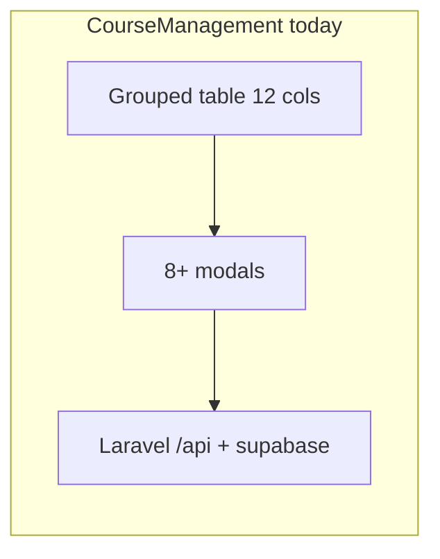

# 課程管理頁（CourseManagement）重構計畫

## 現況與痛點

- **單檔巨大**：[`frontend/src/pages/CourseManagement.vue`](frontend/src/pages/CourseManagement.vue) 約 4100+ 行（template + `<script setup>` + 大量 scoped CSS），認知負擔高、合併衝突風險大。
- **列表橫向過寬**：主表固定 **12 欄**（科目、老師、類型、每堂/總費用、時段、地點、繳費方式/狀態、剩餘堂數、上課日期、操作），操作列另有 **5 個按鈕**，小螢幕必然橫向捲動。
- **職責混雜**：同一頁承載「清單瀏覽、編輯、加購、補登堂次、請假/調課、補課空檔、連假批次請假、單堂操作」等多條流程，對應 **8+ 個 overlay modal**（約 L243–L604）與大量狀態機（session edit modes 等）。

## 重構原則

- **行為不變優先**：第一階段不改 API 契約與商業規則（堂數、請假沖回、調課、補課查詢等），只改呈現與程式結構。
- **可漸進交付**：每一階段可獨立上線與驗收，避免「大爆炸」重寫。
- **保留外部契約**：
  - [`frontend/src/App.vue`](frontend/src/App.vue) 仍用 `active === 'course-mgmt'` 掛載此頁；`initialTeacherId` / `@clear-initial-teacher` 行為保留。
  - [`frontend/src/lib/pageGuideConfig.js`](frontend/src/lib/pageGuideConfig.js) 的 `data-guide="course-mgmt-header|filters|table"` 需在新 DOM 上**對應保留或同步更新**目標選擇器。
  - [`frontend/src/pages/NotificationsCenter.vue`](frontend/src/pages/NotificationsCenter.vue) 與 [`frontend/src/pages/TeachersList.vue`](frontend/src/pages/TeachersList.vue) 導向 `course-mgmt` 不需斷裂。

---

## 階段一：列表密度與操作收斂（高 ROI、低風險）

**目標**：消除「12 欄 + 5 鈕」造成的橫向壓力，多數使用者仍在一頁完成工作。

建議做法（可並行採用）：

1. **主表精簡為「掃視欄」**（約 6–7 欄）：例如保留 科目、老師、類型、時段、剩餘堂數、繳費狀態（或合併「方式+狀態」一欄兩行小字）。
2. **次要欄位移入「詳情」**：每堂/總費用、地點、繳費方式細節 → 點列或「詳情」抽屜 / 次要列（expand row）顯示；與現有「上課日期」展開列（`expandedDates`）可統一成同一套「列展開」模式。
3. **操作改為單一入口**：將編輯、加購、暫停/恢復、換師複製、刪除收斂為 **「⋯」或「管理」dropdown**（或 primary「編輯」+ secondary menu），必要時刪除仍保留二次確認。
4. **響應式（可選但建議）**：寬度不足時改為 **每門課一張 card**（同一資料來源），避免表頭對不齊；桌面仍可用表格式。

**驗收**：主任常用流程（篩選、編輯、加購、點日期進單堂操作）無需橫向捲動即可完成；鍵盤/點擊路徑不明顯變長。

---

## 階段二：Modal 元件化（結構拆分、行為仍由父層或 composable 驅動）

**目標**：把 template 中 L243–L604 這類巨型區塊搬到獨立 `.vue`，降低單檔長度、便於單元目視 review。

建議新建目錄（範例）：`frontend/src/pages/course-management/` 或 `frontend/src/components/course-management/`

| 元件 | 對應現況 |
|------|----------|
| `CourseEditModal.vue` | 編輯 + `CourseEditForm` |
| `PurchaseSessionsModal.vue` | 加購 |
| `QuickAddSessionModal.vue` | 補登堂次 |
| `LeaveModal.vue` / `BulkLeaveModal.vue` | 請假與批次 |
| `RescheduleModal.vue` + `MakeupSlotsModal.vue` | 調課與補課空檔（可共用部分 props） |
| `SessionEditModal.vue` | 單堂狀態機（menu / retro-leave / reschedule） |

**做法**：先 **props + emit** 搬移 UI，邏輯暫時留在父層或以 inject/回調傳入；避免第一輪就深抽 composable 造成雙重變更。

**驗收**：[`CourseManagement.vue`](frontend/src/pages/CourseManagement.vue) template 行數明顯下降；各 modal 可單獨開啟關閉無迴歸。

---

## 階段三：Composables 抽取（依「資料域」切，而非依畫面順序）

**目標**：把 script 內 ref/函式依責任分組，便於測試與重用（例如與 [`frontend/src/lib/classSessionsApi.js`](frontend/src/lib/classSessionsApi.js)、[`frontend/src/lib/coursePricing.js`](frontend/src/lib/coursePricing.js) 對齊）。

建議模組（範例命名）：

- `useCourseList.js`：`loadCourses`、filters、`groupedCourses`、展開群組、與 `branchId` / `initialTeacherId` watch。
- `useCourseSessionsDisplay.js`：`displaySessions`、`getSessionState*`、`expandedDates`、日期 chip 與 tooltip。
- `useSessionEditFlow.js`：`openSessionEdit`、`sessionEditMode`、狀態轉換、與 API 呼叫。
- `useRescheduleAndMakeup.js`：`fetchMakeupSlots*`、`makeupSlotsGrouped`、選 slot。
- `useBulkLeave.js`：連假批次請假表單與結果。
- `useCourseCrud.js`：編輯/刪除/暫停/複製/加購 submit。

**驗收**：主頁 `<script setup>` 主要剩下「組裝 composable + template 綁定」；同一商業規則不複製兩份。

---

## 階段四（選用）：頁內子頁籤或「工具區」分區

**目標**：若營運仍覺得「一頁太多任務」，在 **不新增 App.vue 頂層 tab** 的前提下，於課程管理頁內做二級導覽，例如：

- **課程清單**（預設）：階段一表格/card。
- **批次與工具**：連假請假、（未來）匯入/批次操作集中。

**注意**：若拆頁籤，需更新 [`pageGuideConfig.js`](frontend/src/lib/pageGuideConfig.js) 步驟文案或 targets。

---

## 樣式與設計系統

- 現有 scoped CSS 極長（約 L3137 起）；元件化時建議 **隨子元件搬移對應區塊**，或抽出 `course-management.css` 由子元件 import（維持視覺一致）。
- 延續現有 class 命名（`course-table`、`action-btns` 等）可降低一次性視覺差異。

---

## 測試與回歸清單（建議手動為主）

本頁目前無獨立前端自動化測試檔；重構後至少跑：

- 分校切換後 `loadCourses` / 篩選老師（含從教師列表導入 `initialTeacherId`）。
- 一門課：編輯儲存、加購、暫停/恢復、換師複製、刪除確認。
- 展開上課日期 → 點 chip → 單堂：請假、補請假、調課、查補課空檔、加課補登。
- 連假批次請假：日期區間、結果訊息。
- 新增課程：`UniversalClassScheduler` 成功回呼後列表刷新。
- 操作引導：[`pageGuideConfig.js`](frontend/src/lib/pageGuideConfig.js) 三個 anchor 仍能被 highlight。

完成前端變更後依專案規則執行 `cd frontend && npm run deploy`。

---

## 建議執行順序

1. 階段一（UI 密度）— 使用者體感立即改善。  
2. 階段二（Modal 元件化）— 降低檔案複雜度，為 composable 铺路。  
3. 階段三（Composables）— 穩定後再抽，避免與 UI 大改同一 commit 難以除錯。  
4. 階段四 — 僅在訪談後仍覺得資訊架構不足時再做。
