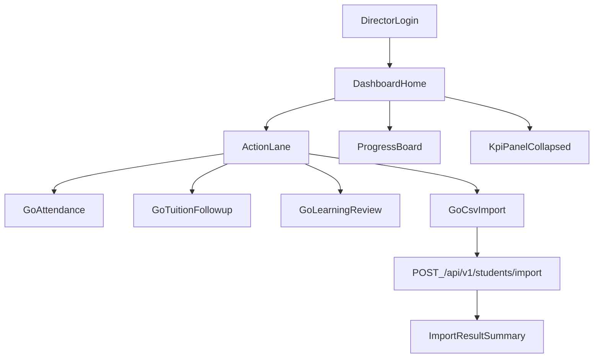

# 主任總覽頁改版討論計畫

## 目標與成功標準
- 目標：把總覽頁改成「先做事、再看數字」的混合版（你已選 `hybrid`）。
- 成功標準：
  - 首屏只看到 3~5 個「今日必做」項目。
  - 每個提醒都有明確下一步按鈕（不只顯示數字）。
  - 匯入 CSV 能在總覽頁一鍵進入並看到清楚錯誤回饋。

## 現況重點（用來討論為何要改）
- 現行總覽頁資訊密度高，首頁同時承載提醒、課表、評量、統計，造成視覺與認知負擔（[DirectorDashboard.vue](/home/admin/frontend/src/pages/DirectorDashboard.vue)）。
- 操作入口分散：總覽僅部分卡片可直接處理，很多動作仍需切頁（[App.vue](/home/admin/frontend/src/App.vue)）。
- 學生 CSV 匯入已存在，但在學生頁深層，回饋以 alert 為主，可讀性與後續修正流程不足（[StudentsList.vue](/home/admin/frontend/src/pages/StudentsList.vue), [ImportController.php](/home/admin/backend/app/Http/Controllers/ImportController.php)）。

## 新版資訊架構（Hybrid）
- 第一層（首屏）：`今日必做 ActionLane`
  - 只放高優先待辦：未繳費高風險、待到班、待審評量、匯入異常。
  - 每張卡只有 1 個主動作（例如：`去點名`、`批次催繳`、`批次審核`、`重新匯入`）。
- 第二層：`今日進度 ProgressBoard`
  - 今日課程進度、到班率、待處理剩餘量，顯示「已完成/總數」。
- 第三層：`經營指標 KPI`（可折疊）
  - 月科目數、老師統計、通知摘要，預設收合，避免搶焦點。

## 匯入 CSV 優先優化（你選的焦點）
- 在總覽頁新增「快速匯入」入口（不必先切到學生頁）。
- 匯入後結果改為可展開摘要：新增/更新/略過/錯誤前幾筆 + 下載錯誤清單（後續迭代）。
- 保留既有後端匯入 API，先做前端流程優化；第二階段再補 API 支援更完整錯誤結構。

## 分階段落地（先討論再做）
- Phase 1（MVP）：重排總覽區塊 + ActionLane + 匯入入口導流 + 明確 CTA。
- Phase 2：ProgressBoard（完成率/剩餘量）+ KPI 收合與個人化排序。
- Phase 3：匯入錯誤修復助手（欄位對應提示、重試流程、錯誤下載）。

## 需要你確認的討論決策（實作前）
- ActionLane 前 4 項優先順序（建議：待到班 > 未繳費 > 待審評量 > 匯入異常）。
- 總覽首頁是否允許直接做「批次操作」（例如批次催繳 / 批次核准），或只做導流到子頁。
- KPI 預設是否收合（建議預設收合，保留「展開看完整統計」）。