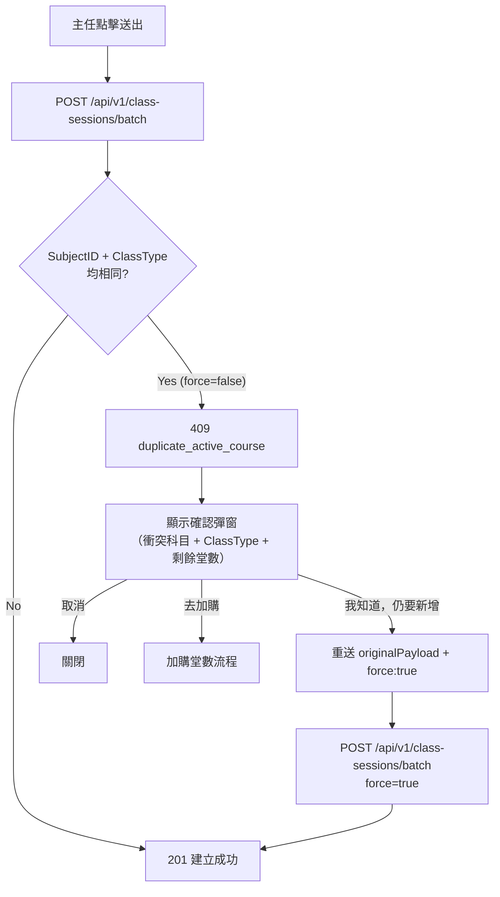

# 重複課程保護修正 PRD

## 1. 文件資訊

| 欄位 | 內容 |
|---|---|
| 功能名稱 | 重複課程保護邏輯修正 |
| 版本 / 日期 | v1.0 / 2026-04-16 |
| 狀態 | Draft |
| 目標角色 | 主任（建立課程的操作者） |

## 2. 目標與業務背景

**現在的痛點：** 主任要幫學生（如黃品皓）新增「不同教學形式」的課程（例如已有數學一對一，想再新增數學輔導），系統一律擋下並回傳 409，沒有任何成功路徑——確認彈窗按「我知道，仍要新增課程」只是重開空表單，再次送出仍然 409，形成死循環。

**業務需求：**
- 相同科目 + **不同 ClassType** → 應直接允許，不需要警告（數學一對一 ≠ 數學輔導，是不同服務）
- 相同科目 + **相同 ClassType** → 應保留警告，但「強制建立」按鈕必須真的可以送出

**成功指標：** 主任能在不報錯的情況下，為已有數學課的學生另外建立數學輔導課程。

## 3. 範圍

**In Scope：**
- 後端 `EnrollmentService::store` 修改衝突判斷條件：從「SubjectID 相同」改為「SubjectID + ClassType 均相同」
- 前端「強制建立」流程修正：確認對話框的「我知道，仍要新增課程」按鈕，重新送出時帶入 `force: true`

**Out of Scope：**
- 修改排課衝突（老師/教室）的邏輯
- 修改加購堂數流程

## 4. RACI

| 角色 | 代表 | R/A/C/I |
|---|---|---|
| PM | 產品負責人 | A |
| CTO / 工程 | 後端 `EnrollmentService` + 前端 Vue 開發者 | R |
| QA | 測試驗收人員 | R |
| 資安 | —（無新增存取面，低風險） | C |
| IT / Ops | 部署 Raspberry Pi + deploy 確認 | I |

## 5. User Stories

**US-01 — 同科目不同類型**
> As a 主任, I want to create a Math tutoring course for a student who already has Math one_on_one, so that I can track both services independently.
>
> Acceptance Criteria:
> - [ ] 學生已有 Math one_on_one（Stop=0）時，新建 Math tutoring **不應** 觸發 409
> - [ ] 成功建立後顯示「已建立 N 堂課」提示

**US-02 — 同科目同類型強制建立**
> As a 主任, I want to see a warning but still be able to force-create a second Math one_on_one when I know what I'm doing.
>
> Acceptance Criteria:
> - [ ] 觸發 409 後，確認彈窗清楚顯示衝突科目與剩餘堂數
> - [ ] 按「我知道，仍要新增課程」後，系統以 `force: true` 重新送出**原來的 payload**
> - [ ] 第二次送出成功，顯示建立成功訊息

## 6. 功能需求（FR）

| 編號 | 需求 |
|---|---|
| FR-001 | 後端衝突判斷須同時比對 `SubjectID` 與 `ClassType`，兩者均相同才視為重複 |
| FR-002 | 衝突回應 `conflicts[]` 需加入 `class_type` 欄位，供前端顯示 |
| FR-003 | 前端「我知道，仍要新增課程」按鈕須以 `originalPayload + { force: true }` 重新呼叫 `createUniversalClassSchedule` |
| FR-004 | 強制送出成功後關閉彈窗並觸發原有 `@success` callback |

## 7. 非功能需求（NFR）

- FR-001 不增加額外 DB query（`existingActive` 已包含 `ClassType` 欄位）
- 強制送出失敗（如其他 4xx/5xx）須顯示錯誤訊息，不可靜默失敗

## 8. 技術方向

### 受影響檔案

- 後端：[`backend/app/Services/EnrollmentService.php`](backend/app/Services/EnrollmentService.php)（`store` 方法，lines 365–392）
- 前端：
  - [`frontend/src/pages/StudentsList.vue`](frontend/src/pages/StudentsList.vue)（`handleSchedulerDuplicate`、`proceedOpenAddCourse`）
  - [`frontend/src/pages/CourseManagement.vue`](frontend/src/pages/CourseManagement.vue)（`handleSchedulerDuplicateCM`、`proceedOpenBackfillForGroup`）
  - [`frontend/src/lib/universalSchedulerApi.js`](frontend/src/lib/universalSchedulerApi.js)（`createUniversalClassSchedule`，已有 `originalPayload` 在 error 上，只需上層送出時加入 `force: true`）

### 架構流程（修正後）

### 後端修改重點

受影響：[`backend/app/Services/EnrollmentService.php`](backend/app/Services/EnrollmentService.php)，`store` 方法衝突判斷區塊（lines 365–392）。

架構選擇：衝突條件從「SubjectID 相同」收緊為「SubjectID + ClassType 均相同」，以正確反映業務語意——同科目不同教學形式屬於不同服務，應可並存。`conflicts[]` 陣列補入 `class_type` 欄位供前端顯示。不需新增 DB query，`existingActive` 查詢結果已含 `ClassType` 欄位。

### 前端修改重點

受影響：[`frontend/src/pages/StudentsList.vue`](frontend/src/pages/StudentsList.vue)、[`frontend/src/pages/CourseManagement.vue`](frontend/src/pages/CourseManagement.vue)。

架構選擇：確認彈窗的「我知道，仍要新增課程」改為以 `originalPayload`（已附於 409 error 物件上）加入 `force: true` 重新呼叫 `createUniversalClassSchedule`，而非重開空表單。此方式不需修改 [`frontend/src/lib/universalSchedulerApi.js`](frontend/src/lib/universalSchedulerApi.js)，只需在兩個父頁面的確認 handler 內補上重送邏輯。

### 子任務 Agent 派發

- `[FEATURE]` → 後端 `EnrollmentService` + 前端兩個頁面
- `[TEST]` → Pest 測試（同科目不同 ClassType 可建立；同科目同 ClassType force=false 409、force=true 201）
- `[DOCS]` → CHANGELOG 更新

## 9. 資安與存取控制

- `force: true` 已在後端 validate（`'force' => 'nullable|boolean'`），不需新增欄位
- 不涉及新的 PII；既有 `require_campus` middleware 保護不變
- STRIDE：`force` flag 只跳過重複判斷，不跳過校區隔離或身份驗證，風險低

## 10. QA 驗收標準

| FR | Happy Path | Edge Case | Error |
|---|---|---|---|
| FR-001 | 學生有 Math one_on_one → 新建 Math tutoring → 201 OK | 學生有 Math tutoring → 再建 Math tutoring → 409 | 傳入未知 class_type → 422 validation error |
| FR-002 | 409 衝突回應含 `class_type` 欄位 | 多科目衝突時每筆都有 `class_type` | — |
| FR-003 | 確認彈窗按「強制」→ 成功建立 | 按「取消」→ 彈窗關閉，不送出 | force 送出後 5xx → 顯示錯誤文字 |

回歸（對照 `docs/AI_REGRESSION_LESSONS.md`）：
- 確認「加購堂數」流程不受影響
- 確認 `Stop=1`（已暫停）的課程不被計入衝突判斷

## 11. 上線與維運

- 不需 migration（無新欄位）
- 修改後執行 `cd frontend && npm run deploy`
- 確認 `POST /api/v1/class-sessions/batch` health OK
- **監控新增項目**：本次修改不新增監控指標；可觀察 Laravel log 中 `duplicate_active_course` 409 回應數量是否降低作為間接指標
- **回滾方案**：若修改後有異常，將 `EnrollmentService.php` 的衝突判斷條件還原為僅比對 `SubjectID`，重新 deploy 前端即可；不涉及 migration，回滾無資料風險

## 12. 里程碑與優先級

| 優先級 | 功能項目 | 預估工期 | 執行 Agent |
|---|---|---|---|
| P0 | FR-001 後端 ClassType 判斷修正 | 30 分鐘 | `[FEATURE]` |
| P0 | FR-003/004 前端 force 強制送出 | 45 分鐘 | `[FEATURE]` |
| P1 | FR-002 衝突回應補 class_type 欄位 | 15 分鐘 | `[FEATURE]` |
| P1 | Pest 測試補充 | 30 分鐘 | `[TEST]` |
| P2 | Code Review | 20 分鐘 | `[REVIEW]` |
| P2 | CHANGELOG 更新 | 10 分鐘 | `[DOCS]` |

## 13. 風險與開放問題

- **假設**：`StudentClass.ClassType` 欄位與 `$data['class_type']` 的值格式一致（均為 `one_on_one`/`tutoring` 等 snake_case），`[TODO: 工程確認 DB 實際值格式]`
- **開放問題**：若一個學生有多筆不同 ClassType 的同科目課程，`alerts/tuition` 續課提醒是否需要個別判斷？`[TODO: 確認與 PM/主任]`

## 14. Definition of Done

- [ ] 所有 FR（FR-001 ~ FR-004）通過 QA 驗收
- [ ] 資安審查無阻擋項（`force` flag 不跳過校區隔離與身份驗證確認）
- [ ] `npm run deploy` 完成且 `POST /api/v1/class-sessions/batch` API health 正常
- [ ] `docs/CHANGELOG.md` 更新
- [ ] PM sign-off
- [ ] CTO / 工程 Lead sign-off
