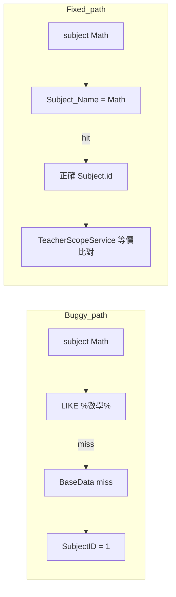

# 修復「老師教數學卻跳科目#1／授課設定沒有該科」假陽性

## 根因（已從程式碼確認）

- [`EnrollmentService::resolveSubjectId`](backend/app/Services/EnrollmentService.php)（約 888–906 行）流程為：`Subject.Subject_Name LIKE '%中文名%'` → `BaseData` → **`?? 1`**。當 `Subject` 只存 **`Math`**（不含「數學」字串）且 `BaseData` 也對不到時，會固定得到 **`SubjectID = 1`**。
- [`TeacherScopeService::resolveEquivalentSubjectIds`](backend/app/Services/TeacherScopeService.php)（約 208–237 行）在該列 **`Subject_Name` 正規化後為空** 時直接 `return [$subjectId]`，無法把「垃圾 id」與其他同名／同語意科目列合併，與老師在 `teacher_subject_levels` 裡綁的**正確** `subject_id` 對不起來。
- [`StudentClassController::mapFrontendPayload`](backend/app/Http/Controllers/StudentClassController.php)（約 1536–1560 行）已寫明問題並採用較正確順序：**先 `Subject_Name = 前端英文鍵`（如 `Math`）**，再中文 `LIKE`，再 `BaseData`；失敗時 log 並以 **66（Math）** 作後備（仍非理想，但優於 `1`）。
- [`ClassSessionController`](backend/app/Http/Controllers/ClassSessionController.php) 內有與 `EnrollmentService` **相同邏輯的私有 `resolveSubjectId`**（約 615–633 行），但 **未被呼叫**（`batchStore` 直接委派 `EnrollmentService::store`）；屬重複／易漂移死碼，可一併刪除或改為呼叫共用解析器，避免日後誤用。

## 建議實作（單一真相來源 + 防呆）

1. **新增共用解析服務**（例如 [`backend/app/Services/FrontendSubjectIdResolver.php`](backend/app/Services/FrontendSubjectIdResolver.php)）  
   - 公開靜態方法 `resolve(string $frontendSubject): ?int`，邏輯與 `StudentClassController::mapFrontendPayload` **對齊**（順序：英文精確 → 中文 `LIKE` → `BaseData`）。  
   - **禁止**使用 `?? 1` 作預設；解析失敗回傳 `null`（或拋出 domain exception，由呼叫端轉 422）。  
   - 若需與現行 `mapFrontendPayload` 完全一致的「最後手段」，可抽成**單一**可設定後備（並集中 log），避免各處魔術數字分叉。

2. **改寫 [`EnrollmentService`](backend/app/Services/EnrollmentService.php)**  
   - `resolveSubjectId` 改呼叫上述 resolver；若為 `null`，在 `store()` **進 transaction 前**回傳 422（訊息例如「無法將科目對應到 Subject 主檔，請檢查 Subject_Name 是否為 Math／數學」），避免寫入錯誤 `SubjectID`。  
   - `TeacherScopeService::check` 使用的 `$subjectIdForScope` 與寫入 `StudentClass` 的 `$subjectId` 必須來自**同一解析結果**。

3. **強化 [`TeacherScopeService::resolveEquivalentSubjectIds`](backend/app/Services/TeacherScopeService.php)**（次要防線，涵蓋**既有錯誤資料**）  
   - 對 `$targetRow` 使用 null-safe（避免 id 不在 `Subject` 表時 PHP 錯誤）。  
   - 當正規化後的 `Subject_Name` 仍為空：沿用 `check()` 已用的 **`BaseData`（Name=課程）** 等方式補齊顯示／分組名稱，再依**正規化後名稱**收集所有同語意 `Subject.id`（與現有 `normalizeSubjectName` + 全表掃描一致）。  
   - 仍無法歸類時才維持僅 `[subjectId]`，避免過度寬鬆誤判。

4. **（可選）統一 [`StudentClassController::mapFrontendPayload`](backend/app/Http/Controllers/StudentClassController.php)**  
   - 改呼叫同一 `FrontendSubjectIdResolver`，刪除重複 map 陣列，降低未來再分叉。

5. **清理 [`ClassSessionController`](backend/app/Http/Controllers/ClassSessionController.php)**  
   - 移除未使用之 `resolveSubjectId` / `resolveSubjectName` 私有方法（若檔內無其他引用），或改為薄包裝呼叫共用服務，避免複製貼上。

6. **測試**（建議新增或擴充 [`backend/tests/Feature/EnrollmentApiTest.php`](backend/tests/Feature/EnrollmentApiTest.php) 或新檔）  
   - 在測試 DB **僅**插入 `Subject`：`Subject_Name = 'Math'`, `id = 某值`（非 1）；`teacher_subject_levels` 綁該 id + 學段。  
   - `POST /api/v1/enrollments` 與 `POST /api/v1/class-sessions/batch` 帶 `subject: Math`：  
     - `StudentClass.SubjectID` 應為該 id，**不應為 1**；  
     - 回應中 **`scope_warning` 應為空或不含「沒有…科目」**（依現有 API 是否總帶 key 而定）。  
   - 可加一個 **回歸**：模擬舊資料 `SubjectID=1` 且列名為空、`BaseData` 有「數學」— 驗證強化後的 `resolveEquivalentSubjectIds` 仍能與老師綁定的數學 id 對上（若測試環境有 `BaseData` 表）。

7. **文件**（僅在使用者要求或慣例要更新時）  
   - 可在 [`docs/AI_REGRESSION_LESSONS.md`](docs/AI_REGRESSION_LESSONS.md) 補一行：入班解析勿用 `?? 1`，須與 `StudentClassController` 英文鍵一致；屬可選。

## 風險與緩解

- **解析失敗改 422**：若極端環境完全沒有 `Subject`／`BaseData` 資料，入班會失敗；優於寫入 `SubjectID=1` 造成靜默錯誤。  
- **效能**：`resolveEquivalentSubjectIds` 已全表掃 `Subject`；維持現狀，僅增加少數分支與一次 `BaseData` 查詢。
