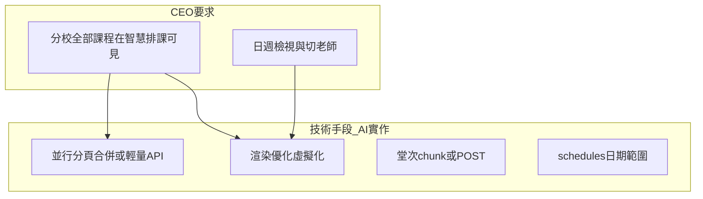

# 大分校資料處理計畫

## 給 CEO／決策者（非技術）

### 我們要解決什麼

- 單一分校可能達 **數百學生、上千課程**，系統必須 **資料不漏、操作可信**，且 **不能** 因資料變多就讓畫面長時間轉圈或卡死。
- **智慧排課**依經營要求：**必須能看見該分校「全部課程」**，才能支撐排程與調度；因此已發展 **日檢視／週檢視** 與 **切換老師**，用檢視方式消化大量課程，而不是用「少載入一部分課」來換速度。

### 我們對外的承諾（產品行為）

| 模組 | 承諾 |
|------|------|
| **智慧排課** | 該分校課程在系統內要 **完整呈現**（符合老闆「看見全部課程」）；日/週與老師切換是正式使用方式。 |
| **課程管理（列表式）** | 以 **分頁或載入更多** 管理長列表，避免一次載入造成畫面卡頓；與排課「全課可見」是 **不同畫面、不同策略**。 |
| **效能** | 技術上會用 **分批請求、精簡欄位、背景合併、必要時虛擬捲動** 等方式，在「資料完整」前提下盡量縮短等待；若硬體或同時上線人數超出合理範圍，仍以監測與升級因應。 |

### 誠實界線

- **同時在線人數**、**單機 Raspberry Pi 上限** 需實測或觀測後才能給具體數字；計畫可承諾 **資料正確與載入策略**，不承諾未驗證的「同時一百人沒問題」。

---

## 產品原則（技術與 UX 對齊 CEO 要求）

1. **智慧排課（`SmartCalendar`）**  
   - **不得**因效能而只載「部分課程」導致畫面上少課。  
   - 效能手段改為：**多筆小請求並行合併**、**日曆用精簡欄位 API**、**畫面只渲染可見區（虛擬化）**，而非刪減業務可見範圍。  
   - **日／週檢視 + 切老師**：繼續作為消化大量課程的主要操作，計畫不與之衝突。

2. **課程管理（`CourseManagement`）**  
   - 表格式管理頁可維持 **分頁／載入更多 + 篩選**，首屏快、總筆數清楚。

3. **堂次、請假／調課**  
   - 堂次查詢 **chunk 或 POST**，避免網址過長；細列日期可 **依展開再載**。  
   - `schedules` 仍應 **有日期範圍**（請假調課列），避免把多年歷史一次下載；與「課程主檔全載」分開處理。

---

## 背景與現況風險（技術摘要）

- `per_page=1000` 只取 **第一頁** → 課程 **漏顯**（[`CourseManagement.vue`](frontend/src/pages/CourseManagement.vue)、[`SmartCalendar.vue`](frontend/src/pages/SmartCalendar.vue)）。  
- `GET` 上串過多 `student_class_ids` → **URL 過長**（[`classSessionsApi.js`](frontend/src/lib/classSessionsApi.js)）。  
- `schedules?per_page=1000` 觸發後端 **全表 get** → 歷史越大越慢（[`ScheduleController`](backend/app/Http/Controllers/ScheduleController.php)）。

---

## 給 AI 實作：技術任務清單

### A. 課程管理 [`CourseManagement.vue`](frontend/src/pages/CourseManagement.vue) + [`StudentClassController::index`](backend/app/Http/Controllers/StudentClassController.php)

- 小 `per_page`、分頁或「載入更多」、顯示 `total`。  
- 篩選條件走 query，避免前端全量 filter。

### B. 智慧排課 [`SmartCalendar.vue`](frontend/src/pages/SmartCalendar.vue)（CEO：**全校課程必須載入**）

- **必須**：取得該 `branch_id` 下 **完整** `student-classes` 清單（與現有日/週、老師切換相容）。  
- **實作選項**（擇一或併用，以不阻塞 UI 為準）：  
  - 並行請求 `page=1..N`（每頁例如 100～200）合併，**顯示載入中狀態**直到合併完成；或  
  - 新增 **輕量端點**（例：`GET /student-classes/calendar-feed?branch_id=`）只回排課所需欄位，單次或少量請求。  
- 前端若單次 DOM 過重，考慮 **虛擬列表** 或依老師／週 **只渲染可見格**（資料仍全）。  
- 與 [`docs/AI_REGRESSION_LESSONS.md`](docs/AI_REGRESSION_LESSONS.md) 排課／請假行為對照測試。

### C. 堂次 [`classSessionsApi.js`](frontend/src/lib/classSessionsApi.js) + [`ClassSessionController`](backend/app/Http/Controllers/ClassSessionController.php)

- `student_class_ids` **分段** 或 **POST `/class-sessions/query`**（若新增路由）。  
- [`useCourseSessionsDisplay.js`](frontend/src/composables/course-management/useCourseSessionsDisplay.js)：避免對 **全部** 課程 id 一次轟炸；優先 **當前檢視相關** 或 **展開列** 再載。

### D. Schedules 請假／調課

- 前端帶 **可見週日期範圍** + 另查 `schedule_date IS NULL` 週期列。  
- 後端限縮 `per_page>=1000` → 無界 `get()` 的行為。

### E. 學生／點名

- [`StudentsList.vue`](frontend/src/pages/StudentsList.vue)、[`AttendancePage.vue`](frontend/src/pages/AttendancePage.vue)：分頁或姓名搜尋；[`StudentController::index`](backend/app/Http/Controllers/StudentController.php)。

### F. 繳費提醒（可選）

- [`AlertController::tuition`](backend/app/Http/Controllers/AlertController.php) SQL 預篩；[`docs/DIRECTOR_PAYMENT_ALERT_RULES.md`](docs/DIRECTOR_PAYMENT_ALERT_RULES.md)。

### G. 文件

- [`docs/DIRECTOR_SCALING_FAQ.md`](docs/DIRECTOR_SCALING_FAQ.md) 或營運章節：**課程管理**可翻頁；**智慧排課**可看全分校課程；效能手段為技術實作，非隱藏資料。

### H. 測試（Pest）

- `student-classes` 多頁合併後筆數 = `total`。  
- 智慧排課路徑：分校課程數 > 單頁時仍完整。  
- `class-sessions` chunk／POST；`schedules` 範圍；`tuition` 回歸。

---

## 執行順序建議（AI）

1. 修 **漏課**（排課與課程管理各自路徑）：排課採 **全量策略**（B），課程管理採 **分頁**（A）。  
2. **chunk／POST** 堂次（C）。  
3. **schedules** 有界（D）。  
4. 學生／點名（E）、FAQ（G）、測試（H）；繳費提醒（F）視負載再開。

