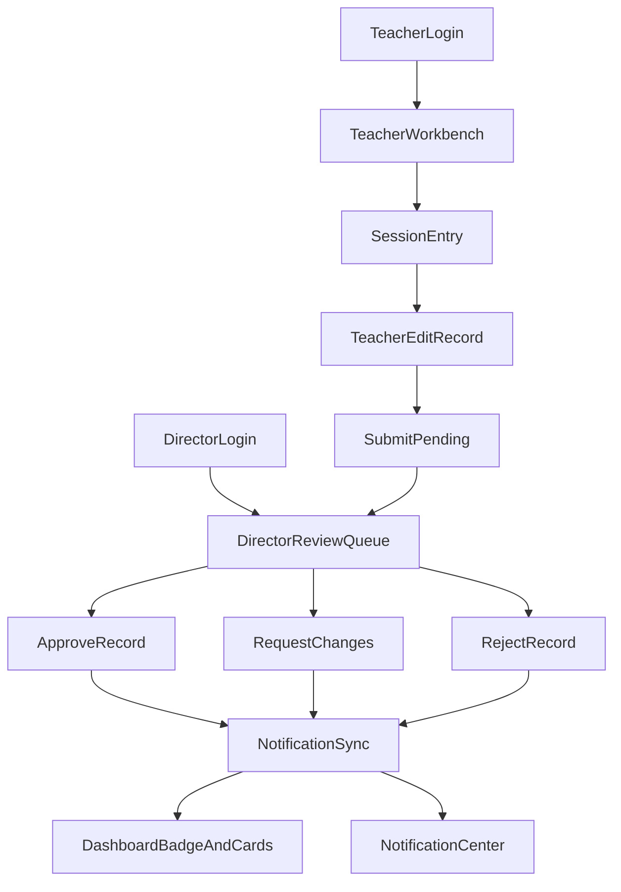

# 學習評量全流程改版計畫

## 目標與邊界
- 目標：完成「老師填寫 + 主任審核 + 通知/儀表板」一致化體驗，降低老師填寫成本、提高主任審核效率、同步通知準確性。
- 範圍：重構前端 IA 與互動流程、補齊後端契約一致性、建立可回歸測試與上線驗收清單。
- 時程策略：完整規格優先（3+ 週），採分階段交付但以單一藍圖落地。

## 現況基線（改版依據）
- 前端主頁面過於集中在單檔：[LearningRecordsPage.vue](/home/admin/frontend/src/pages/LearningRecordsPage.vue)。
- 主任審核入口分散於總覽與評量頁：[DirectorDashboard.vue](/home/admin/frontend/src/pages/DirectorDashboard.vue)。
- 通知可導流到評量頁，但未深連結到單筆記錄：[NotificationsCenter.vue](/home/admin/frontend/src/pages/NotificationsCenter.vue)。
- 後端狀態流與審核邏輯集中在：[LearningRecordController.php](/home/admin/backend/app/Http/Controllers/LearningRecordController.php)。
- 通知同步來源為 `pending/changes_requested`，與 `only_due` 清單語意存在差異：[NotificationSyncService.php](/home/admin/backend/app/Services/NotificationSyncService.php)。

## 目標體驗設計

### 老師端（填寫工作台）
- 課表優先：只從堂次進入評量，避免手填基本資料。
- 動作語意固定：`填評量 / 編輯評量 / 檢視評量`，其中 `approved` 只能檢視。
- 頂部快捷篩選：僅保留「待填」「需修改」「已核准」三種視圖。
- 編輯器強化：自動儲存草稿、離開前提醒、欄位分段提示與常用語模板。

### 主任端（審核工作台）
- 將審核頁拆成「待審佇列」「需修改追蹤」「已核准查詢」。
- 批次操作：批次核准、批次退回（需填模板化原因）。
- 單筆審核保留：可檢視堂次上下文（學生課程、老師、時段、歷史退回紀錄）。

### 通知與總覽串接
- `learning_review` 通知支援深連結到目標記錄。
- 總覽待審卡與通知口徑一致（是否 `only_due` 需統一定義）。
- 審核結果即時回寫 badge 與未讀計數。

## 技術改造藍圖

### 前端重構（拆模組）
- 由 [LearningRecordsPage.vue](/home/admin/frontend/src/pages/LearningRecordsPage.vue) 拆出：
  - `TeacherSchedulePanel`
  - `TeacherRecordEditor`
  - `DirectorReviewQueue`
  - `LearningRecordTable`
  - `LearningRecordFilters`
- 導航與 badge 保持在 [App.vue](/home/admin/frontend/src/App.vue)；新增「通知導到指定 record」處理。
- 總覽審核卡改為重用審核資料模型：[DirectorDashboard.vue](/home/admin/frontend/src/pages/DirectorDashboard.vue)。

### 後端契約整合
- 固化學習評量狀態機：`pending -> changes_requested/rejected -> approved -> rollback pending`。
- 明確化通知同步口徑：`only_due` 與通知生成條件統一定義，實作在 [NotificationSyncService.php](/home/admin/backend/app/Services/NotificationSyncService.php)。
- 檢查與補齊角色/校區限制與回應一致性於 [LearningRecordController.php](/home/admin/backend/app/Http/Controllers/LearningRecordController.php) 及路由 [api.php](/home/admin/backend/routes/api.php)。

### 資料流示意

## 交付階段（完整規格優先）

### Phase 0：規格凍結（2-3 天）
- 定義老師/主任資訊架構、按鈕語意、狀態字典、通知口徑。
- 產出 API 契約草案（含錯誤碼與權限行為）。
- 驗收：UX flow + API contract 文件確認完成。

### Phase 1：老師工作台重做（4-6 天）
- 完成課表進入、可編輯/唯讀策略、精簡篩選、編輯器強化。
- 移除/弱化非老師必要入口（保持流程聚焦）。
- 驗收：老師 3 步內完成填寫；`approved` 無法編輯。

### Phase 2：主任審核工作台重做（4-6 天）
- 新增待審/需修改/已核准分區與批次審核。
- 回寫審核說明模板與歷程顯示。
- 驗收：主任可在單頁完成主要審核作業，不需往返多頁。

### Phase 3：通知與儀表板一致化（3-4 天）
- 深連結通知到指定 record。
- 校正總覽卡片與通知數口徑（due 與非 due 定義統一）。
- 驗收：通知點擊可直達目標，badge 與列表數據一致。

### Phase 4：測試、回歸與上線（3-4 天）
- Feature tests：狀態流、權限、通知解析、校區隔離。
- 手動 E2E：老師填寫、主任審核、通知導流、總覽同步。
- 上線演練：灰度啟用 + 回退流程。

## 測試與驗收清單
- 後端：
  - `teacher` 無法編輯 `approved`。
  - `director/admin/super_admin` 可依規則審核與 rollback。
  - 通知 `learning_review` 在狀態變化後能建立/解決正確。
- 前端：
  - 老師端按鈕文案與行為一致。
  - 主任端批次審核正確回寫 UI 與 badge。
  - 通知深連結可直接打開目標記錄。

## 風險與緩解
- 風險：單檔重構造成回歸面大。
  - 緩解：先拆組件再改行為，分階段合併。
- 風險：通知口徑變更影響既有營運判讀。
  - 緩解：先雙軌比對（舊口徑 vs 新口徑）一個迭代週期。
- 風險：角色權限與校區過濾有隱性耦合。
  - 緩解：新增權限矩陣測試與固定測試資料集。

## 主要變更檔案（預計）
- 前端：
  - [LearningRecordsPage.vue](/home/admin/frontend/src/pages/LearningRecordsPage.vue)
  - [DirectorDashboard.vue](/home/admin/frontend/src/pages/DirectorDashboard.vue)
  - [NotificationsCenter.vue](/home/admin/frontend/src/pages/NotificationsCenter.vue)
  - [App.vue](/home/admin/frontend/src/App.vue)
  - [classSessionsApi.js](/home/admin/frontend/src/lib/classSessionsApi.js)
- 後端：
  - [LearningRecordController.php](/home/admin/backend/app/Http/Controllers/LearningRecordController.php)
  - [NotificationSyncService.php](/home/admin/backend/app/Services/NotificationSyncService.php)
  - [NotificationController.php](/home/admin/backend/app/Http/Controllers/NotificationController.php)
  - [api.php](/home/admin/backend/routes/api.php)
- 測試：
  - [LearningRecordApprovalDeductionTest.php](/home/admin/backend/tests/Feature/LearningRecordApprovalDeductionTest.php)
  - [NotificationApiTest.php](/home/admin/backend/tests/Feature/NotificationApiTest.php)