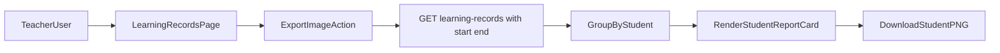

# 老師學習評量圖片匯出計畫

## 目標與範圍
- 老師可在學習評量頁匯出「自己學生」的評量圖卡。
- 匯出條件支援自訂日期區間。
- 輸出格式為圖片，且一位學生一張（完整版內容）。
- 先做老師角色（`teacher`）MVP，不影響主任既有審核流程。

## 現況依據
- 前端學習評量頁與分組資料流在 [frontend/src/pages/LearningRecordsPage.vue](/home/admin/frontend/src/pages/LearningRecordsPage.vue)。
- 前端以 `userRole` / `userId` 決定教師視圖（由 [frontend/src/App.vue](/home/admin/frontend/src/App.vue) 傳入）。
- 後端學習評量查詢在 [backend/app/Http/Controllers/LearningRecordController.php](/home/admin/backend/app/Http/Controllers/LearningRecordController.php)，目前已有 teacher scope，但缺少日期區間篩選。
- API 路由在 [backend/routes/api.php](/home/admin/backend/routes/api.php)，現有匯出模式僅 Excel（`ExportController`），尚無圖片/列印匯出。

## 實作策略
- 採「前端渲染 + 轉圖下載」路線（例如 `html-to-image`），避免後端新增圖片渲染服務。
- 在前端先依 API 取得老師可見資料，再以學生分組渲染隱藏匯出模板，逐張輸出 PNG。
- 後端補日期區間查詢參數，確保匯出資料精準且可重用於列表查詢。

## 變更清單
- **前端 UI/互動**
  - 在 [frontend/src/pages/LearningRecordsPage.vue](/home/admin/frontend/src/pages/LearningRecordsPage.vue) 新增「匯出評量圖」按鈕與匯出對話框（開始日、結束日）。
  - 只對 `teacher` 顯示該功能；沿用現有 `branchId` 與 token 流程。
  - 新增匯出進度與錯誤提示（例如第 N 位學生匯出失敗可重試）。
- **前端匯出模板**
  - 新增可重用模板元件（建議檔案：`frontend/src/components/learning/LearningRecordExportCard.vue`），完整呈現：學生資訊、科目、上課時間、作業、測驗、進度、下次作業、老師評語、狀態。
  - 由頁面端迭代學生資料，生成一位學生一張卡後輸出 PNG。
- **前端工具/依賴**
  - 新增圖片匯出函式（建議 `frontend/src/lib/learningRecordExport.js`），封裝 DOM 節點轉圖、檔名規則、批次下載節流。
  - 新增匯出套件依賴（`html-to-image` 或等價方案）。
- **後端 API**
  - 在 [backend/app/Http/Controllers/LearningRecordController.php](/home/admin/backend/app/Http/Controllers/LearningRecordController.php) `index()` 增加日期區間參數（如 `start_date`, `end_date`）與 validation。
  - 日期條件套用 `SessionDate` 範圍，並保留既有 teacher scope（`TeacherID`/`StudentClass.TeacherID`）與 campus 限制。
  - 路由可沿用 `GET /api/v1/learning-records`，不必新增 endpoint，降低破壞面。

## 驗證與測試
- **後端**
  - 新增 Feature test（`tests/Feature/LearningRecordsIndexTest.php` 或既有測試檔擴充）：
    - teacher 查詢只看到自己的學生。
    - `start_date/end_date` 能正確過濾。
    - 跨校資料不外洩。
- **前端手測**
  - teacher 身分：選定日期區間後，產出多位學生 PNG 檔，檔名包含學生名與日期區間。
  - 無資料區間：顯示友善提示，不觸發空下載。
  - 大量資料（20+學生）下匯出穩定、不中斷。

## 風險與對策
- 匯出張數多可能導致瀏覽器記憶體壓力：採序列化匯出與每張完成後釋放 DOM。
- 中文字型與排版在不同裝置可能跑版：固定卡片寬度、字級與行高；必要時嵌入安全字型 fallback。
- 個資與權限：前端按鈕顯示受角色控制，後端仍以 teacher scope 作最終授權。

## 交付順序（MVP）
1. 後端 `index()` 日期區間支援 + 測試。
2. 前端匯出按鈕/日期選擇 UI。
3. 匯出模板與 PNG 下載流程（每位學生一張）。
4. 手測與微調版面（美觀優先：標題、校區/老師資訊、一致間距）。