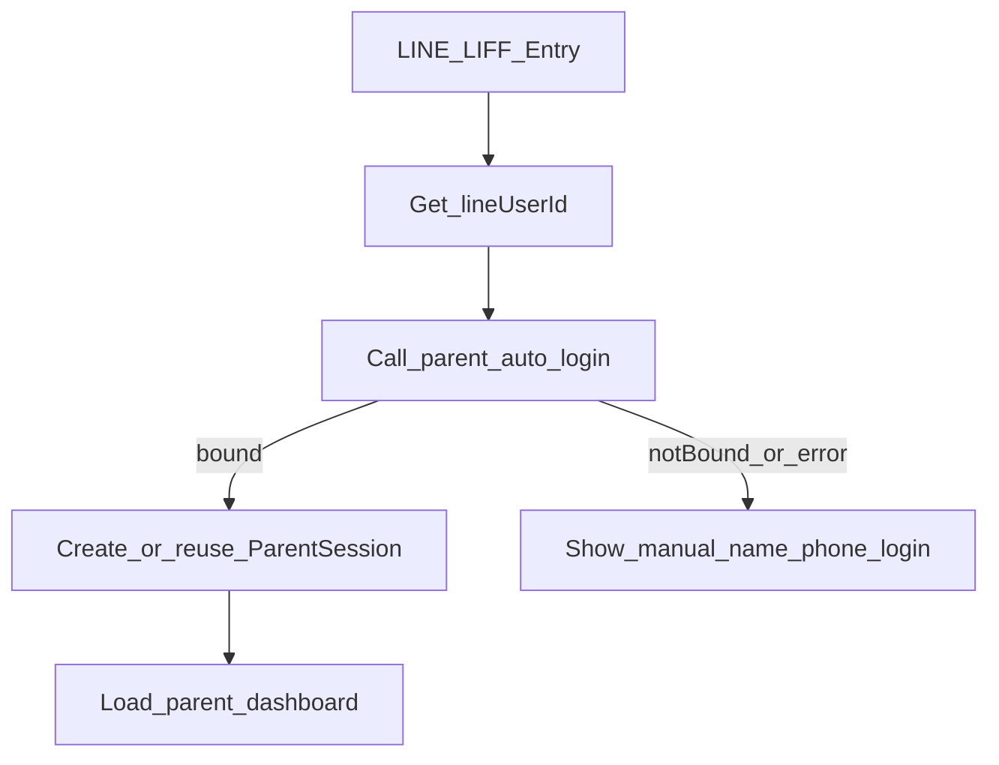

# PRD — LINE 家長入口免輸入直登（林澤青／大安案例擴展為通用功能）

## 1. 文件資訊

- 功能名稱：LINE LIFF 直登家長入口（免輸入姓名手機）
- 版本 / 日期：v1.0 / 2026-04-16
- 狀態：Draft
- 目標角色：家長（從 LINE 進入）、主任（減少家長登入障礙）

## 2. 目標與業務背景

- 痛點：家長已在 LINE 綁定學生，但每次進入家長入口仍跳回姓名+手機登入頁。
- 業務價值：降低家長使用門檻，提高家長入口使用率與黏著度。
- KPI：
  - 已綁定家長從 LINE 進入後，免手動登入成功率 >= 99%
  - 登入頁曝光率（LINE 入口）下降 >= 80%

## 3. 範圍

- In Scope
  - LINE LIFF 入口支援 lineUserId 自動登入（已綁定學生）。
  - 家長入口前端在 LIFF 環境優先走直登 API。
  - 若同一 LINE 綁多位學生，顯示學生選擇（沿用既有多學生邏輯）。
  - 指定驗證案例：林澤青（大安分校）可直接進入。
- Out of Scope
  - 一般瀏覽器 URL（非 LINE）免登入。
  - 重做整體家長認證機制（JWT/SSO 改版）。

## 4. RACI

- PM：A
- CTO / 工程：R
- UI/UX Designer：R
- QA：R
- 資安：C
- IT / Ops：I

## 5. User Stories

- As a 家長, I want 從 LINE 直接進家長檔案, so that 不必每次輸入姓名手機。
  - [ ] 已綁定 LINE 的家長由 LIFF 進入時，直接看到 dashboard。
- As a 家長（多孩）, I want 進入後能選孩子, so that 查看正確學生資料。
  - [ ] 若同一 lineUserId 綁定多位學生，系統回傳 `students` 清單供切換。
- As a 系統, I want 未綁定時仍導向登入頁, so that 保持安全與相容。
  - [ ] lineUserId 找不到綁定學生時，保留現行姓名手機登入流程。

## 5b. UI/UX 精緻化需求

- 受影響頁面：[ParentPortal.vue](frontend/src/pages/ParentPortal.vue)
- 要求：
  - 版面層次：新增「LINE 驗證中」狀態區塊，優先於原登入表單。
  - 色彩一致性：沿用現有成功/錯誤提示色，不新增自定義 palette。
  - 互動回饋：LIFF 直登 API 呼叫時顯示 loading，成功自動轉 dashboard，失敗才回登入表單。
  - 空狀態：未綁定時顯示明確文案「尚未綁定，請先登入或於 LINE 輸入綁定指令」。
  - 防呆：避免直登失敗後卡死，需可回退手動登入。
  - 響應式：手機優先（LINE 入口主要行動端）。

## 6. 功能需求（FR）

- FR-001：新增（或擴充）家長 API，可用 `line_user_id` 直接建立家長 session。
- FR-002：僅允許已綁定該 `line_user_id` 的學生登入。
- FR-003：若綁定多位學生，回傳 `students` 陣列供前端切換。
- FR-004：前端在 LIFF 環境啟動時優先嘗試直登；失敗時回退原姓名手機登入。
- FR-005：既有 `POST /api/v1/parent/login` 與非 LIFF 流程行為不變。

## 7. 非功能需求（NFR）

- 效能：直登 API P95 < 500ms。
- 可用性：直登失敗須可回退，不可阻塞整頁。
- 相容性：不破壞既有 LINE 綁定指令與家長 session 續用邏輯。

## 8. 技術方向

- 受影響檔案（預估）
  - [backend/app/Http/Controllers/ParentPortalController.php](backend/app/Http/Controllers/ParentPortalController.php)
  - [backend/routes/api.php](backend/routes/api.php)
  - [frontend/src/pages/ParentPortal.vue](frontend/src/pages/ParentPortal.vue)
- 受影響資料表
  - `Student`（`LineID`）
  - `ParentSession`
- 架構選擇
  - 後端以既有 `createSession()` 路徑重用，不新增第二套 token 規則。
  - 前端僅在 LIFF 環境加一層 bootstrap 直登，不改既有手動登入主流程。

## 9. 資安與存取控制

- 僅接受 LIFF 取得之 `lineUserId`（必要時加 LIFF token 驗證，若現階段無法驗證需記錄風險）。
- 僅可存取 `Student.LineID = lineUserId` 的學生資料。
- 稽核記錄：直登成功/失敗（lineUserId、studentId、campus）。
- STRIDE：
  - Spoofing：lineUserId 冒用風險，需至少做來源檢查與速率限制。
  - Info Disclosure：禁止回傳非該 lineUserId 綁定學生。

## 10. QA 驗收標準與測試計畫

- Happy Path
  - 已綁定 LINE 的家長點 LIFF 直接進 dashboard。
  - 林澤青（大安）案例可直接進入，不出現姓名手機表單。
- Edge
  - 同 lineUserId 綁多位學生可切換。
  - ParentSession 過期可自動重建。
- Error
  - lineUserId 無綁定 → 顯示手動登入頁。
  - 直登 API 失敗 → 不白屏，回退登入表單。
- UI/UX 驗收
  - [ ] 有 loading 狀態且不跳動版面
  - [ ] 失敗提示清楚可理解
  - [ ] 可回退手動登入
  - [ ] 手機版無 overflow，主要按鈕可點擊

## 11. 上線與維運

- 部署步驟
  - 後端 API 上線
  - 前端 `npm run deploy`
  - 驗證 LIFF URL 與 campus LINE 設定
- 回滾
  - 前端關閉 LIFF 直登分支，回退至手動登入
  - 後端保留 API 但前端不調用

## 12. 里程碑與優先級

- P0：後端直登 API + 權限過濾
- P0：前端 LIFF bootstrap 直登 + 回退手動登入
- P1：多學生切換與錯誤文案優化
- P1：測試與回歸
- P2：操作文件更新

## 13. 風險 / 假設 / 開放問題

- 風險
  - LIFF 身分來源驗證不足可能被偽造（需資安評估）。
- 假設
  - 媽媽是透過 LINE 官方帳號 LIFF 入口進入。
  - 林澤青已完成 `Student.LineID` 綁定。
- 開放問題
  - 是否要求後端強制驗證 LIFF ID token（若要，需前端傳 token 並後端驗簽）。

## 14. Definition of Done

- [ ] FR-001~FR-005 全通過
- [ ] UI/UX 驗收清單通過並 sign-off
- [ ] 資安檢查通過
- [ ] 前端 deploy 完成
- [ ] 文件更新完成
- [ ] PM / 工程 Lead sign-off