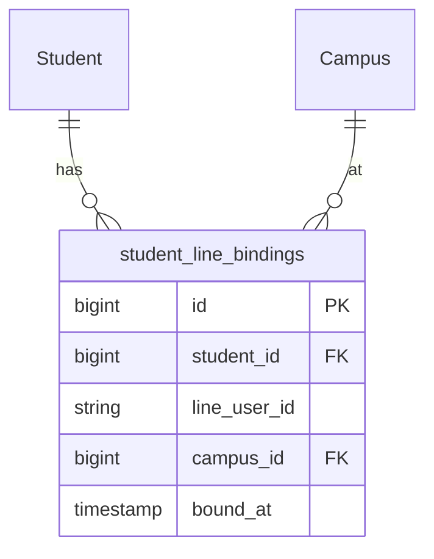

# PRD — 爸媽都能綁定同一學生（多家長 LINE 綁定）

## 1. 文件資訊

| 欄位 | 內容 |
|---|---|
| 功能名稱 | 學生多家長 LINE 綁定 |
| 版本 / 日期 | v1.0 / 2026-04-16 |
| 狀態 | Draft |
| 目標角色 | 家長（爸媽各自使用 LINE）、主任（管理綁定狀態） |

---

## 2. 目標與業務背景

**痛點**：目前 `Student.LineID` 只能存一個 LINE 帳號，當爸爸重新綁定後，媽媽的綁定就被覆蓋，導致只有其中一方能接收通知與進入家長入口。

**業務價值**：
- 雙親均可獨立查閱孩子的課程、出缺勤與評量
- 減少因「綁定被蓋掉」引發的客訴與重工

**成功指標**：
- 同一學生可被 2+ 個 LINE 帳號各自綁定，互不影響
- 既有已綁定的媽媽資料零遺失

---

## 3. 範圍

**In Scope**：
- 新建 `student_line_bindings` 表（`student_id`, `line_user_id`, `campus_id`, `bound_at`）
- Migration 自動將現有 `Student.LineID` 資料反轉寫入新表
- 所有 LINE 綁定 / 查詢路徑改用新表（`LineWebhookController`, `ParentPortalController`）
- 保留 `Student.LineID` 欄位做向下相容（不刪、不改 schema），但新綁定不再寫入

**Out of Scope**：
- 解綁 UI（主任管理介面另立 PRD）
- Telegram 多家長（同理可做但不在本 PRD）
- 推播通知同時發多位家長（通知模組另立 PRD）

---

## 4. RACI

| 角色 | R/A/C/I |
|---|---|
| PM | A |
| CTO / 工程 | R |
| UI/UX Designer | R（管理頁面若需調整） |
| QA | R |
| 資安 | C |
| IT / Ops | I |

---

## 5. User Stories

**US-01**（爸爸也能綁定）
> As a 爸爸, I want 對 LINE 官方帳號輸入「綁定 學生姓名」, so that 我也能進入家長入口查看資訊。
>
> Acceptance Criteria：
> - [ ] 爸爸綁定後，媽媽原有的綁定不被覆蓋
> - [ ] 爸爸與媽媽各自登入均可看到同一孩子的 dashboard

**US-02**（既有綁定不受影響）
> As a system, I want 既有 Student.LineID 資料在 migration 後自動轉移, so that 媽媽不需要重新綁定。
>
> Acceptance Criteria：
> - [ ] migration 執行後，每筆非空 `Student.LineID` 都在 `student_line_bindings` 有對應記錄

**US-03**（重複綁定防呆）
> As a system, I want 同一人對同一學生重複綁定時給出友善提示, so that 不會建立重複記錄。
>
> Acceptance Criteria：
> - [ ] `(student_id, line_user_id)` 有 UNIQUE index，重複時回傳「已綁定」訊息

---

## 5b. UI/UX 精緻化需求

本次主要為後端結構調整，前端 `ParentPortal.vue` 行為不變。若未來需要「解綁」或「查看哪些家長已綁定」的管理頁面，另立 PRD。

---

## 6. 功能需求（FR）

| 編號 | 描述 |
|---|---|
| **FR-001** | 建立 `student_line_bindings` 表：`id`, `student_id`（FK Student.id）, `line_user_id`（varchar 64）, `campus_id`（FK Campus.id）, `bound_at`（timestamp），`(student_id, line_user_id)` UNIQUE |
| **FR-002** | Migration 將 `Student` 表中所有非空 `LineID` 反轉寫入 `student_line_bindings`（`bound_at` 填 `NOW()`，`campus_id` 填 `Student.CampusID`） |
| **FR-003** | `LineWebhookController::bindStudent` 改為向 `student_line_bindings` insert（ON DUPLICATE KEY 忽略），不再寫 `Student.LineID` |
| **FR-004** | `LineWebhookController` 所有「是否已綁定」檢查（`$student->LineID === $lineUserId`）改查 `student_line_bindings.where(student_id, line_user_id).exists()` |
| **FR-005** | `LineWebhookController::buildStatus` 的 `bound_count` 改查 `student_line_bindings.where(campus_id).count()` |
| **FR-006** | `ParentPortalController::loginWithLine` 改查 `student_line_bindings.where(line_user_id)` 找到對應 students |
| **FR-007** | `ParentPortalController::dashboard` sibling 查詢：「同 lineUserId」改查 `student_line_bindings`；「同 phone」邏輯不變 |
| **FR-008** | `ParentPortalController::switchStudent` 的授權檢查：同 lineUserId 改查 `student_line_bindings` |

---

## 7. 非功能需求

- **向下相容**：`Student.LineID` 欄位不改 schema（保留），已有讀 `Student.LineID` 的其他地方繼續可用但不是主要路徑
- **效能**：`student_line_bindings(line_user_id)` 加 index，查詢 P95 < 50ms
- **資料完整性**：`student_id` FK cascade delete（學生刪除時自動清除綁定）

---

## 8. 技術方向

**資料表架構**：

**受影響檔案**：
- 新增 migration：`database/migrations/xxxx_create_student_line_bindings_table.php`
- 新增 model：[`backend/app/Models/StudentLineBinding.php`](backend/app/Models/StudentLineBinding.php)
- [backend/app/Http/Controllers/LineWebhookController.php](backend/app/Http/Controllers/LineWebhookController.php)（FR-003～FR-005）
- [backend/app/Http/Controllers/ParentPortalController.php](backend/app/Http/Controllers/ParentPortalController.php)（FR-006～FR-008）

**架構選擇**：
- 不刪 `Student.LineID`：保留相容性，`StudentController` 及 CSV import 不需改動
- 新表使用 `insertOrIgnore`（Laravel）處理重複綁定，避免 exception

---

## 9. 資安與存取控制

- `student_line_bindings` 只通過已驗證的 LINE webhook channel secret（現有驗簽機制不動）
- `loginWithLine` 仍只允許查到自己 `line_user_id` 綁定的學生，無跨學生資訊洩漏風險
- STRIDE：Spoofing 風險不增加（仍依賴 LIFF userId，與現行相同）

---

## 10. QA 驗收標準

### FR-001 / FR-002（Migration）
- Happy Path：Migration 後所有舊 `Student.LineID` 非空者均出現在 `student_line_bindings`
- Edge：`Student.LineID` 為空的學生不產生記錄

### FR-003 / FR-004（綁定流程）
- Happy Path：媽媽已綁定學生A，爸爸執行「綁定 學生A 手機」→ 兩人均可登入，各自看到 dashboard
- Edge：同一人對同一學生重複綁定 → 回傳「已綁定過了喔！」，不產生重複記錄
- Regression：RFID 綁定流程不受影響

### FR-006（`loginWithLine`）
- Happy Path：爸爸 `line_user_id` 查到學生A → 建立 session
- Error：未綁定 `line_user_id` → 404「尚未綁定」

### FR-007 / FR-008（dashboard / switchStudent）
- Edge：媽媽登入後，dashboard 顯示的 siblings 包含爸爸綁定的同一學生的其他兄弟姊妹（若有）

---

## 11. 上線與維運

1. 執行 migration（自動 backfill 舊資料）
2. 部署後端
3. 驗證：讓爸爸重新綁定，確認媽媽仍可登入
4. 回滾方案：rollback migration（`student_line_bindings` drop）+ revert controller 改動，`Student.LineID` 全程保留故無資料損失

---

## 12. 里程碑與優先級

| 優先級 | 項目 | Agent |
|---|---|---|
| P0 | Migration + Model | `[FEATURE]` |
| P0 | LineWebhookController 改寫（FR-003～005） | `[FEATURE]` |
| P0 | ParentPortalController 改寫（FR-006～008） | `[FEATURE]` |
| P1 | Regression 測試（確認媽媽舊綁定不受影響） | `[TEST]` |
| P2 | CHANGELOG 更新 | `[DOCS]` |

---

## 13. 風險 / 假設 / 開放問題

**風險**：
- 低：`student_line_bindings` migration backfill 若有異常（如 campus_id 為 null），以 `insertOrIgnore` 容錯

**假設**：
- 家長綁定都經由 LINE 官方帳號 webhook（不是系統後台手動設定）
- `Student.CampusID` 在 backfill 時是可信的分校來源

**開放問題**：
- `[TODO: 需確認]` 主任是否需要在後台看到「哪些家長綁定了這個學生」的管理介面？

---

## 14. Definition of Done

- [ ] FR-001～FR-008 全數通過 QA 驗收
- [ ] Migration 執行後舊資料完整保留
- [ ] 爸爸、媽媽各自可登入同一學生的 dashboard
- [ ] `npm run deploy` 完成（本次後端為主，前端不動）
- [ ] `docs/CHANGELOG.md` 更新
- [ ] PM / 工程 Lead sign-off