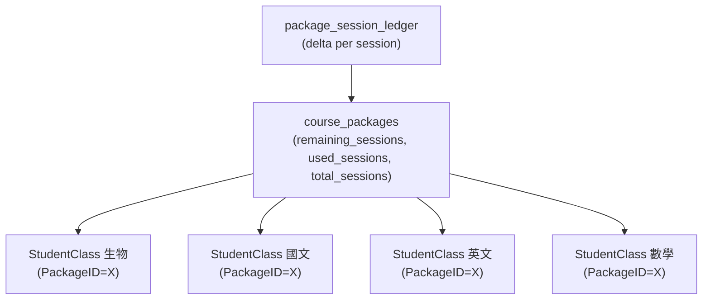

# 修正方案課程剩餘堂數顯示（共用扣減）

## 問題根因

`StudentClassController::index()` 對所有課程一律以 **`SessionCount − per-course observed usage`** 計算 `remaining_sessions`，沒有偵測 `PackageID`。

結果：每科各自算出 23 / 23 / 21 / 22，但學生實際只買 24 堂共用，正確顯示應該是同一個數字（方案池餘堂）。

相關架構如下：



目前 `index()` 忽略 `pkg.remaining_sessions`，只看各 `StudentClass` 自己的計數。

## 修正範圍

### 1. 後端：[`backend/app/Http/Controllers/StudentClassController.php`](backend/app/Http/Controllers/StudentClassController.php)

在 `index()` 的 transform 迴圈之前，**批次撈出所有 `PackageID`** 所對應的 `CoursePackage`，存入 map。

在 transform 迴圈內，當 `$class->PackageID > 0` 時：
- `remaining_sessions` = `$packageMap[$class->PackageID]->remaining_sessions`（pool 餘堂）
- `sessions_purchased` = `$class->PackageTotalSessions`（保持不變，已是 pool total）
- `used_sessions` = `$packageMap[$class->PackageID]->used_sessions`（pool 累計已用）
- 新增欄位 `package_remaining_sessions` = pool 餘堂（前端可用來區分顯示方式）

關鍵變動位置（[第 141–357 行](backend/app/Http/Controllers/StudentClassController.php#L141)）：

```php
// 新增：批次撈方案池餘堂
$packageIds = $classes->getCollection()
    ->pluck('PackageID')->filter(fn($id) => $id > 0)->unique()->values()->all();
$packageMap = $packageIds
    ? CoursePackage::whereIn('id', $packageIds)->get()->keyBy('id')
    : collect();

// ...在 transform 迴圈內原有的 remaining 計算之後加 override...
if ($class->isPartOfPackage() && isset($packageMap[$class->PackageID])) {
    $pkg = $packageMap[$class->PackageID];
    $class->remaining_sessions   = max(0, (int) $pkg->remaining_sessions);
    $class->RemainingSessions    = max(0, (int) $pkg->remaining_sessions);
    $class->used_sessions        = (int) $pkg->used_sessions;
    $class->UsedSessions         = (int) $pkg->used_sessions;
    $class->package_remaining_sessions = (int) $pkg->remaining_sessions;
}
```

需在頂端 `use` 引入 `App\Models\CoursePackage`（確認是否已有）。

### 2. 前端：[`frontend/src/pages/StudentsList.vue`](frontend/src/pages/StudentsList.vue)（[第 237–247 行](frontend/src/pages/StudentsList.vue#L237)）

目前進度條用 `used_sessions / sessions_purchased`，修正後數字已正確，**進度條邏輯不變**。

只需在「方案課程」的剩餘堂數旁加一個小提示，讓主任/老師知道這是共用數字：

```vue
<span :class="{ 'text-red': course.remaining_sessions <= 2 }">
  <strong>{{ course.remaining_sessions ?? 0 }}</strong> / {{ course.sessions_purchased || 0 }} 堂
  <span v-if="course.PackageID" class="tag tag-package-hint">（方案共用）</span>
</span>
```

- `CourseManagement.vue` 的「剩餘堂數」欄同樣補此提示（[第 362 行附近](frontend/src/pages/CourseManagement.vue)）。

### 3. 不需要修改

- `PackageDeductionService` / `SessionDeductionService` — 扣堂邏輯正確，不動
- `CoursePackagesPage.vue` — 已正確顯示 pool 餘堂，不動
- Migration — 無需新欄位

## 驗收條件

- `GET /api/v1/student-classes?student_id=X` 中，同一方案的多科課程 `remaining_sessions` 皆等於 `course_packages.remaining_sessions`
- 使用任一科上課後，所有同方案科目的 `remaining_sessions` 同步更新（下次 API 呼叫反映）
- 非方案課程 `remaining_sessions` 計算邏輯不受影響
