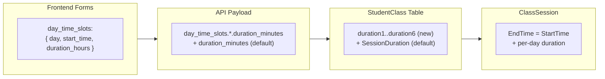

# Per-Weekday Class Duration (每週幾不同上課時長)

## Current State

- `StudentClass.SessionDuration` = single integer (minutes) for the entire course
- `day_time_slots` payload = `[{ day, start_time }]` -- no per-day duration
- `ClassSession` already has `StartTime` + `EndTime`, so each session CAN have a different duration at the DB level
- DB stores per-day schedule in `week1-6` / `time1-6` columns; **no `duration1-6` columns**
- Billing: `Rate` = flat per-session fee; `Charge = Rate * SessionCount`

## Architecture Changes



---

## Phase 1: DB Migration

Add `duration1` through `duration6` (nullable integer, minutes) to `StudentClass`, mirroring the existing `week1-6` / `time1-6` pattern. Keep `SessionDuration` as the "primary" / default duration.

File: new migration `backend/database/migrations/2026_04_10_000001_add_per_day_duration_to_student_class.php`

```php
$table->integer('duration1')->nullable();
$table->integer('duration2')->nullable();
// ... through duration6
```

Update `StudentClass` model fillable array in [backend/app/Models/StudentClass.php](backend/app/Models/StudentClass.php) to include `duration1..duration6`.

---

## Phase 2: Backend API -- Read Path

In [backend/app/Http/Controllers/StudentClassController.php](backend/app/Http/Controllers/StudentClassController.php) `index()` (around line 166-211), when reconstructing `day_time_slots`, include `duration_hours` per slot:

```php
$dayTimeSlots[$day] = [
    'day' => $day,
    'start_time' => $start,
    'duration_hours' => $class->{"duration" . ($index + 1)}
        ? round($class->{"duration" . ($index + 1)} / 60, 1)
        : $class->duration_hours,  // fallback to global
];
```

The top-level `duration_hours` remains as the primary/first-day value for backward compatibility.

---

## Phase 3: Backend API -- Write Path

### 3a. EnrollmentService (`store`)

In [backend/app/Services/EnrollmentService.php](backend/app/Services/EnrollmentService.php):

- Extend `normalizeDayTimeSlots()` to also extract `duration_minutes` per slot, returning a map: `[day => ['start_time' => ..., 'duration_minutes' => ...]]`
- When creating `ClassSession` rows, use per-day duration if present, fall back to global `duration_minutes`
- Write `duration1..duration6` alongside `week1..6` / `time1..6` in the `StudentClass` payload
- `SessionDuration` = first day's duration (backward compat)
- **`TotalHours` calculation**: sum actual hours per session instead of `sessions * single_duration / 60`

### 3b. ClassSessionController (`batchStore`)

In [backend/app/Http/Controllers/ClassSessionController.php](backend/app/Http/Controllers/ClassSessionController.php):

- Add validation: `'day_time_slots.*.duration_minutes' => 'nullable|integer|min:30|max:480'`
- `duration_minutes` remains required as the global default

### 3c. StudentClassController (`update` / `mapFrontendPayload`)

In [backend/app/Http/Controllers/StudentClassController.php](backend/app/Http/Controllers/StudentClassController.php):

- `mapFrontendPayload`: write `duration1..6` from `day_time_slots.*.duration_minutes`
- Session regeneration (around line 1661): use per-day duration map when rebuilding future sessions
- `addSession`: accept per-day override from `day_time_slots`

---

## Phase 4: Frontend -- Per-Day Duration UI

All three scheduling components need the same change pattern: each weekday row gains a **duration input** alongside the existing start-time selector.

### [frontend/src/components/UniversalClassScheduler.vue](frontend/src/components/UniversalClassScheduler.vue)

Current per-day row (line ~122-128):
```
[weekday label] [start time select] [~ computed end]
```

New per-day row:
```
[weekday label] [start time select] [duration input] [~ computed end]
```

- Global `duration_hours` becomes "預設時長" (default for newly added days)
- Each day can override
- `day_time_slots` shape becomes `[{ day, start_time, duration_hours }]`
- `computeSessionEndTime(startTime)` changes to `computeSessionEndTime(startTime, durationHours)`
- Submit: `duration_minutes` = first day's value (compat); each slot carries its own `duration_minutes`

### [frontend/src/components/EnrollmentWizard.vue](frontend/src/components/EnrollmentWizard.vue)

Same pattern as UniversalClassScheduler. Per-day row gets a duration number input. Submit payload includes `day_time_slots.*.duration_minutes`.

### [frontend/src/components/CourseEditForm.vue](frontend/src/components/CourseEditForm.vue)

Same pattern. When loading existing course data, per-day `duration_hours` from API populates each slot.

---

## Phase 5: Billing -- Proportional to Duration

### Current model
- `Rate` = flat per-session fee (名為 `rate_per_30min` 但實際是每堂費用)
- `Charge = Rate * SessionCount`

### New model (backward-compatible)
Add `rate_unit` field to `StudentClass`: `'session'` (default, legacy) | `'hour'`

**When `rate_unit = 'session'`** (all existing courses):
- Behavior unchanged: `Charge = Rate * SessionCount`

**When `rate_unit = 'hour'`** (courses with varied per-day durations):
- `Rate` = per-hour fee
- `Charge = sum(Rate * duration_hours)` for each planned session
- Frontend label changes from "一堂課費用" to "每小時費用"

Affected files:
- Migration: add `rate_unit` enum/string to `StudentClass`
- [backend/app/Services/EnrollmentService.php](backend/app/Services/EnrollmentService.php): compute `Charge` based on `rate_unit`
- [backend/app/Http/Controllers/StudentClassController.php](backend/app/Http/Controllers/StudentClassController.php): `purchaseBatch` charge calculation
- [frontend/src/lib/coursePricing.js](frontend/src/lib/coursePricing.js): `getPerSessionFee` and `getCourseTotalFee` adapt to `rate_unit`
- [frontend/src/pages/StudentsList.vue](frontend/src/pages/StudentsList.vue) and [frontend/src/pages/CourseManagement.vue](frontend/src/pages/CourseManagement.vue): column headers adapt
- [backend/app/Http/Controllers/ParentPortalController.php](backend/app/Http/Controllers/ParentPortalController.php): `resolveUnitPrice` needs updating

---

## Phase 6: Display Pages

- [frontend/src/pages/StudentsList.vue](frontend/src/pages/StudentsList.vue): `scheduleDisplay` function already reads `day_time_slots`; extend to show per-day duration (e.g., "週二 16:00 2h, 週四 16:00 1.5h")
- [frontend/src/pages/CourseManagement.vue](frontend/src/pages/CourseManagement.vue): similar display update
- [frontend/src/pages/SmartCalendar.vue](frontend/src/pages/SmartCalendar.vue): event blocks should reflect actual session duration

---

## Phase 7: Tests

- Extend [backend/tests/Feature/ClassSessionBatchApiTest.php](backend/tests/Feature/ClassSessionBatchApiTest.php): test with varied `day_time_slots.*.duration_minutes`
- Extend [backend/tests/Feature/EnrollmentApiTest.php](backend/tests/Feature/EnrollmentApiTest.php): test enrollment with per-day durations
- New test: verify `ClassSession.EndTime` varies by weekday
- New test: verify `Charge` calculation when `rate_unit = 'hour'`

---

## Risk and Compatibility Notes

- **Backward compatibility**: All existing courses have `duration1-6 = null` and `rate_unit = 'session'` (or null). Null per-day durations fall back to `SessionDuration`, so no behavior change for existing data.
- **FinanceController::calcHours** (subject-unit weighting): currently falls back to `SessionDuration` when learning record times are missing. With per-day durations, it should use `ClassSession.StartTime/EndTime` (already the primary path) -- no change needed if records have times.
- **SessionDeductionService**: counts sessions, not hours. No change needed unless we want fractional deductions.
- **ParentPortalController::resolveUnitPrice**: has an inconsistent `Rate` interpretation (per-30-min blocks). This should be normalized to respect `rate_unit`.
