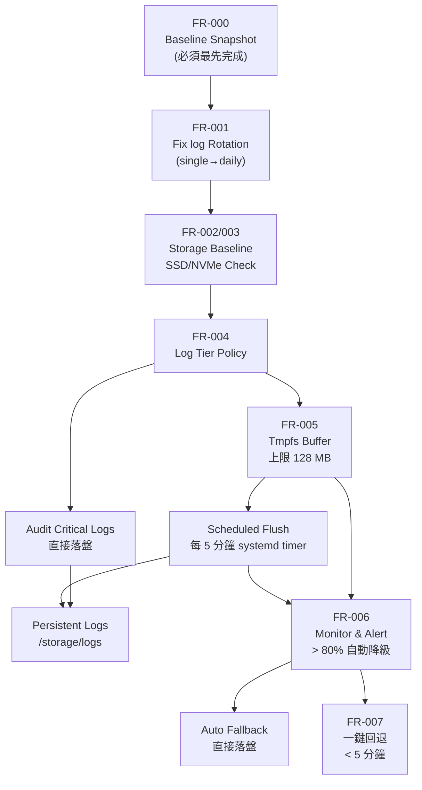

# PRD：樹莓派儲存與 Log 寫入優化

## 1. 文件資訊

| 欄位 | 內容 |
|---|---|
| 功能名稱 | 樹莓派部署儲存優化（SSD/NVMe 基線 + Log 記憶體緩衝） |
| 版本 / 日期 | v1.1 / 2026-04-16 |
| 狀態 | Draft |
| 目標角色 | 維運（IT/Ops）、技術部門（後端/DevOps）、資安、PM；間接受益：主任、老師 |

---

## 2. 目標與業務背景

**現在痛點**

- 樹莓派服務常見瓶頸在儲存 I/O，而非 CPU；高頻 log 寫入會加速儲存介質磨損。
- 目前 `backend/config/logging.php` 的 `laravel.log` 使用 `single` driver，**永不輪轉**，長期運行下單檔無上限增長，且完全落在磁碟；`perf.log` 雖有 daily 14 天輪轉，但同樣屬持久化磁碟寫入。
- 專案文件（`docs/OPERATIONS_RUNBOOK.md`、`docs/deploy-raspberry-pi.md`）有部署 SOP，但缺乏「儲存介質基線標準」與「log 寫入分級策略」。

**業務價值**

- 提升主任、老師日常操作的系統穩定感（尖峰時段 API 不卡頓）。
- 降低儲存裝置老化風險，減少突發停機與資料毀損機率。
- 建立可驗證、可回滾、可稽核的維運標準。

**成功指標（KPI）**

> 所有 KPI 均須對照 FR-000 基線快照驗收；基線未建立前，以下數字為目標值，不得作為驗收基準。

- 90% 以上正式節點使用 SSD/NVMe 作為根檔案系統。
- `laravel.log` 每日磁碟寫入量（bytes）較基線下降至少 40%。
- 高峰時段（上課時段）API P95 latency 較基線下降至少 20%，且絕對值不高於基線。
- tmpfs 緩衝使用率在正常運作時維持 < 50%（128 MB 上限下 < 64 MB）。
- 三個月內因儲存寫入導致的非計畫性停機事件為 0。

---

## 3. 範圍

**In Scope**

- 建立現況效能基線快照（前置阻擋項）。
- 修正 `laravel.log` 無輪轉問題（改為 daily driver）。
- 定義並落地 Raspberry Pi 生產環境儲存基線（SSD/NVMe）。
- 導入 log 分級策略：高頻 operational log 先入記憶體（tmpfs），定時落盤。
- 補齊監控與告警（tmpfs 使用率、落盤失敗、磁碟健康）。
- 補齊部署、回滾、驗收 SOP 文件。

**Out of Scope**

- 不重寫業務邏輯（課務、點名、財務）。
- 不更換 Laravel 框架或 major logging library。
- 不一次性改造所有歷史環境；先以正式節點與新節點為優先。

---

## 4. RACI

| 角色 | 代表 | R/A/C/I |
|---|---|---|
| PM | | A |
| CTO / 工程 Lead | | R（技術方案核定） |
| 後端 / DevOps | | R（實作） |
| IT / Ops | | R（節點部署、Canary 執行、監控） |
| QA | | R（驗證與回歸） |
| 資安 | | C（存取控制、稽核要求） |

> 注意：IT/Ops 是本次主要執行者（掛載 tmpfs、設定落盤排程、執行 Canary），應列為 R，非 I。

---

## 5. User Stories

**業務視角**

- As a 主任 / 老師, I want 系統在上課尖峰時段維持穩定反應, so that 我可以快速完成點名、查詢學生與填寫評量，不被系統卡頓打斷。
  - Acceptance Criteria
    - [ ] 尖峰時段（上課 30 分鐘窗口）API P95 不高於基線值。
    - [ ] 不因儲存優化導致任何業務資料遺失或錯誤。

**維運視角**

- As a 維運人員, I want 服務節點使用 SSD/NVMe 作為根檔案系統, so that 降低 I/O 瓶頸與媒體耗損風險。
  - Acceptance Criteria
    - [ ] 每台節點可用 `lsblk` / `findmnt` 證明根檔案系統非 SD 卡。
    - [ ] 節點硬體盤點清單完整，含型號、容量、健康狀態。

- As a 後端工程師, I want 高頻 log 先寫入記憶體並定時落盤, so that 減少隨機寫入放大與 I/O 爭用。
  - Acceptance Criteria
    - [ ] 高頻 log 在 tmpfs 路徑可觀測（`df -h` 可見 tmpfs 掛載點）。
    - [ ] 落盤任務依排程成功執行，且有失敗告警。
    - [ ] `laravel.log` 已改為 daily 輪轉，無無上限單檔。

- As a 資安人員, I want log 保留與稽核策略一致, so that 不因優化導致稽核缺口。
  - Acceptance Criteria
    - [ ] 稽核必要欄位完整保留於持久化磁碟。
    - [ ] log 保存天數與存取權限符合政策（天數由資安最終核定）。

---

## 6. 功能需求（FR）

- **FR-000（前置阻擋項）**：系統應在任何改動前，建立可量測的現況基線快照，至少包含：各節點根檔案系統來源（`lsblk`）、`laravel.log` 每日寫入 bytes、`perf.log` 成長速率、熱點 API P95 現況。基線未完成，禁止進行 FR-001 以後的任何改動。
- **FR-001**：系統應修正 `backend/config/logging.php`，將 `laravel.log` 的 `single` driver 改為 `daily`（建議保留 14 天，與 `perf.log` 一致），解決無輪轉問題。
- **FR-002**：系統應提供節點儲存介質盤點腳本，輸出根檔案系統來源、裝置型號與健康狀態。
- **FR-003**：系統應建立部署基線：生產節點根檔案系統需使用 SSD/NVMe（或等效裝置）。
- **FR-004**：系統應定義 log 分級（高頻 operational / 中頻 / 稽核關鍵），僅高頻類別走 tmpfs 緩衝。
- **FR-005**：系統應將高頻 operational log 寫入 tmpfs（建議上限 128 MB），並由排程於固定間隔落盤（建議預設 5 分鐘，理由：控制斷電最大損失 < 5 分鐘，避免 1 分鐘 I/O 尖峰過密；最終週期由 CTO 與 Ops 確認）。
- **FR-006**：系統應在 tmpfs 容量超過門檻（建議 80% / 102 MB）、落盤失敗、落盤延遲時觸發告警，並自動降級為直接落盤。
- **FR-007**：系統應提供一鍵回退機制，可在 5 分鐘內恢復原本直接落盤策略。
- **FR-008**：系統應更新維運文件，包含安裝、驗收、故障排除與回滾 SOP。

---

## 7. 非功能需求（NFR）

**效能**

- NFR-001：導入後 API P95 不得高於基線值；目標為較基線下降至少 20%。
- NFR-002：落盤作業單次執行不得造成 API latency spike（CPU 增量 < 5%，持續時間 < 10 秒）。

**可靠性**

- NFR-003：斷電情境下，最多允許遺失最後一個落盤週期（預設 5 分鐘）內之高頻非關鍵 log。
- NFR-004：稽核關鍵 log 不得僅存在 tmpfs，必須即時寫入持久化磁碟。

**錯誤處理與降級**

- NFR-005：tmpfs 使用率超過 80% 時自動降級為直接落盤，並產生告警。
- NFR-006：落盤任務連續失敗 3 次時，自動切換回安全模式並通知維運。

---

## 8. 技術方向（給 CTO，非實作細節）

**受影響頁面 / API / 資料表**

- 頁面：無直接使用者頁面改動（維運層需求）。
- API：`/api/v1/health` 需擴充儲存與 log pipeline 狀態回傳。
- 資料表：不新增業務資料表；若需紀錄維運事件，可評估新增輕量 `ops_event` 表（待 CTO 決議，列為 P1）。

**受影響檔案（方向性）**

- [`backend/config/logging.php`](backend/config/logging.php)（FR-001：single → daily）
- [`docs/OPERATIONS_RUNBOOK.md`](docs/OPERATIONS_RUNBOOK.md)
- [`docs/deploy-raspberry-pi.md`](docs/deploy-raspberry-pi.md)
- [`docs/PERF_ROLLOUT_RUNBOOK.md`](docs/PERF_ROLLOUT_RUNBOOK.md)
- `scripts/`（基線量測腳本、tmpfs 掛載設定、落盤排程腳本）

**架構取捨**

- 採「分級 log 策略」而非全量 tmpfs，平衡效能與稽核完整性。
- 採「可回滾雙路徑」而非一次性切斷，降低上線風險。
- 採「小步 rollout（單校 Canary 先行）」而非全站同時切換，控制影響面。
- `laravel.log` 輪轉問題優先於 tmpfs 導入，因為輪轉未解時，tmpfs 落盤後仍面臨單檔無限增長問題。

**tmpfs 容量建議**

- RPi 5 通常 4–8 GB RAM；MySQL + PHP-FPM 正常佔用約 1–2 GB。
- 建議 log tmpfs 上限 128 MB（< 3% 總 RAM），保守且可調。
- 超過 80%（102 MB）觸發告警並自動降級。

**落盤機制建議**

- 觸發方式：systemd timer（優於 cron，有失敗追蹤與日誌整合）。
- 建議週期：5 分鐘（平衡斷電損失與 I/O 頻率）。
- 落盤方式：`rsync` 或 `cp` 後清空 tmpfs 舊檔，保留最近 N 筆在記憶體加速讀取。

**是否需要 migration**

- FR-001（log rotation 設定）：不需要 DB migration。
- 若導入 `ops_event` 稽核落盤事件，才評估 migration（P1）。

**子任務 Agent 派發**

- `[FEATURE]`：log rotation 修正、log 分級策略、tmpfs 設定、健康檢查與告警整合
- `[TEST]`：基線量測腳本、壓力 / 失敗注入與回歸測試設計
- `[REVIEW]`：資安、權限、故障模式審查
- `[DOCS]`：SOP、部署、回滾與 changelog

---

## 9. 資安與存取控制（給資安 / IT）

**角色與權限**

- 僅 `super_admin` / IT 維運角色可變更 log 策略參數（tmpfs 大小、落盤週期、分級設定）。
- 既有 `role:*` 與 `require_campus` 規則不得因維運調整而弱化。
- log 檔案（tmpfs 與持久化）應設定 `chmod 640`，僅 `www-data` 與維運群組可讀。

**PII 與敏感資料**

- log 不得新增明文 token、密碼、完整身份資訊（學生姓名、手機號碼）。
- 需稽核既有 `debug` level log，確認無 PII 明文，再進行 tmpfs 導入（避免高頻落盤擴散敏感資料）。

**稽核要求**

- 策略切換、手動落盤、失敗重試、回滾操作均需可追溯（操作者、時間、原因）。
- 稽核關鍵 log 保留天數 [TODO: 需確認] 由資安最終核定；建議預設 90 天。

**STRIDE 快評**

- Spoofing：需限制誰可切換策略（僅 `super_admin` / IT）。
- Tampering：log 落盤鏈路需具完整性保證（落盤後比對 size 或 line count）。
- Information Disclosure：tmpfs 與持久化檔案權限最小化（`chmod 640`）。
- Denial of Service：tmpfs 爆量自動降級，避免因記憶體耗盡影響 API。
- Repudiation：維運操作（策略切換、回滾）需保留稽核紀錄。

---

## 10. QA 驗收標準與測試計畫

**FR-000（基線快照）— 前置阻擋項**

- Happy Path：基線量測完成，各指標已記錄並歸檔。
- Error Case：基線量測失敗（log 無資料、命令權限不足），**禁止繼續後續改動**。

**FR-001（log rotation 修正）**

- Happy Path：`laravel.log` 每日自動輪轉，14 天後舊檔自動刪除。
- Edge Case：輪轉當下有大量 log 寫入，不遺失任何 log 行。
- Error Case：輪轉失敗時有錯誤紀錄，人工可識別。
- Regression：既有 `tail -30 backend/storage/logs/laravel.log` 排障流程不受影響。

**FR-004 / FR-005（log 分級 + tmpfs）**

- Happy Path：高頻 operational log 寫入 tmpfs，稽核關鍵 log 仍直接持久化。
- Edge Case：tmpfs > 80% 時自動降級為直接落盤，服務不中斷。
- Error Case：落盤任務失敗觸發告警並記錄事件；連續 3 次失敗切安全模式。
- Regression：不影響 Laravel 既有 log 讀取路徑（`storage/logs/laravel.log` 路徑不變）。

**FR-006（監控與告警）**

- Happy Path：模擬 tmpfs 高水位，告警在 1 分鐘內觸發。
- Edge Case：告警系統本身不可用時，降級動作仍自動執行。
- Regression：不影響既有 `docs/OPERATIONS_RUNBOOK.md` H 節全 API 500 排障 SOP。

**FR-007（一鍵回滾）**

- Happy Path：回滾腳本執行完成，直寫落盤恢復，API health 正常。
- Edge Case：回滾執行中斷，可重複執行且結果一致（冪等）。
- Error Case：回滾失敗時提供明確人工介入步驟。
- Regression：回滾後 API P95 不高於基線值。

**對照已知回歸風險**

- 對照 `docs/AI_REGRESSION_LESSONS.md`，確認部署流程不造成前端資產不同步（`index.html` 與 chunk 同輪 deploy）或 API 健康檢查漏驗。

---

## 11. 上線與維運（給 IT / Ops）

**Canary 策略**

- 選定單一分校節點（建議人流最少的分校）先行導入。
- Canary 成功標準（通過後才擴展全量）：
  - 觀測 24–48 小時（含至少 2 個上課尖峰時段）。
  - API P95 無退化（不高於基線值）。
  - tmpfs 使用率穩定 < 50%（< 64 MB）。
  - 落盤成功率 100%，無告警觸發。
  - 主任 / 老師無異常反映。

**部署步驟**

- Step 1：執行 FR-000 基線量測並歸檔（必須最先）。
- Step 2：上線 FR-001 log rotation 修正，觀察 1 個工作天確認輪轉正常。
- Step 3：在 Canary 節點掛載 tmpfs、設定 systemd flush timer、調整 `logging.php`。
- Step 4：執行 Canary 觀測（24–48 小時），通過成功標準後擴展全量。
- Step 5：全量上線後，執行回滾演練（演練不影響服務），確認 5 分鐘內可恢復。

**監控新增項目**

- tmpfs 使用率（每分鐘）、flush 成功率、flush 延遲（秒）、磁碟寫入速率（MB/s）、API P95。

**回滾方案**

- 保留原始 `logging.php` 設定檔快照。
- 回滾腳本：卸載 tmpfs → 停用 systemd timer → 還原 `logging.php` → 重啟 PHP-FPM。
- 整個流程需文件化，目標在 5 分鐘內完成。

---

## 12. 里程碑與優先級

| 優先級 | 功能項目 | 預估工期 | 執行 Agent |
|---|---|---|---|
| P0（Must Have） | FR-000 基線快照 | 0.5 天 | IT/Ops |
| P0（Must Have） | FR-001 log rotation 修正 | 0.5 天 | `[FEATURE]` |
| P0（Must Have） | FR-002/003 儲存介質盤點與基線 | 1 天 | IT/Ops |
| P0（Must Have） | FR-004/005 log 分級 + tmpfs + 落盤 | 2–3 天 | `[FEATURE]` `[TEST]` |
| P0（Must Have） | FR-006/007 告警、降級與回滾機制 | 1–2 天 | `[FEATURE]` `[REVIEW]` |
| P1（Should Have） | `/api/v1/health` 擴充 log pipeline 狀態 | 1–2 天 | `[FEATURE]` |
| P1（Should Have） | 稽核事件結構化報告 | 2–3 天 | `[FEATURE]` `[DOCS]` |
| P2（Nice to Have） | 長期趨勢儀表板（I/O 與 log 量） | 2–3 天 | `[DOCS]` Ops |
| P2（Nice to Have） | 自動化容量調參建議 | 2–3 天 | `[DOCS]` Ops |

---

## 13. 風險、假設、開放問題

**風險**

- 高：tmpfs 容量設定過大，擠壓 MySQL 與 PHP-FPM 可用記憶體，影響 API 穩定性。緩解：上限 128 MB（< 3% RAM），Canary 先行觀測。
- 高：`laravel.log` 在 single driver 下若已過大，rotation 切換當下可能有短暫 I/O 尖峰。緩解：在離峰時段（22:00 後）執行 FR-001 切換。
- 中：落盤排程與上課尖峰時段重疊，造成短時 I/O 競爭。緩解：尖峰時段（18:00–21:00）避開落盤，或採分段落盤。
- 低：文件未同步造成值班人員認知落差。緩解：FR-008 文件更新為 DoD 必要項。

**假設**

- 現行節點（已確認為 NVMe SSD）具備足夠 RAM（≥ 4 GB）可安全分配 128 MB tmpfs。
- 監控系統可接收新增告警指標（若無，需先評估告警方式）。
- 上線排程可安排在非上課尖峰時段。

**開放問題**

- [TODO: 需確認] 關鍵稽核 log 的最短保留天數（建議預設 90 天），Owner：資安。
- [TODO: 需確認] 落盤週期最終值（建議 5 分鐘），Owner：CTO + Ops。
- [TODO: 需確認] 是否新增 `ops_event` 資料表存放策略切換歷史，Owner：CTO。
- [TODO: 需確認] 告警通知方式（LINE Notify / Email / Slack），Owner：IT/Ops。

---

## 14. Definition of Done

- [ ] FR-000：現況基線快照已建立並歸檔，各 KPI 基準值已記錄。
- [ ] FR-001：`laravel.log` 已改為 daily rotation，無上限單檔問題已解決。
- [ ] FR-002/003：節點盤點清單完整，所有生產節點根檔案系統確認非 SD 卡。
- [ ] FR-004/005：log 分級策略落地，tmpfs 緩衝與落盤排程正常運作。
- [ ] FR-006：告警與自動降級機制測試通過（含 Canary 觀測 24–48 小時）。
- [ ] FR-007：一鍵回滾腳本演練完成，5 分鐘內可恢復確認。
- [ ] FR-008：`docs/OPERATIONS_RUNBOOK.md`、`docs/deploy-raspberry-pi.md` 與 `docs/CHANGELOG.md` 已更新。
- [ ] KPI 較 FR-000 基線達標（寫入量下降 ≥ 40%、P95 下降 ≥ 20%、tmpfs 使用率 < 50%）。
- [ ] 資安審查無阻擋項（PII log 稽核、檔案權限最小化）。
- [ ] Canary 全量擴展完成，主任 / 老師無異常反映。
- [ ] CTO / 工程 Lead sign-off。
- [ ] PM sign-off。
