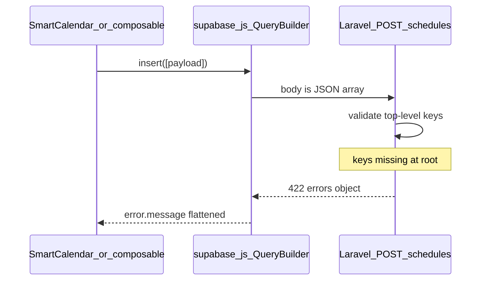

# 行事曆調課 `validation.required` — 技術說明與修復計畫

## 1. 問題摘要（給技術／產品）

| 項目 | 說明 |
|------|------|
| **使用者現象** | 智慧排課拖曳或表單「確認調課」後跳出 `調課失敗：validation.required` 重複多次。 |
| **影響功能** | 凡透過 [`frontend/src/supabase.js`](frontend/src/supabase.js) `insert([row])` 呼叫 `POST /api/v1/schedules` 的流程：**調課、請假寫 schedules、加課**；[`useRescheduleAndMakeup.js`](frontend/src/composables/course-management/useRescheduleAndMakeup.js)、[`api.js`](frontend/src/api.js) 同路徑亦同。 |
| **根因** | `insert()` 將 body 固定為 **JSON 陣列** `JSON.stringify(this._body)`（見 [`supabase.js`](frontend/src/supabase.js) 約 204–207、245–250 行）。Laravel [`ScheduleController::store`](backend/app/Http/Controllers/ScheduleController.php) 使用 `$request->validate([...])`，預期 **根物件** 含 `student_id`、`day_of_week`、`start_time`、`end_time`、`branch_id` 等。陣列根節點時欄位落在 `0.*`，驗證器視為缺漏 → 多個 `required` 錯誤；[`flattenValidationErrors`](frontend/src/supabase.js) 將錯誤併成一串顯示。 |
| **為何約五次 `validation.required`** | 驗證規則中恰好有五個 `required`：`student_id`、`day_of_week`、`start_time`、`end_time`、`branch_id`（其餘多為 `nullable`）。 |

## 2. 建議解法（擇一，技術部門拍板）

**方案 A（建議）：前端 POST 單筆時 unwrap**

- 修改 [`frontend/src/supabase.js`](frontend/src/supabase.js)：`POST` 且 `_body` 為「長度 1、元素為 plain object」時，`body: JSON.stringify(_body[0])`；其餘（多筆陣列、非物件）維持原樣。
- **優點**：一處修正，所有「假 Supabase + Laravel 單筆 REST」的 `insert([x])` 一併對齊常見 REST 慣例；與 [`StudentController::store`](backend/app/Http/Controllers/StudentController.php) 等讀 `$request->all()` 頂層鍵的行為也一致。
- **風險**：若未來某 API **刻意**要收 JSON 陣列 batch，需另闢路由或標頭區分；目前 repo 內 `insert` 均為單筆陣列包裝，未見多筆 batch。

**方案 B：後端 unwrap**

- 在 [`ScheduleController::store`](backend/app/Http/Controllers/ScheduleController.php) 開頭：若 `$request->all()` 為單一數值鍵 `0` 且值為陣列，則 `$request->replace($request->input('0'))` 再 `validate`。
- **優點**：不改前端、舊版前端仍可用。
- **缺點**：只修 `schedules`；其他同樣 `insert([row])` 的 `POST` 若也有 `validate` 頂層，仍可能壞（需逐一盤點）。

**建議決策**：優先 **方案 A**；若需相容舊前端或未部署前端的裝置，可 **A + B**（後端防禦性 unwrap 僅作保險）。

## 3. 驗證與上線

- **自動測試**：新增或擴充 Pest Feature：對 `POST /api/v1/schedules` 送 **單一 JSON 物件**（Bearer + `branch_id` 等），預期 201；可選再加「陣列 body」若採方案 B 則應 201。
- **手動**：智慧排課拖曳調課、請假、加課各走一輪；課程管理內依賴同 client 的排程寫入若有則一併點檢。
- **前端上線**：若改 [`frontend/src/supabase.js`](frontend/src/supabase.js)，依專案規則執行 `cd frontend && npm run deploy`，避免 `index.html` 與 hash chunk 不同步（見 `docs/AI_REGRESSION_LESSONS.md`）。

## 4. 技術部門回報用簡短結論（可貼 Slack / 工單）

> 根因：前端 `supabase.js` 的 `POST` 將 `insert([row])` 序列化為 JSON **陣列** `[{...}]`，而 `ScheduleController::store` 的 `$request->validate()` 只讀 **根層** 欄位，導致必填欄位全被判為缺漏（422），UI 顯示多個 `validation.required`。  
> 建議：POST 單筆時改送單一 JSON **物件** `{...}`（或後端 unwrap 單元素陣列）；上線前跑排程相關 Feature test 並 `npm run deploy`。
