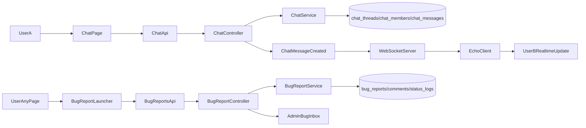

# AllTrue 內部聊天 + Bug 回報整合規劃

## 目標與範圍
- 第一版支援：
  - 校區內人員（老師/主任/行政）`1對1`聊天
  - 校區內群組聊天室（例如：分校公告群、教務群）
  - 即時收發、已讀/未讀、聊天室清單最後訊息預覽
  - 全系統任何頁面可提交 Bug 回報（含頁面上下文、錯誤描述、優先級）
  - Bug 受理流程由 `admin/super_admin` 更新狀態與回覆
- 不納入第一版：聊天檔案上傳、語音/通話、跨校聊天、家長端聊天、外部工單系統雙向同步。

## 現況對接（以現有架構為基礎）
- 前端無 router，頁面切換透過 `active` key，聊天頁可直接掛在 [`/home/admin/frontend/src/App.vue`](/home/admin/frontend/src/App.vue) 導覽結構。
- API 與 token 模式沿用既有 `/api/v1/*` + Bearer token（`AttachAuthUser`），避免引入第二套 auth。
- 分校隔離沿用 `require_campus` 與 request 內 `auth_campus_ids` 範式，聊天資料需強制綁定 `CampusID`。
- 專案目前沒有現成 broadcasting wiring，需新增 Laravel broadcasting + WebSocket server 能力。
- 既有通知模組已有 `unread-count` 與已讀邏輯，可複用概念到「聊天未讀」與「Bug 受理通知」。

## 技術方案（建議）
- 後端：Laravel 8 Broadcasting（Pusher protocol）
  - Driver 可選：
    - 自建 `soketi`（推薦，資源輕、部署彈性高）
    - 或託管 Pusher（最快，但有外部成本）
- 前端：`laravel-echo` + `pusher-js` 訂閱私有頻道
- 權限：
  - 私訊頻道：僅對話成員可訂閱
  - 群組頻道：僅群組成員可訂閱
  - 全部以 `CampusID` 做硬限制
- 降級機制：WebSocket 連線失敗時，退回 5-10 秒輪詢（僅聊天室清單與未讀數）

## 資料模型設計
- 新增 migration（建議放在 [`/home/admin/backend/database/migrations`](/home/admin/backend/database/migrations)）：
  - `chat_threads`
    - `id`, `CampusID`, `type`(`dm`/`group`), `name`(群組用), `created_by`, `last_message_id`, `last_message_at`, timestamps
    - index: `(CampusID, last_message_at)`
  - `chat_thread_members`
    - `id`, `thread_id`, `user_id`, `role`(`owner`/`member`), `joined_at`, `left_at`, `last_read_message_id`, `last_read_at`
    - unique: `(thread_id, user_id)`
  - `chat_messages`
    - `id`, `thread_id`, `sender_user_id`, `sender_name_snapshot`, `body`, `message_type`(`text`), `created_at`
    - index: `(thread_id, id)`
- Model 建議放在 [`/home/admin/backend/app/Models`](/home/admin/backend/app/Models)：
  - `ChatThread.php`, `ChatThreadMember.php`, `ChatMessage.php`

## Bug 回報資料模型設計
- 新增 migration（建議放在 [`/home/admin/backend/database/migrations`](/home/admin/backend/database/migrations)）：
  - `bug_reports`
    - `id`, `CampusID`, `reporter_user_id`, `title`, `description`, `severity`(`low`/`medium`/`high`/`critical`), `status`(`new`/`triaged`/`in_progress`/`resolved`/`closed`), `page_key`, `url`, `client_info`, `assigned_to`, `created_at`, `updated_at`
    - index: `(CampusID, status, severity, created_at)`
  - `bug_report_comments`
    - `id`, `bug_report_id`, `author_user_id`, `body`, `is_internal_note`, `created_at`
    - index: `(bug_report_id, id)`
  - `bug_report_status_logs`
    - `id`, `bug_report_id`, `changed_by`, `from_status`, `to_status`, `note`, `created_at`
    - index: `(bug_report_id, created_at)`
- Model 建議：
  - `BugReport.php`, `BugReportComment.php`, `BugReportStatusLog.php`

## API 與事件設計
- 路由新增於 [`/home/admin/backend/routes/api.php`](/home/admin/backend/routes/api.php) 既有 `v1` + `role:director,teacher` + `require_campus` 區塊：
  - `GET /api/v1/chat/threads`：聊天室列表（含未讀數、最後訊息）
  - `POST /api/v1/chat/threads/dm`：建立/取得 1對1 thread
  - `POST /api/v1/chat/threads/group`：建立群組
  - `GET /api/v1/chat/threads/{id}/messages?before_id=`：訊息分頁
  - `POST /api/v1/chat/threads/{id}/messages`：送訊息
  - `POST /api/v1/chat/threads/{id}/read`：更新已讀游標
  - `GET /api/v1/chat/unread-count`：總未讀
- Controller/Service：
  - [`/home/admin/backend/app/Http/Controllers`](/home/admin/backend/app/Http/Controllers) 新增 `ChatController.php`
  - [`/home/admin/backend/app/Services`](/home/admin/backend/app/Services) 新增 `ChatService.php`（成員驗證、未讀計算、DM 去重）
- Broadcast：
  - 新增 `ChatMessageCreated` event（ShouldBroadcast）
  - 新增 channel 授權（私有 thread channel）
- Bug 回報 API（同樣放 [`/home/admin/backend/routes/api.php`](/home/admin/backend/routes/api.php) 的 `v1` 群組）：
  - `POST /api/v1/bugs`：提交回報（director/teacher/admin）
  - `GET /api/v1/bugs`：查詢列表（回報者看自己；admin/super_admin 看校區內全部）
  - `GET /api/v1/bugs/{id}`：查看詳情
  - `POST /api/v1/bugs/{id}/comments`：新增留言/處理回覆
  - `POST /api/v1/bugs/{id}/status`：更新狀態（僅 admin/super_admin）
  - `POST /api/v1/bugs/{id}/assign`：指派承辦（僅 admin/super_admin）
- Controller/Service 新增：
  - [`/home/admin/backend/app/Http/Controllers`](/home/admin/backend/app/Http/Controllers) `BugReportController.php`
  - [`/home/admin/backend/app/Services`](/home/admin/backend/app/Services) `BugReportService.php`

## 前端頁面與資料流
- 新增 [`/home/admin/frontend/src/pages/ChatPage.vue`](/home/admin/frontend/src/pages/ChatPage.vue)
  - 左側：聊天室列表（未讀 badge、搜尋）
  - 右側：訊息流 + 輸入框
  - 上方：群組建立、成員管理（第一版可先只做建立與查看）
- 調整 [`/home/admin/frontend/src/App.vue`](/home/admin/frontend/src/App.vue)
  - 新增 `chat` menu item、`active === 'chat'` 的渲染區塊
  - 角色限定：`director/teacher/admin` 顯示
- 新增 API 封裝於 [`/home/admin/frontend/src/lib`](/home/admin/frontend/src/lib)
  - `chatApi.js`：threads/messages/read/unread endpoints
  - `chatRealtime.js`：Echo 初始化、頻道訂閱/反訂閱
- Bug 回報 UI：
  - 新增 [`/home/admin/frontend/src/components/BugReportLauncher.vue`](/home/admin/frontend/src/components/BugReportLauncher.vue)（全域浮動按鈕或頁面右下入口）
  - 新增 [`/home/admin/frontend/src/pages/BugReportsPage.vue`](/home/admin/frontend/src/pages/BugReportsPage.vue)（列表/詳情/狀態流轉）
  - 新增 [`/home/admin/frontend/src/lib/bugReportsApi.js`](/home/admin/frontend/src/lib/bugReportsApi.js)
  - 在 [`/home/admin/frontend/src/App.vue`](/home/admin/frontend/src/App.vue)：
    - 全域掛載 launcher（除家長入口）
    - 新增 `bugs` page（admin/super_admin 可見完整受理視圖；其他角色為我的回報）
- 分校行為
  - 所有請求帶 `branch_id` 或讓後端依 token 校區判斷；切換分校時重建 chat state 與頻道訂閱，Bug 列表也同步切換校區上下文。

## 權限與安全規則（必做）
- 任一 thread/message 讀寫前，先驗證：
  - 使用者屬於 thread 成員
  - thread `CampusID` 在 `auth_campus_ids` 內
- 禁止跨校查詢 thread id（回傳 404，避免資訊洩漏）
- 群組建立者預設 `owner`，僅 owner 可調整成員（可放第二迭代）
- Bug 回報權限：
  - `director/teacher/admin` 可提交與查看自己回報
  - `admin/super_admin` 可查看校區內全部回報、更新狀態、指派與內部註記
  - 任何跨校 `bug_id` 查詢回傳 404
- 建議狀態規範：`new -> triaged -> in_progress -> resolved -> closed`（允許 `resolved -> in_progress` reopen）

## 實作順序（5 個里程碑）
1. **M1 資料層與 API 基礎**
   - 聊天與 Bug 回報 migration + models + 基礎 CRUD
2. **M2 WebSocket 打通**
   - broadcasting config、事件推送、前端 Echo 訂閱
3. **M3 Chat UI**
   - ChatPage + App menu 接入 + 未讀 badge 與訊息即時刷新
4. **M4 Bug 回報 UI 與受理流**
   - 全域提交入口 + BugReportsPage + 狀態流轉/指派
5. **M5 測試與上線**
   - Feature tests + 手動驗收 + 部署文件更新

## 測試與驗收
- 後端 Feature tests（建議新增於 [`/home/admin/backend/tests/Feature`](/home/admin/backend/tests/Feature)）
  - `ChatApiTest.php`：建 thread、發訊息、讀取訊息、read cursor、unread count
  - `ChatCampusIsolationTest.php`：跨校 thread 不可讀寫
  - `BugReportApiTest.php`：提交、列表、留言、狀態更新、指派
  - `BugReportCampusIsolationTest.php`：跨校 bug 不可讀寫
- 前端手測
  - A 帳號發訊息，B 帳號 <1 秒內收到
  - 斷線重連後可補拉歷史訊息
  - 切分校後不應看到他校聊天室
  - 任一頁面可快速提交 bug（含頁面上下文）
  - admin 可受理與更新狀態，提交者可看到狀態回覆

## 部署與營運
- 需新增 WebSocket 服務進程（soketi 或等價）到現有部署流程
- 記錄必要 env：WebSocket host/port/key/secret/app_id
- 上線 checklist：
  - API 健康檢查
  - WebSocket 連線檢查
  - 權限/跨校隔離回歸
  - 前端 deploy（實作階段會執行 `cd /home/admin/frontend && npm run deploy`）

## 系統流程圖

## 主要風險與對策
- WebSocket 基礎設施首次導入風險：先在 staging 驗證連線/重連，再上 production
- 舊專案無 router，頁面狀態管理易混雜：聊天狀態集中在 `ChatPage` composable，不污染 `App.vue`
- 未讀計算效能：以 `last_read_message_id` + `messages.id` 比對，避免重掃全文
- Bug 回報可能變成「無優先級待辦池」：加入 `severity` + SLA 欄位與 triage 優先排序規則
