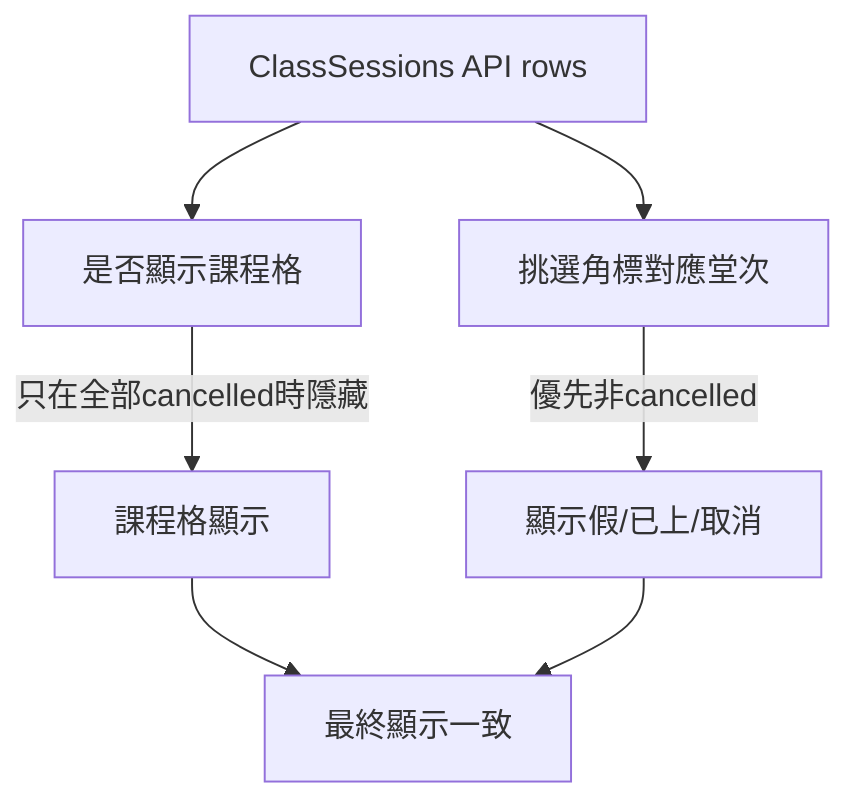

# 張正樂 4/15 誤顯示取消修正計畫

## 問題釐清
目前行事曆與課程管理都以 `ClassSession` 為主資料來源，但「取消角標」判斷邏輯與「是否顯示該課程格」邏輯不同步：
- 課程是否顯示：若同日堂次不是「全部 cancelled」就會顯示（`SmartCalendar.vue` 的 `isSessionCancelledOnDate`）。
- 角標顯示：`findSessionRowForCell` 目前只用日期+起始時間 `find()` 第一筆，可能先拿到舊的 `cancelled` 列，導致角標顯示「取消」。

這會在「同日同時段同課程存在 cancelled + scheduled 併存」時出現你看到的畫面（有課程格，但角標寫取消）。

## 影響範圍
- 前端行事曆：[`/home/admin/frontend/src/pages/SmartCalendar.vue`](/home/admin/frontend/src/pages/SmartCalendar.vue)
- 前端堂次資料正規化：[`/home/admin/frontend/src/lib/classSessionsApi.js`](/home/admin/frontend/src/lib/classSessionsApi.js)
- 後端堂次查詢來源：[`/home/admin/backend/app/Http/Controllers/ClassSessionController.php`](/home/admin/backend/app/Http/Controllers/ClassSessionController.php)

## 修正策略

### 0) CTO 架構決策（先定規則再改碼）
- **單一真相（Single Source of Truth）**：行事曆單格顯示與角標判斷，都以同一組 `ClassSession` rows 解析結果為準，不允許各自 `find()`。
- **狀態優先序（建議版）**：`attended/completed/late/absent` > `scheduled` > `leave/leave_adjusted/excused` > `cancelled`。
- **同狀態 tie-break**：先用 `id` 較大者（代表較新資料）作為暫行規則；若後端後續提供 `updated_at`，再切換為時間優先。
- **非目標（本期不做）**：不直接做破壞性資料清理（刪/改歷史堂次），先以顯示邏輯修正止血。

### 1) 前端主修：角標選取改為「狀態優先」而非第一筆
在 `SmartCalendar.vue`：
- 調整 `findSessionRowForCell`：同日同時段若有多筆，按狀態優先權挑選，避免 `cancelled` 蓋掉有效堂次。
- 使用上面 CTO 決策定義的固定優先序，避免後續人員各自重寫。
- 若同狀態多筆，採 `id desc`，確保最新異動覆蓋舊狀態。

### 2) 前端一致性補強：共用同一個「有效堂次選擇器」
- 讓 `rollCallBadge`、`evalBadge`、（必要時）tooltip/右鍵操作共用同一挑選函式。
- 避免一處判定 scheduled、另一處判定 cancelled 的分裂行為。

### 3) 後端防呆（次要、可第二階段）
在 `ClassSessionController` / 排課異動流程增加觀測與去重策略評估：
- 先加查詢與日誌，統計同 `StudentClassID + SessionDate + StartTime` 的多筆狀態分布。
- 若確定屬於異常重複，可規劃後續資料整併規則（但本次先不做破壞性資料修復）。

## 交付分階段（CTO 版）
- **Phase 1（本週必交）**：前端單格解析器統一 + 張正樂 4/15 案例修正 + 回歸驗證。
- **Phase 2（下週觀測）**：後端重複堂次分布觀測，輸出數據報告（比例、主要來源、是否集中在特定操作）。
- **Phase 3（必要才啟動）**：資料修復提案（migration/script）與風險審核後再執行。

## 驗證與回歸
1. 針對張正樂案例（4/15）驗證：
- 課程管理仍看得到 4/15。
- 行事曆同一格不再顯示「取消」誤標。
2. 建立回歸案例（手動+API）：
- 同日同時段 `cancelled + scheduled`：應顯示非取消狀態。
- 同日全為 `cancelled`：課程格隱藏或顯示取消需符合既有產品規則（目前邏輯是隱藏）。
- 同日 `leave + scheduled`：角標應以有效堂次為主，不誤判。
3. 若有前端變更，執行 `cd /home/admin/frontend && npm run deploy`。

## QA 驗收條件（DoD）
- **案例修復達成**：張正樂 4/15 在行事曆不再顯示「取消」誤標，且課程格與課程管理資訊一致。
- **規則一致性**：同一格堂次解析規則（狀態優先序 + tie-break）在 `rollCallBadge`、`evalBadge`、tooltip/操作入口一致生效。
- **回歸不破壞**：以下場景與既有規格一致，無新增錯誤顯示或課程格消失。
- **資料對應可追溯**：任一顯示結果可追到對應 `ClassSession` row，避免前端黑箱判斷。
- **上線可控**：具備明確回滾條件與觀測指標，且 QA 有結論（Pass/Fail + 風險備註）。

## QA 測試項目
1. **核心修復案例（必測）**
- 張正樂 4/15：課程格存在、角標非取消、時間正確、老師/科目資訊正確。

2. **狀態組合測試（必測）**
- 同日同時段 `cancelled + scheduled`：應顯示有效堂次（非取消）。
- 同日同時段 `attended + cancelled`：應優先顯示已上/完成語意。
- 同日同時段 `leave + scheduled`：應依優先序顯示預期狀態（不得誤標取消）。
- 同日同時段全為 `cancelled`：符合現行規則（課程格隱藏或取消顯示，以產品定義為準）。

3. **視圖與操作流程回歸（必測）**
- 行事曆日視圖、週視圖皆驗證同一堂次結果一致。
- 右鍵操作、點名角標、評量角標與 tooltip 一致，不出現互相矛盾。
- 課程管理頁堂次列表與行事曆同日期狀態一致。

4. **角色與分校權限（必測）**
- 主任角色與老師角色看到的堂次狀態一致（僅權限差異，不應出現狀態判斷分裂）。
- 切換分校後不應混入他分校堂次造成誤標。

5. **API 一致性測試（建議）**
- `GET /api/v1/class-sessions` 回傳 rows 與前端最終顯示一一對應。
- 若存在同時段多筆 rows，驗證前端是否按設計優先序挑選。

6. **發版前檢核（必測）**
- 完成測試紀錄（案例、結果、截圖/錄影、失敗重現步驟）。
- 依上線守門條件判定是否可上線；不符即阻擋並回報。

## 上線守門與回滾
- **上線條件**：張正樂案例與 3 個回歸場景全部通過，且未出現新誤標。
- **觀測指標（7 天）**：行事曆「取消誤標」客服回報數、同時段多筆異常比例。
- **回滾條件**：若出現「課程格消失」或「評量/點名角標大面積異常」，立即回滾前端解析器改動。

## 交付切分（更新）
- PR A（必做）：前端 `SmartCalendar` 解析器統一與角標修正 + 回歸驗證。
- PR B（建議）：後端資料品質觀測腳本/查詢 + 監控口徑。
- PR C（條件式）：資料整併方案（僅在觀測證明必要時啟動）。