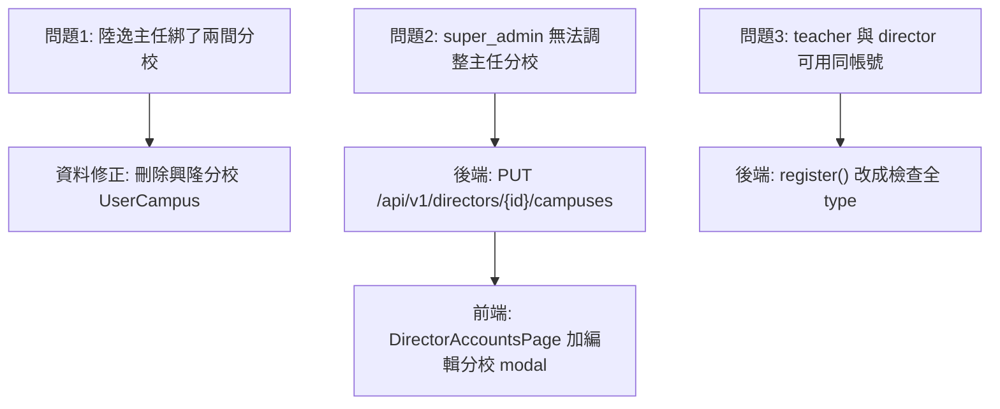

# 主任跨校管理與帳號衝突修正

## 三個問題與對應解法



---

## Task 1 — 資料修正（陸逸保留大直）

直接對資料庫執行一條刪除：

- 刪除 `UserCampus` 中 `UserID=158, CampusID=17`（興隆分校）的那筆記錄
- 不動老師帳號（id=81, type=T），兩人帳號分開存在，保留原狀

---

## Task 2 — 後端：新增「編輯主任分校」API

**檔案**: [`backend/app/Http/Controllers/DirectorAccountController.php`](backend/app/Http/Controllers/DirectorAccountController.php)

新增一個方法 `updateCampuses`，路由：

```
PUT /api/v1/directors/{id}/campuses
Body: { "campus_ids": [3, 17] }
```

邏輯：
- 僅 super_admin 可呼叫
- 傳入的 campus_ids 替換掉該主任目前所有 Approved=true 的 UserCampus
- 至少保留 1 間（不允許清空）
- 在 `backend/routes/api.php` 補上對應路由

---

## Task 3 — 前端：主任列表加「編輯分校」按鈕與 modal

**檔案**: [`frontend/src/pages/DirectorAccountsPage.vue`](frontend/src/pages/DirectorAccountsPage.vue)

在「已審核主任」表格的操作欄，於「重設密碼」旁邊加一個「編輯分校」按鈕。

點擊後彈出簡單 modal：
- 列出所有校區，以 checkbox 多選（或若設計為「不允許跨校」可改為 radio 單選）
- 至少勾選一間才可儲存
- 儲存後呼叫 `PUT /api/v1/directors/{id}/campuses`，重新 loadActive()

> **設計決策**：預設允許主任跨校（用 checkbox），super_admin 自行決定要給幾間。若你希望強制只能單一分校，可改為 radio，這樣 UI 上就自然限制。

---

## Task 4 — 後端：封堵 LoginName 全域唯一

**檔案**: [`backend/app/Http/Controllers/DirectorAccountController.php`](backend/app/Http/Controllers/DirectorAccountController.php)

`register()` 目前只查 `whereIn('type', ['D', 'U', 'S', 'A'])`，漏掉 `type=T`（老師）。

修正為查全部 type：

```php
// 修改前
$accountInUseByDirectorSide = User::where('LoginName', $loginName)
    ->whereIn('type', ['D', 'U', 'S', 'A'])
    ->exists();

// 修改後
$accountInUse = User::where('LoginName', $loginName)->exists();
if ($accountInUse) {
    return response()->json(['message' => '此帳號已被使用'], 422);
}
```

同樣地，`ProfileController::store()`（主任手動新增老師時）也有 `conflictingTypesForLoginName()` 方法隔離 T 與 D namespace，需一併改為全域唯一檢查。

---

## 執行順序

1. Task 1：立即修資料（刪除陸逸的興隆分校）
2. Task 4：後端 bug fix（LoginName 全域唯一）
3. Task 2：後端 API（編輯主任分校）
4. Task 3：前端 UI（編輯分校 modal）+ deploy
