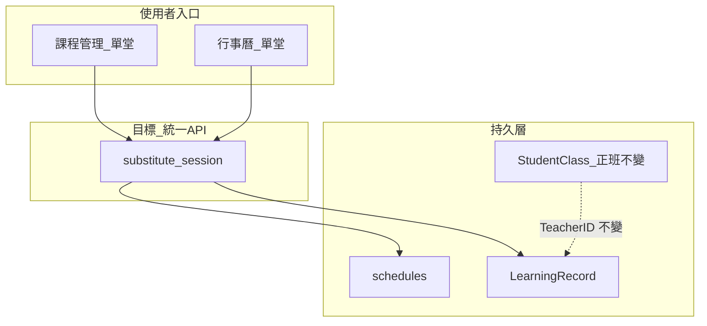

# 需求文件（PRD）：單堂「換代課老師」— 課程管理／行事曆雙入口

**文件對象**：技術部門（後端／前端／QA）  
**提出單位**：產品  
**狀態**：待開發評估與排期  
**關聯模組**：課程管理 [`CourseManagement.vue`](frontend/src/pages/CourseManagement.vue)、智慧排課 [`SmartCalendar.vue`](frontend/src/pages/SmartCalendar.vue)、排課例外 `schedules`、堂次 `ClassSession`、學習評量 `LearningRecord`、API [`ScheduleController`](backend/app/Http/Controllers/ScheduleController.php)、[`LearningRecordController`](backend/app/Http/Controllers/LearningRecordController.php)、[`ClassSessionController`](backend/app/Http/Controllers/ClassSessionController.php)

---

## 1. 背景與問題

目前「正班老師」綁在課程主檔 `StudentClass.TeacherID`；實際每一堂 `ClassSession` **沒有**獨立授課老師欄位。代課若要讓行事曆出現在代課老師名下，需依賴 `schedules` 例外列的 `teacher_id`；評量則依 `LearningRecord.TeacherID`，且主任須到「學習評量」頁手動「換老師」。**沒有**從課程管理或行事曆單堂課一鍵完成的統一入口，營運易漏步驟、兩邊資料不同步。

另：老師帳號查看評量列表時，[`LearningRecordController::index`](backend/app/Http/Controllers/LearningRecordController.php) 對 `TeacherID` 與「正班課程 ID 集合」為 **AND**，代課老師即使已被寫入 `LearningRecord.TeacherID`，仍可能**看不到**該筆待填評量。

---

## 2. 目標（Goals）

1. **雙入口、一致結果**：主任在 **課程管理** 或 **智慧排課行事曆** 點選「單堂課」（特定 `ClassSession` 對應之上課日＋時段／或明確之 session id），皆可開啟 **「換代課老師」** 流程；完成後系統達成以下一致狀態（見第 4 節驗收）：
   - **行事曆／課表**：該堂顯示於 **代課老師** 名下（週檢視與老師篩選行為與產品決策一致）。
   - **學習評量**：該堂對應之 `LearningRecord` 的授課老師為 **代課老師**（**不**變更 `StudentClass.TeacherID`，後續堂次仍為正班）。
   - **課程主檔**：`StudentClass.TeacherID` 維持正班（除非另開「整門課換老師」產品，本需求不包含）。
2. **代課老師可自助**：代課老師登入後，於學習評量列表可看到並填寫被指派的該堂評量。
3. **稽核與還原**：保留原因說明（可選填）、操作人、時間；支援主任在合理範圍內 **撤銷代課**（還原為正班顯示與評量老師，需定義與已核准評量／已點名之衝突規則）。

## 3. 非目標（Non-goals）

- 不改「整門課程換老師」既有行為（學習評量內「同時更換此課程的授課老師」為另一條路）。
- 本文件不強制變更薪資公式；若需「正班請假」標記供薪資使用，另列營運規則與報表需求。

---

## 4. 使用者故事與驗收標準（Acceptance Criteria）

### 4.1 課程管理 — 單堂換代課

- **As** 主任，**I want** 在課程展開的「上課日期」中對某一堂點選操作並選「換代課老師」，**so that** 我不必切到行事曆或評量頁分別處理。
- **AC**
  - 可選代課老師（僅限已綁定該分校之帳號，與既有換老師規則一致）。
  - 儲存後，該堂在 **智慧排課** 週檢視中出現在代課老師欄（依第 5 節技術方案實作）。
  - 該堂若已有評量紀錄：`LearningRecord.TeacherID` 更新為代課；若尚無，應建立或關聯正確 `ClassSessionID` 之 pending 紀錄（行為須與現有「堂次與評量一對一」規則一致，避免孤兒紀錄）。
  - 課程列表明細仍顯示正班老師為「課程老師」亦可，但**該堂**需有明確 UI 提示「本堂代課：XXX」（Phase 1 可用標籤＋tooltip；Phase 2 可改為讀取堂次級欄位）。

### 4.2 行事曆 — 單堂換代課

- **As** 主任，**I want** 在智慧排課點選某堂（含由課程展開之格子或上下文選單），選「換代課老師」，**so that** 與課程管理操作結果完全一致。
- **AC**
  - 與 4.1 完成後之 DB／API 狀態一致；重複操作代課應為 idempotent 或明確錯誤（不可留下重複 `schedules` 幽靈列）。
  - 權限：`director`／`admin`／`super_admin`（與現有調課／請假一致）；老師角色是否開放由產品決定（預設 **不開放**）。

### 4.3 代課老師 — 評量列表

- **AC**：代課老師帳號呼叫 `GET /api/v1/learning-records`（無額外參數）必能列出 `TeacherID`＝自己且課程仍屬正班之該堂待填／待審紀錄。

### 4.4 正班老師 — 當日課表呈現（需產品拍板）

下列擇一寫入規格並驗收（與現有 `hasLeave`／`rescheduled` 合併邏輯相關，見 [`SmartCalendar.vue`](frontend/src/pages/SmartCalendar.vue)）：

| 選項 | 正班老師週檢視該時段 | 代課老師週檢視 |
|------|----------------------|----------------|
| A | 不顯示該堂（空白） | 顯示該堂 |
| B | 顯示「假」或「代課中」佔位（不計為可授課節點） | 顯示該堂 |
| C | 其他（請產品補充 wireframe） | 顯示該堂 |

**待辦**：產品／營運於 `prd-signoff` 確認選項（影響是否調整 `hasLeave` 與例外列並存規則）。

---

## 5. 技術方案建議（供工程評估）

### Phase 1（較快上線）：編排既有能力＋新 API 封裝

- **行事曆**：以與現行調課相同之 **`rescheduled`（原日）＋ `scheduled`（同日、同時段、`teacher_id`＝代課）** 寫入 `schedules`，避免「同日 `leave` ＋ `scheduled`」被 [`hasLeave`](frontend/src/pages/SmartCalendar.vue) 擋下之組合。
- **評量**：後端在單一 transaction 內呼叫與 [`PATCH .../learning-records/{id}/teacher`](backend/app/Http/Controllers/LearningRecordController.php) 相同之商業規則（**不**帶 `update_class`），或抽出共用 Service 供 API 使用。
- **建議新增**：`POST /api/v1/student-classes/{id}/sessions/{sessionId}/substitute`（路徑為例）由後端保證：
  - 驗證 `ClassSession` 屬於該 `StudentClass`、分校／權限。
  - 寫入／更新 `schedules` 兩筆與 `LearningRecord.TeacherID`（與 `LearningRecordTeacherChange` 稽核）。
  - 回傳標準化 DTO（代課老師 id、schedules id、learning_record id）供兩個前端入口共用。

### Phase 2（資料單一真相）：堂次級授課老師

- 新增 `ClassSession.SessionTeacherID`（nullable；未填＝正班），所有「這堂誰上」之讀取改為 `COALESCE(SessionTeacherID, StudentClass.TeacherID)`；並定義與 `schedules` 雙向同步或逐步淘汰例外列之策略（工程估工較大，含出缺勤、主任儀表板、家長端等迴歸面）。

---

## 6. 前端實作要點（摘要）

| 區域 | 行為 |
|------|------|
| [`CourseManagement.vue`](frontend/src/pages/CourseManagement.vue) | 單堂選單新增「換代課老師」→ Modal（老師搜尋、原因、確認）→ 呼叫統一 API |
| [`SmartCalendar.vue`](frontend/src/pages/SmartCalendar.vue) | 既有課格上下文選單新增同一項目、同一 Modal 元件或可共用 composable |
| 共用 | 成功後 toast、並 invalidate 課程列表／行事曆／評量相關快取或重打 `loadCourses`／對應 query |

---

## 7. 後端與資料注意事項

- **多校區**：代課老師須通過 `UserCampus` 與該堂學生 `CampusID` 一致之檢查（與既有換老師 API 一致）。
- **衝堂**：寫入 `schedules` 前沿用 [`ScheduleGuardService`](backend/app/Services/ScheduleGuardService.php)（與調課相同）。
- **與 `reschedule-session` 關係**：若單鍵代課 API 內部需同步 `ClassSession` 時間／RFID 對應，須明確是否呼叫既有 `reschedule-session` 或改由 Service 內聚，避免雙重寫入。
- **測試**：Pest Feature — 代課 API 成功、`learning-records` 老師列表、行事曆 API 回傳之 `teacher_id`、重複代課 idempotent。

---

## 8. 風險與依賴

- **正班畫面空白 vs 顯示假**：未拍板前，工程實作選項 A 最省改動；選項 B 需動 [`SmartCalendar.vue`](frontend/src/pages/SmartCalendar.vue) 合併邏輯。
- **代課老師看不到評量**：屬 **release blocker**，應與 Phase 1 一併修正 [`LearningRecordController::index`](backend/app/Http/Controllers/LearningRecordController.php) 老師篩選邏輯。
- **出缺勤／刷卡**：若仍僅以 `StudentClass.TeacherID` 篩選，代課老師手機點名列表可能缺該堂 — 若產品要求代課也能點名，需另開任務（`ClassSessionController`／Attendance 篩選與 Phase 2 欄位）。

---

## 9. 文件與上線

- 更新營運操作手冊：兩入口皆可換代課、與「整門換老師」之差異、錯誤訊息（撞課、未綁分校）。
- 前端若有變更 `frontend/src`，上線流程仍依倉庫規範執行 `npm run deploy`（與技術部門既有流程一致）。

---

## 10. 參考：現況資料流（簡圖）

