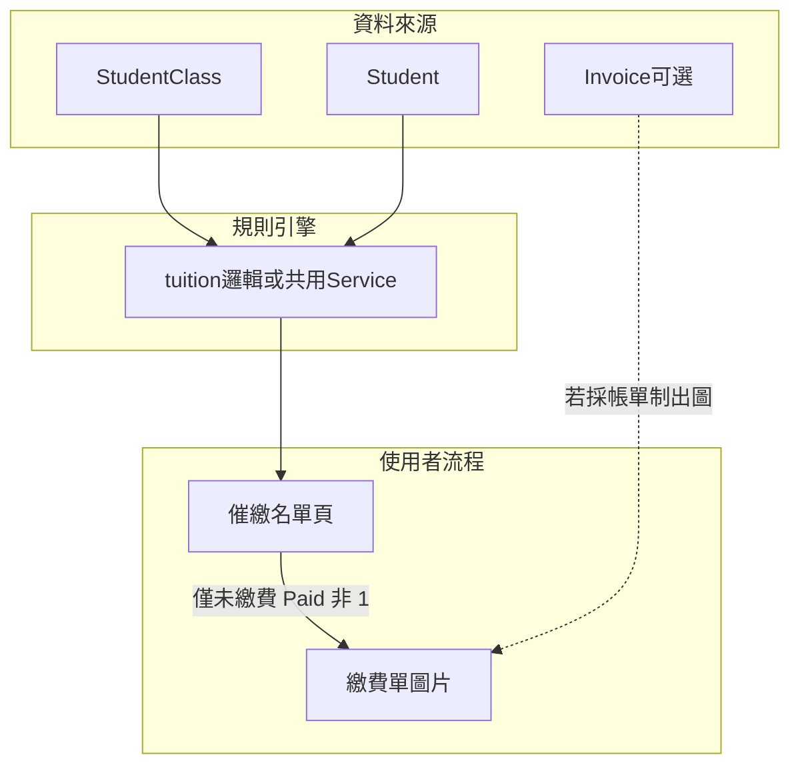

# 催繳名單自動彙整 + 專屬繳費單圖片 — 跨單位需求說明（PM → CTO／資安／UI·UX）

## 1. 背景與目標

**業務目標**：櫃檯／主任希望系統能依固定規則，**自動彙整「本週／本階段需要聯繫繳費或續課」的名單**，並可對其中**尚未繳費**者**一鍵產出可傳 LINE 給家長的繳費單圖片**，降低人工對帳與漏催。

**產品定案（補充）**：**已繳費（`Paid = 1`）者不產出、不提供「繳費單圖片」操作**（含堂數制「已繳但剩 ≤2 堂／0 堂」之續課提醒列——該列仍可出現在**聯繫／續課名單**，但不走繳費單流程）。月結制已繳且僅「快到期」之列，同樣不開繳費單。

**成功畫面（高層）**：主任打開「催繳／繳費單」專區 → 看到與規則一致的名單 → 僅對 **未繳費** 且具出單條件者 → 產生圖片 → 下載或複製傳家長。

---

## 2. 範圍與名詞（與現有系統對齊）

| 名詞 | 現況來源 | 說明 |
|------|----------|------|
| **堂數制低堂數** | [`StudentClass`](backend/app/Models/StudentClass.php) `ScheduleMode = count` | `RemainingSessions <= 2`（**含 0 堂**）；已繳費仍可能列（續課／加購），與 [`docs/DIRECTOR_PAYMENT_ALERT_RULES.md`](docs/DIRECTOR_PAYMENT_ALERT_RULES.md) 一致。 |
| **月結「快到期」** | 同上 `ScheduleMode = date` + `settlement_day` | 現行規則為「今天與本次計算繳費日相隔 **0～4 天** 才列入；**第 5 天整日不算**」；**已過繳費日且未繳**則**一律**列入（逾期催繳）。見同檔「月結制」章節。 |
| **進行中課程** | `Stop = 0` | 與提醒 API 相同，暫停／結案不列。 |
| **分校** | `branch_id` / `CampusID` | 名單與圖片皆須依目前分校隔離。 |
| **繳費單資格** | `StudentClass.Paid` | **`Paid != 1`（未繳）** 才允許產出／顯示「繳費單」按鈕；已繳僅列名單聯繫續課或月結將屆，**不出繳費單**。 |

**產品對齊提醒（給產品／CTO）**：需求文字若寫「月結小於等於五天」，須與現行文件「**小於 5 天（0～4）**」明確對齊；若業務要改成「含第 5 天」或「曆日 5 天內不同算法」，屬 **[`AlertController::tuition`](backend/app/Http/Controllers/AlertController.php) 變更管制**（見 [`docs/DIRECTOR_PAYMENT_ALERT_RULES.md`](docs/DIRECTOR_PAYMENT_ALERT_RULES.md)「變更管制」），須產品明示同意並更新文件與測試。

---

## 3. 功能需求（給工程／CTO）

### 3.1 自動彙整「要繳費／需聯繫」名單

- **觸發**：進入專用頁面時載入；可選「手動重新整理」與背景快取策略（CTO 決策：即時查 DB vs 快取 1～5 分）。
- **規則**：與 **`GET /api/v1/alerts/tuition`**（[`AlertController::tuition`](backend/app/Http/Controllers/AlertController.php)）**同一套條件**，避免「總覽有提醒、催繳名單沒有」的認知落差。
- **輸出欄位（建議最低集）**：學生姓名、科目／課程識別、`alert_type`、`remaining_sessions`（堂數制）、`due_date` / `days_until_settlement`（月結）、`Paid` 狀態、`StudentClass` id、分校。
- **技術選項（CTO 決一即可）**  
  - **A**：新頁直接呼叫既有 `GET /api/v1/alerts/tuition?branch_id=…`（最快、零規則分叉）。  
  - **B**：抽出 `TuitionAlertService`（名稱示意），`tuition` 與名單共用（長期可維護，一次 refactor 範圍需評估）。

### 3.2 對名單「專屬繳費單圖片」

- **前置條件（產品已定）**：僅 **`Paid != 1`（未繳費）** 之名單列可進入繳費單／出圖流程；**`Paid = 1` 一律隱藏或停用**出單按鈕（後端若提供批次出圖 API，亦須拒絕已繳列）。已繳列如需聯繫續課，改以「複製提醒文案／電話」等非繳費單路徑（UI/UX 設計）。
- **現況**：繳費單圖片資料來自 **`Invoice` + `GET /api/v1/invoices/{id}/slip-data`**（[`BillingController::slipData`](backend/app/Http/Controllers/BillingController.php)），見 [`frontend/src/components/PaymentSlipModal.vue`](frontend/src/components/PaymentSlipModal.vue)。
- **缺口（須產品拍板）**：`alerts/tuition` 列的是 **`StudentClass`**，未必已有 **`Invoice`**。  
  - **選項 1**：僅對「已有帳單」列顯示「出繳費單」；其餘顯示「請先開立帳單」或導向開帳流程。  
  - **選項 2**：**無帳單時**用 `StudentClass` + 應繳摘要產生「催繳通知圖」（非正式 Invoice，抬頭／免責字句不同）——需新 API 或擴充 slip DTO，**不得**與正式帳單混用編號語意。  
  - **選項 3**：一鍵「由提醒列建立草稿帳單」再出圖（牽涉帳務流程與審計，CTO 評估）。

### 3.3 非功能需求（CTO）

- **效能**：名單僅分校內資料；大校區需分頁或虛擬捲動。  
- **權限**：維持主任／`require_campus`；是否開放櫃檯角色另議。  
- **稽核（若走開帳）**：誰在何時對哪一筆建立帳單／出圖，建議 log（最小：user id、student_class id、invoice id、timestamp）。

---

## 4. 資安與個資（給資安／法遵）

- **傳輸與儲存**：圖片含學生姓名、金額、期間；下載／剪貼簿屬**終端裝置行為**，須在操作說明中提醒勿傳錯對象、LINE 群組誤傳風險。  
- **最小揭露**：圖片上是否顯示完整姓名、帳單編號；家長端是否只顯示暱稱／末字遮罩（UI/UX + 產品）。  
- **存取控制**：`slip-data` 已應校驗學生校區與主任可管校區；新「無 Invoice 出圖」API 必須**同等**檢查，禁止以 `StudentClassID` 枚舉他校。  
- **變更與規則**：若調整「幾天內算快到期」之演算法，須同步 [**變更管制**](docs/DIRECTOR_PAYMENT_ALERT_RULES.md) 與回歸測試（`TuitionAlertsApiTest` 等）。

---

## 5. UI/UX（給設計／前端）

- **資訊架構**：新建「催繳名單」或置於「帳單列表」旁 tab；與 [`DirectorDashboard.vue`](frontend/src/pages/DirectorDashboard.vue)「繳費／續課提醒」區塊文案一致，避免兩處規則不同說法。  
- **名單列**：強調 **alert_type** 與「下一步建議」（續課／繳月費／逾期）；月結列顯示 `due_date` 與倒數／逾期天數（與 API 欄位一致）。  
- **已繳列**：列上可標示「已繳／續課聯繫」；**不顯示「繳費單」主按鈕**，避免誤傳「催繳圖」給已繳家長（與產品定案一致）。  
- **批次操作**：多選 →「批次產生圖片」僅納入未繳列；可能產生多檔 ZIP 或逐一下載（需行動裝置體驗評估）。  
- **空狀態**：無符合條件時說明「本分校目前無待催繳課程」，與空帳單列表區隔。  
- **無障礙**：列表鍵盤操作、狀態不只靠顏色（已部分於總覽實作者可沿用）。

---

## 6. 里程碑建議（給 CTO 排程）

| 階段 | 內容 | 依賴 |
|------|------|------|
| M1 | 催繳名單頁 + 只吃 `alerts/tuition` 資料 | 無 Invoice 需求 |
| M2 | 有 Invoice 者一鍵開現有 [`PaymentSlipModal`](frontend/src/components/PaymentSlipModal.vue) | 需 Invoice 與 StudentClass 關聯可查 |
| M3 | 無 Invoice 的出圖或自動開草稿帳單 | 產品選項 1/2/3 + 資安稽核 |

---

## 7. 開放決策（請產品／CTO 會前定案）

1. 月結「五天」是否**維持現行 0～4 天**還是**改定義**（觸發變更管制）。  
2. 無 `Invoice` 時，出圖採 **阻擋**、**替代催繳圖**、或 **自動開帳單** 哪一種。  
3. 名單是否需 **匯出 CSV**（僅內部）或禁止匯出以降低外洩（資安）。  
4. ~~已繳費是否產繳費單~~ **已定案：已繳不產繳費單**（見 §1、§3.2）。

---

## 8. 參考檔案（工程實作索引）

- 規則單一來源：[docs/DIRECTOR_PAYMENT_ALERT_RULES.md](docs/DIRECTOR_PAYMENT_ALERT_RULES.md)  
- API：[backend/app/Http/Controllers/AlertController.php](backend/app/Http/Controllers/AlertController.php)（`tuition`）  
- 總覽 UI：[frontend/src/pages/DirectorDashboard.vue](frontend/src/pages/DirectorDashboard.vue)  
- 帳單／繳費單：[frontend/src/pages/BillingList.vue](frontend/src/pages/BillingList.vue)、[backend/app/Http/Controllers/BillingController.php](backend/app/Http/Controllers/BillingController.php)（`slipData`）
