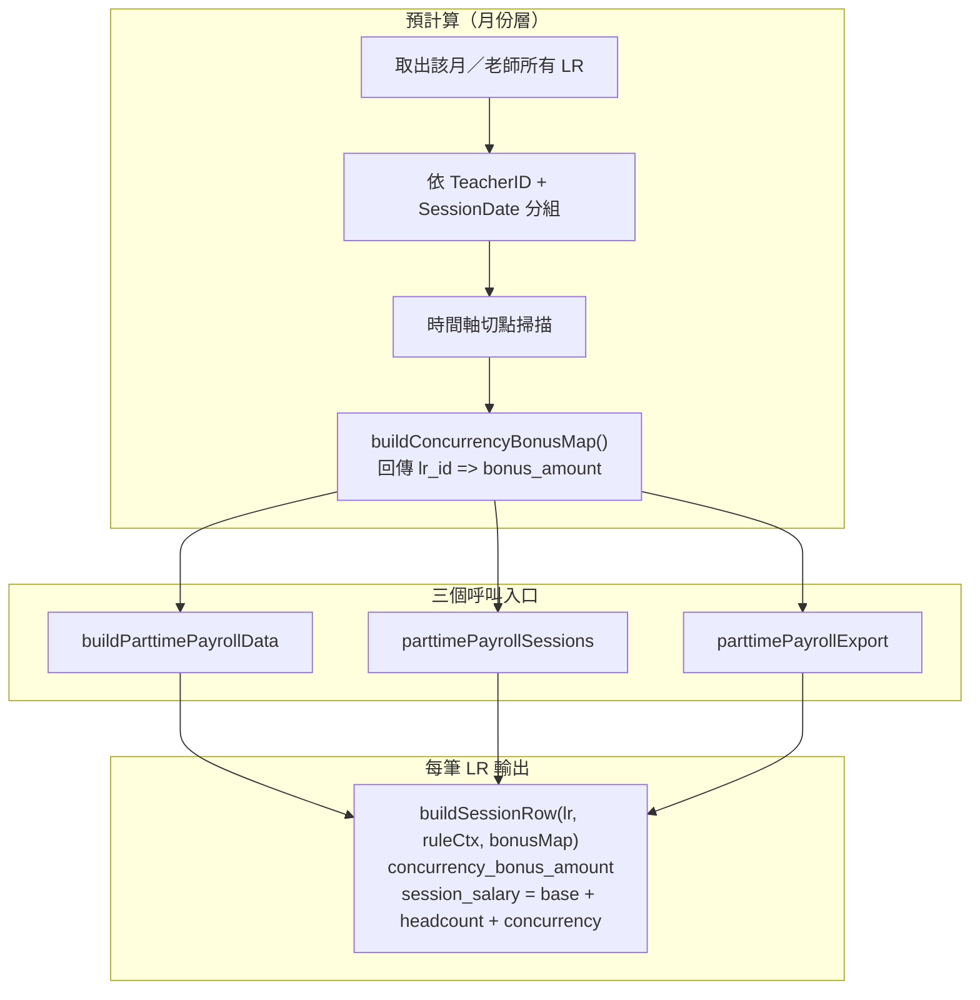

# 兼職薪資：併堂重疊加給（PM 修正計畫）

## 1. 業務規則（已與需求方對齊）

### 1.1 k 的定義：學生總人數，非 Session 數

- 重疊區內 k = 所有同時進行中的 LR **學生數加總**（非 Session 數）
- 各課型學生數對應：

| ClassType | 學生數 |
|-----------|--------|
| `one_on_one` | 1 |
| `one_on_two` | 2 |
| `one_on_three` | 3 |
| `tutoring` | 1（輔導亦計入，確認值）|

- 最大 k = 3（業務上不會超過）

### 1.2 加給計算公式

```
重疊區總加給（師收） = 50（元/人/小時）× k × Δt（小時）
每筆 LR 獲分加給      = 50 × 該堂學生數 × Δt
```

- **50 是時薪費率**，Δt 為浮點小時數（精確到分鐘）；半小時重疊 Δt=0.5、兩小時重疊 Δt=2，依此乘算，**不做整點捨入**。
- 兩式等價（∵ Σ各堂學生數 = k），同時確保每筆明細可獨立對帳。

| 重疊時長 Δt | k=2（兩個學生） | k=3（三個學生） |
|------------|----------------|----------------|
| 0.5h（30 分） | 50×2×0.5 = **50 元** | 50×3×0.5 = **75 元** |
| 1h | 50×2×1 = **100 元** | 50×3×1 = **150 元** |
| 2h | 50×2×2 = **200 元** | 50×3×2 = **300 元** |

### 1.3 與既有人數加成（headcount_bonus）的關係

兩種加成**獨立疊加，互不排除**：

| 加成項目 | 觸發條件 | 計算基礎 |
|----------|----------|----------|
| headcount_bonus（既有） | ClassType 為 one_on_two / one_on_three | 全堂時數，無論是否重疊 |
| concurrency_bonus（新增） | 同日有 ≥2 筆 LR 時間重疊 | 僅限重疊時段長度 |

範例：一對二課（2 學生）與另一門一對一（1 學生）重疊 1h：
- 一對二課：headcount_bonus +50/h（全程）＋concurrency_bonus +100（1h 重疊，50×2×1）
- 一對一課：headcount_bonus 0 ＋concurrency_bonus +50（1h 重疊，50×1×1）
- 老師當日額外收 +150 元（重疊補貼）

### 1.4 缺少時間資訊的 LR

- 若某筆 LR 無有效 `StartTime` / `EndTime`，**排除在重疊計算之外**，`concurrency_bonus_amount = 0`；原 `session_salary` 不變（安全兜底，系統正常情況不應發生）。

## 2. 現況與落差

- 現行 [`buildSessionRow`](backend/app/Http/Controllers/FinanceController.php) 只有 `session_salary = round((baseRate + headcountBonus) * hours)`，無時間重疊邏輯。
- `buildSessionRow` 被三處呼叫（總覽、明細分頁、匯出）且各自獨立，若 bonus 未在呼叫前統一預算，三處金額會不一致——**本次架構重點即解決此問題**。
- [`docs/PRD_PARTTIME_TEACHER_PAYROLL.md`](docs/PRD_PARTTIME_TEACHER_PAYROLL.md) §4 未描述併堂；§4.3 公式需擴充。

## 3. 技術設計要點



- **預計算時機**：三個入口呼叫 `buildSessionRow` 之前，必須先用同一份 `bonusMap` 計算完畢再傳入，確保總覽、明細、CSV 三處數字一致。
- **切點演算法**：收集同一老師同一天所有有效時間 LR 的 `StartTime` / `EndTime` → 排序形成事件點 → 掃描每段內同時進行中的 LR → 計算各段長度 Δt → 按學生數分配給各筆 LR。
- **設定值**：`payroll.concurrency_bonus_per_student`（預設 50），獨立於 `headcount_bonus`。

## 4. 需修改的產物

| 產物 | 內容 |
|------|------|
| PRD | [`docs/PRD_PARTTIME_TEACHER_PAYROLL.md`](docs/PRD_PARTTIME_TEACHER_PAYROLL.md) 新增 §4.x 併堂加給完整規則、更新 §4.3 公式與範例表 |
| 後端（新增） | [`FinanceController.php`](backend/app/Http/Controllers/FinanceController.php)：新增 `private buildConcurrencyBonusMap(Collection $records): array` |
| 後端（修改） | 三個入口（`buildParttimePayrollData`、`parttimePayrollSessions`、`parttimePayrollExport`）預計算 bonusMap 並傳入 `buildSessionRow`；`buildSessionRow` 增加 `concurrency_bonus_amount` 欄、`session_salary` 含三項加總 |
| 設定 | [`backend/config/payroll.php`](backend/config/payroll.php) 新增 `concurrency_bonus_per_student => 50` |
| 測試 | [`backend/tests/Feature/ParttimePayrollTest.php`](backend/tests/Feature/ParttimePayrollTest.php) 增加下列情境（詳見 §5） |
| 前端 | [`frontend/src/pages/ParttimePayrollPage.vue`](frontend/src/pages/ParttimePayrollPage.vue) 明細表新增「併堂加給」欄；[`frontend/src/lib/parttimePayrollApi.js`](frontend/src/lib/parttimePayrollApi.js) 型別對應；匯出 CSV 欄位同步；平均時薪文案標註「含併堂加給」 |

## 5. 驗收情境（QA）

| # | 情境 | 重疊段 | k（學生） | 期望加給（總） | 每筆 LR 加給 |
|---|------|--------|-----------|---------------|-------------|
| 1 | 僅 1 堂一對一（無重疊） | — | — | 0 | 0 |
| 2 | A(1人) 17–19 + B(1人) 18–20 | 18–19（**1h**） | 2 | +100 | A +50, B +50 |
| 3 | A(1人) 17–19 + B(1人) 18:30–20 | 18:30–19（**0.5h**） | 2 | +50 | A +25, B +25 |
| 4 | A(1人) 17–20 + B(1人) 18–20 | 18–20（**2h**） | 2 | +200 | A +100, B +100 |
| 5 | A(2人 one_on_two) 17–19 + B(1人) 18–20 | 18–19（1h） | 3 | +150 | A +100, B +50 |
| 6 | 輔導(1人) 17–19 + 一對一(1人) 18–20 | 18–19（1h） | 2 | +100 | 各 +50 |
| 7 | 三堂一對一完全重疊 1h | 1h | 3 | +150 | 各 +50 |
| 8 | LR 無 StartTime，與另一堂重疊 | — | — | 缺時 LR bonus=0，另一堂依有效k計算 | — |
| 9 | 鎖帳後僅檢視 | — | — | 數字與鎖定前一致 | — |

注意：情境 5 中 A 的 `headcount_bonus`（+50/h×2h=100）**另外仍保留**，不被 concurrency_bonus 取代。

## 6. 風險與溝通

- **平均時薪顯示**：`avg_hourly_rate = total_salary / total_hours` 分母為「授課時數加總」，加入併堂加給後數值會上升，建議 UI 標注「含併堂加給」避免誤解。
- **與科目數／其他報表**：併堂僅影響 `parttime-payroll` 路徑，不動 `subject-units`。
- **bonusMap 架構**：三個 API 入口必須使用同一次預計算的 bonusMap，實作時需注意 `parttimePayrollSessions` 有分頁，bonusMap 應在分頁前以全月 LR 計算完畢。

## 7. 建議實作順序

1. 後端 `buildConcurrencyBonusMap` private method + unit 層測試（可單獨測不依賴完整 Feature）。
2. 串接三個 API 入口，補 Feature 測試覆蓋全部 QA 情境。
3. 更新 PRD 與 `payroll.php` config。
4. 前端明細欄位、CSV 欄位、平均時薪文案。
5. 手動 QA 驗收 §5 情境後 deploy 前端。
