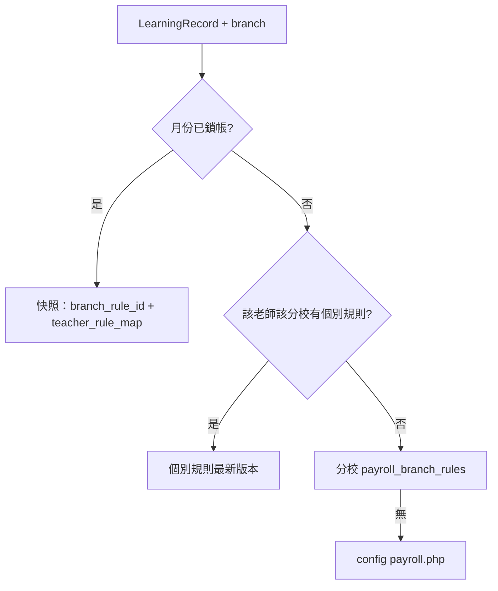

# PRD — 兼職老師「個別費率／計價規則」（Per-Teacher Payroll Overrides）

**版本**：1.0（草案）| **日期**：2026-04-15 | **狀態**：規格待核准  
**關聯文件**：[docs/PRD_PARTTIME_TEACHER_PAYROLL.md](docs/PRD_PARTTIME_TEACHER_PAYROLL.md)（現行 v1.0 假設「同一分校內所有兼職老師共用同一組時薪規則」）

---

## 1. 執行摘要（PM 觀察）

- **現況**：後端已實作分校規則表 [`payroll_branch_rules`](backend/app/Models/PayrollBranchRule.php)（`base_rates` + `headcount_bonus`），[`FinanceController::buildSessionRow`](backend/app/Http/Controllers/FinanceController.php) 對該次查詢僅注入**單一** `ruleCtx`，故同一 `branch_id`、同一月份內，所有兼職老師堂次使用**相同**費率結構。[`config/payroll.php`](backend/config/payroll.php) 僅作無 DB 規則時的 fallback。
- **缺口**：實務上常見「同一分校、不同兼職老師談不同時薪／不同人數加成」，現行模型無法表達。
- **介面原則（使用者要求）**：**不為此需求大改** [ParttimePayrollPage.vue](frontend/src/pages/ParttimePayrollPage.vue) 既有卡片／表格視覺；新能力以「老師維護流程加欄／modal」或「薪資頁次要入口（抽屜／子頁）」擴充，主列表與四張總覽卡維持不變。

---

## 2. 問題陳述

主任在 [兼職老師薪資頁](frontend/src/pages/ParttimePayrollPage.vue) 可查詢、匯出、鎖帳，但「薪資計算設定」目前語意為**整分校**規則。當兩位兼職老師合約不同時，只能二選一或改規則後影響全員，**無法稽核「誰在何時適用哪套費率」**，與人事實務不符。

---

## 3. 產品目標與非目標

### 3.1 目標

- 支援 **每位兼職老師**（建議範圍見 §5.1）擁有**可選**的個別計價規則；未設定者仍用分校預設（與現行行為一致）。
- 明細列仍顯示 `base_rate`、`headcount_bonus`（或合成 `effective_rate`），且能標示**規則來源**（分校預設 / 個別覆寫），以利對帳。
- 鎖帳月份可重現數字：個別規則變更須納入與現有 [`rule_version_id`](backend/database/migrations/2026_04_15_100000_create_payroll_branch_rules.php) 同等級的**版本／快照**思維（見 §5.5、§10）。

### 3.2 非目標（本期可明確排除）

- 不改變認列來源（仍為已核准 `LearningRecord` 等，見原 PRD §5）。
- 不引入任意公式引擎（DSL）；本期僅允許與現行相同的**結構化參數**（學段基礎價 + 人數加成），避免過度設計。
- 不處理獎懲、交通津貼、勞健保扣繳（延續原 PRD 非目標）。

---

## 4. 使用者與權限

| 角色 | 行為 |
|------|------|
| `director` / `admin` | 可查薪資；可編輯**所屬分校**兼職老師的個別費率（若產品決定僅 super_admin 可改費率，則此列改為唯讀）。 |
| `super_admin` | 同上，且可跨分校；可執行重開鎖帳（既有流程）。 |

**建議預設（可於核准時定案）**：個別費率屬敏感人事資料，**僅 `super_admin` 可寫入、主任唯讀計算結果**；若組織希望主任可調，則需補稽核與教育訓練條款。

---

## 5. 功能需求

### 5.1 規則範圍（關鍵產品決策）

- **建議採用**：`teacher_id`（`User.id`，與現有 `LearningRecord.TeacherID` 一致）+ **`branch_id`（分校）** 維度儲存覆寫。理由：同一老師可能在多分校授課，合約常按校區分開；堂次已透過學生 `CampusID` 與現有查詢隔離。
- **備選**：僅 `teacher_id` 全域一組費率（實作較簡，但跨校同價假設常不成立）。PRD 以「分校維度」為主方案，備選寫入「技術簡化選項」。

### 5.2 覆寫語意（與分校規則的關係）

- **方案 A（建議 MVP）**：個別規則為**完整取代**——若該 (`teacher_id`, `branch_id`) 存在「生效中」的個別規則，則該老師在該分校的堂次計價**完全不讀**分校 `base_rates`/`headcount_bonus`，改讀個別表同一 JSON 結構（與 [`PayrollBranchRule`](backend/app/Models/PayrollBranchRule.php) 欄位對齊，降低 [`buildSessionRow`](backend/app/Http/Controllers/FinanceController.php) 分支複雜度）。
- **方案 B（二期）**：**部分覆寫**（只改高中基礎價等）——需定義 merge 規則與 UI，複雜度高，不列入 MVP。

### 5.3 解析順序（單堂次、單分校查詢下）

**架構修正（相對初版流程圖）**：`locked → snap` 時，快照必須同時還原 **(1) 分校規則列 id** 與 **(2) 每位老師個別規則列 id（若當時有 override）**；不可僅依「當下 locked flag」卻仍用 DB latest 個別規則，否則違反 §6 AC3。

### 5.4 資料與 API（概念層，實作另開技術票）

- **新表（建議命名）**：`payroll_teacher_branch_rules`（或等價），欄位與分校規則對齊：`teacher_user_id`, `branch_id`, `base_rates` (json), `headcount_bonus`, `created_by`, `created_at`；**追加** `effective_from`（日期，可選）若產品需要「下月起調薪」。
- **版本化**：與 `payroll_branch_rules` 相同採 **append-only**（每次 `PUT` 插入新列、`id` 遞增）；鎖帳快照只保存 **列 id**，不複製 JSON 內容到多處（避免冗餘與不一致）。
- **FK／約束**：`teacher_user_id` 必須對應 `User.id`（已確認 [`LearningRecord`](backend/app/Models/LearningRecord.php) 為 `belongsTo(User::class, 'TeacherID', 'id')`）；寫入 API 應驗證該使用者為 `employment_type=part_time` 且具該分校授權（`UserCampus` 或既有老師跨校模型），避免誤綁或越權。
- **GET/PUT API**（範例路徑，避免與現有衝突）：
  - `GET /api/v1/finance/parttime-payroll/teacher-rules?branch_id=&teacher_id=`
  - `PUT /api/v1/finance/parttime-payroll/teacher-rules`（body 含 `branch_id`, `teacher_id`, `base_rates`, `headcount_bonus`）
- **既有查詢 API**：`GET parttime-payroll` 與 `.../sessions` 回應中，每筆明細（或老師列）增加 **`rule_source`: `branch_default` | `teacher_override`** 與可選 **`rule_version_id`**（利於支援）。

### 5.5 鎖帳與稽核（必寫清楚以免糾紛）

- **草稿月**：每次查詢用「當下最新」分校規則 + 個別規則（與現行草稿語意一致）。
- **已鎖帳月**：除現有 `payroll_month_status.rule_version_id`（分校規則快照）外，需能證明每位老師當月使用的個別規則版本。建議二擇一寫入規格：
  - **5.5a**：`payroll_month_status` 新增 JSON 欄 `teacher_rule_snapshots`：`{ "<teacherUserId>": <payroll_teacher_branch_rules.id>, ... }`（僅存鎖定當下仍活躍的 override；無 override 者可省略 key，表示當時用分校規則）。
  - **5.5b**：鎖帳時寫入不可變的 `payroll_lock_lines`（堂次級快照）——查詢簡單但儲存較大；列為備選。

`payroll_audit_log` 應新增 action（例如 `teacher_rule_update`）與 reason/metadata，與現有 `rule_update` 並列。

### 5.6 前端／資訊架構（遵守「不亂動漂亮介面」）

- **主薪資頁**：維持現有 filter、四卡 summary、表格、鎖帳列；**不重新排版**。
- **個別費率編輯**（擇一或並存，由核准時定案）：
  1. **首選**：在 [TeachersList.vue](frontend/src/pages/TeachersList.vue) 老師編輯表單中，當 `employment_type === 'part_time'` 時顯示「兼職薪資參數（本分校）」折疊區或按鈕開啟**小型 modal**（表單欄位複用現有薪資設定 modal 的輸入元件樣式，避免第三套 UI）。
  2. **次選**：薪資頁 header 既有「薪資計算設定」旁增加「個別老師費率」→ **導向子路由或全螢幕抽屜**（仍不改主表格 CSS）。
- **薪資列表**：可選在姓名旁加 **小標「自訂」**（僅文字／tag），不變更表格欄寬邏輯。

### 5.7 匯出 CSV

- 每堂次或每位老師區塊增加欄位：`rule_source`, `teacher_rule_version_id`（若有），與畫面口徑一致。

---

## 6. 驗收標準（Acceptance Criteria）

**產品／功能（與初版一致並補強）**

1. 分校預設規則為 A；老師甲設定個別規則 B 後，僅老師甲的應付薪資與明細 `base_rate`/`effective_rate` 反映 B，其餘兼職老師仍反映 A。
2. 老師甲未設個別規則時，行為與**目前上線邏輯完全一致**（回歸測試通過）。
3. 鎖帳後，即使事後修改個別或分校規則，該月已鎖資料與匯出檔與鎖帳當下一致（在採用 §5.5 快照方案前提下）。
4. 跨分校：老師在分校 1 與分校 2 可各有一套覆寫；查詢 `branch_id=1` 時不套用分校 2 的覆寫。
5. 已鎖帳月份：後續修改個別或分校規則列後，重查該月仍得到鎖帳當下金額（快照路徑）；且「取消個別費率」僅影響未鎖帳月份之草稿重算。

**API／資料（QA 必測）**

6. `GET/PUT .../teacher-rules`：`base_rates` 缺鍵、非數值、超出允許範圍、`headcount_bonus` 越界時回 **422** 且 DB 無髒寫；成功時回傳含新版本 id（或與 GET 一致之版本欄位）。
7. **越權與隔離**：非授權分校之 `branch_id`、他人校區老師之 `teacher_id` → **403**；匿名／無 token → **401**（與現行 API 一致）。
8. **非兼職／身分**：對 `employment_type != part_time` 之 `teacher_id` 寫入個別規則 → **422**（或產品允許之明確行為，須寫死於 spec 後測試）。
9. **明細欄位**：`GET .../sessions` 每筆含 `rule_source`；`teacher_override` 時可對應到可查之規則版本 id（或於 summary 提供對照表），便於對帳。
10. **匯出一致性**：同參數連續兩次 export，位元組級或至少**金額欄位**一致；與同次 `GET parttime-payroll` 老師列 `total_salary` 加總一致（§11 TC-CSV）。

**UI／可用性（手測為主）**

11. 兼職老師編輯入口：儲存個別費率後返回薪資頁，**無需硬重新整理**即可看到新金額（或明確提示「請重新載入」且一鍵生效）。
12. 主列表／四卡版面與現行 [ParttimePayrollPage.vue](frontend/src/pages/ParttimePayrollPage.vue) 相比無結構性跑版（僅允許小 tag、文案）。

---

## 7. 風險與依賴

- **效能**：`buildParttimePayrollData` 目前逐筆 `buildSessionRow`；若改為每老師查規則，應**批次預載** (`teacher_id` × `branch_id`) 規則 map，避免 N+1；建議索引 `(branch_id, teacher_user_id, id DESC)` 利於取「最新一筆」。
- **資料一致性**：`LearningRecord.TeacherID` 即 **`User.id`**（非 `Teacher` 表主鍵）；個別規則鍵應統一為 `User.id`，與現有薪資 API path `teacherId` 一致。
- **權限**：個別費率寫入須強制 `require_campus` + 角色檢查，防止跨校修改；`super_admin` 分支傳 `branch_id` 時仍須校驗目標分校存在。
- **API 契約混淆**：現有 summary 已暴露 `rule_version_id`（分校規則）。導入個別規則後，應明確命名如 `branch_rule_version_id` + `teacher_rule_snapshot`（或僅在鎖帳後回傳 snapshot 摘要），避免前端與匯出腳本誤解單一欄位。
- **營運／DB**：擴充 `payroll_audit_log.action` ENUM 須另一次 migration（與 [`2026_04_15_100000_create_payroll_branch_rules`](backend/database/migrations/2026_04_15_100000_create_payroll_branch_rules.php) 同類風險）；需有回滾與 prod 執行順序說明。

---

## 8. 交付物建議（文件落地）

- 將本 PRD 存成獨立檔案（建議）：`docs/PRD_PARTTIME_PAYROLL_PER_TEACHER_OVERRIDES.md`，並在 [docs/PRD_PARTTIME_TEACHER_PAYROLL.md](docs/PRD_PARTTIME_TEACHER_PAYROLL.md) 開頭增加「關聯：個別費率見 xxx」連結。
- 變更管制：若未來允許「不同計價公式」（非單純費率表），應另開 PRD 與版本號，避免本檔無限膨脹。

---

## 9. 開放決策（須產品／營運拍板 1–2 項）

1. **誰可編輯個別費率**：主任 vs 僅 super_admin（§4）。
2. **是否需要 `effective_from` 排程調薪**；若否，MVP 僅「立即生效 + 版本歷史」即可。

---

## 10. CTO／架構審查補充（問題清單與建議）

以下為閱覽初版計畫後的架構修正與待補規格，已反映於 §5.3–§7 與 to-dos。

| 項目 | 問題或缺口 | 建議 |
|------|------------|------|
| 鎖帳一致性 | 僅存分校 `rule_version_id` 不足以還原「誰用哪套個別費率」 | 採 §5.5a 時，`teacher_rule_snapshots` 與 `rule_version_id` 在 **同一 transaction** 與鎖帳狀態寫入；查詢鎖定月時 **禁止** fallback 到個別規則表的 latest |
| 恢復預設 | 初版未寫「取消個別費率」 | 明確 API：`DELETE` 或 `PUT` 帶 `use_branch_default: true` + 稽核列；計算邏輯視為「無 override」 |
| 併發 | 鎖帳與規則更新競態 | 鎖帳 row 使用樂觀鎖或 `SELECT ... FOR UPDATE`（依現有 Laravel 慣例擇一）；文件化 |
| employment 變更 | 月中 full_time ↔ part_time | 需產品決策：認列仍依 LR 建立時老師身分，或依查詢當下 `User.employment_type`（影響歷史重算） |
| effective_from | 若導入排程調薪 | 每筆 LR 用 `SessionDate` 選「當日生效」之規則列；鎖帳快照須能還原當時「每堂」或至少「每位老師」適用列（後者僅在規則未月中切換時正確） |
| 匯出與重現 | CSV 與畫面金額 | 鎖定月匯出應與 snapshot 計算路徑共用同一 resolver，避免 duplicate 邏輯 |

---

## 11. QA 驗收矩陣（測試設計）

### 11.1 測試層級

| 層級 | 範圍 | 建議工具 |
|------|------|----------|
| 自動化 | API 狀態碼、JSON 欄位、金額計算、鎖帳快照、越權 | Laravel Pest／Feature（延伸 [ParttimePayrollTest.php](backend/tests/Feature/ParttimePayrollTest.php)、[PayrollRulesTest.php](backend/tests/Feature/PayrollRulesTest.php)） |
| 手動 E2E | 分校切換、UI modal、CSV 開啟於 Excel、列印／中文欄位 | 測試環境 + checklist |

### 11.2 案例表（Given / When / Then）

| ID | 優先級 | Given | When | Then |
|----|--------|-------|------|------|
| TC-OVR-01 | P0 | 同分校兩位兼職、均有核准 LR | 僅老師 A 設個別規則（較高高中時薪） | A 的 `total_salary` 與 sessions 明細 `base_rate` 反映覆寫；B 與分校預設一致；`rule_source` 分別為 teacher_override / branch_default |
| TC-OVR-02 | P0 | 老師 A 跨分校 1、2 各一筆 LR | 僅在 branch_id=1 設覆寫 | branch_id=1 查詢用覆寫；branch_id=2 查詢用分校預設 |
| TC-OVR-03 | P0 | 草稿月、A 有覆寫 | 更新分校規則（不碰個別） | 僅無覆寫老師金額變動；A 仍用個別規則 |
| TC-LOCK-01 | P0 | 草稿月已算出新金額 | 執行 lock | `payroll_month_status` 含分校 rule id + `teacher_rule_snapshots`（若有）；之後改規則重查該月金額不變 |
| TC-LOCK-02 | P1 | 已 lock | super_admin reopen + reason | 狀態可回到可重算；稽核 log 有 reason（與現行行為一致處需回歸） |
| TC-REV-01 | P0 | A 有覆寫 | 執行「恢復分校預設」 | 後續 GET 草稿月 A 與其他人同規則；`payroll_audit_log` 有對應 action |
| TC-403-01 | P0 | 主任僅授權分校 1 | `PUT teacher-rules` 帶 branch_id=2 | 403 |
| TC-422-01 | P1 | 任意 | `base_rates.high` = 50 或缺 tutoring | 422 |
| TC-CSV-01 | P0 | 含覆寫與無覆寫老師 | 同月 export 與 GET list | 各老師 `total_salary` 加總與 CSV 一致；覆寫列含 `rule_source`／版本欄位（若 spec 有） |
| TC-PG-01 | P2 | sessions 多筆 | `per_page` 分頁 | 每頁 `session_salary` 加總等於該老師該月總額（與 list 一致） |
| TC-REG-01 | P0 | 無任何個別規則列 | 全 API 路徑 | 與實作前同一組断言通過（零行為變更） |

### 11.3 迴歸與資料邊界（勾選清單）

- [ ] `trial` 課程、未核准 LR、作廢 LR 不計薪（與原 PRD §5.2 一致）。
- [ ] 鎖帳後 `PUT` 分校規則、`PUT` 個別規則皆不改已鎖月之 list／export。
- [ ] `search`、`sort` 參數與個別規則並存時結果仍正確排序／篩選。
- [ ] 月份邊界：LR `SessionDate` 落於月初／月底仍歸入正確月。

### 11.4 Release gate（建議）

合併前：**TC-OVR-01～03、TC-LOCK-01、TC-REV-01、TC-403-01、TC-CSV-01、TC-REG-01** 自動化綠燈；若產品允許主任寫入費率，則補跑完整權限矩陣手測並存證（截圖或錄影可選）。
