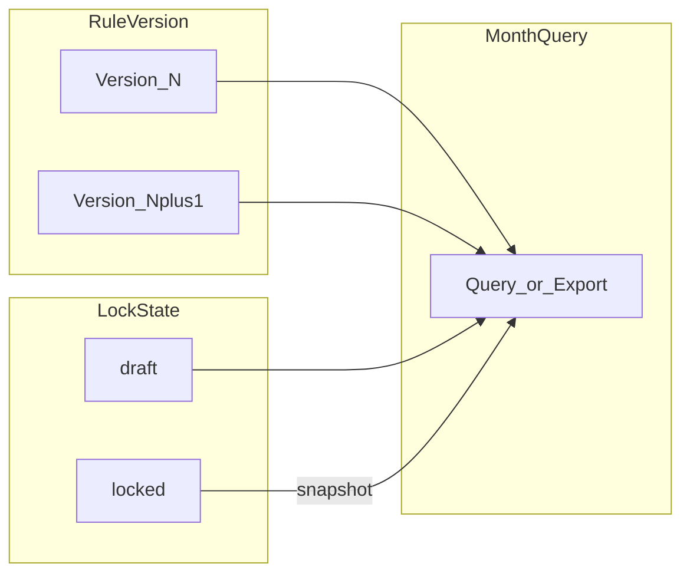

## 執行約束（Stakeholder 指示）

- **實作優先**：可直接修改 [`FinanceController`](backend/app/Http/Controllers/FinanceController.php)（兼職薪資、規則 GET/PUT、lock、export 等）與 [`api.php`](backend/routes/api.php) 路由；計價邏輯可留在 Controller 內或抽小 Service，以一次改好、可測為準。
- **不再另寫規格文件**：不強制新增／合併獨立 PRD markdown、不強制 ADR 檔；本 `.plan` 內 §1～§11 作為實作與 QA 對照即可。
- **版本紀錄必做**：於 [`docs/CHANGELOG.md`](docs/CHANGELOG.md) 新增一則條目（日期、行為摘要、API／migration／前端若有），供發版與稽核追蹤。

---

# PRD — 兼職薪資計算方式（主任可設定）

以下為計畫內參考規格（**不要求**再複製成其他 docs 檔案）。若未來要與 [`docs/PRD_PARTTIME_TEACHER_PAYROLL.md`](docs/PRD_PARTTIME_TEACHER_PAYROLL.md) 對齊，可另開任務。

---

## 1. 文件資訊

| 項目 | 內容 |
|------|------|
| 名稱 | 兼職薪資「計算方式」— 分校主任可設定 |
| 版本 | 1.0（本增補）／主 PRD 1.1 |
| 狀態 | 草案待審 |
| 關聯 | 主 PRD §4 薪資規則、§6 月結、§9 資料模型；實作 [`backend/config/payroll.php`](backend/config/payroll.php)、[`FinanceController`](backend/app/Http/Controllers/FinanceController.php) `buildSessionRow`；本計畫 §6.6 UI、§6.7 架構、§11 QA |

## 2. 背景與問題

- 現行兼職薪資費率寫在 **伺服器設定**（`base_rates`、`headcount_bonus`、`grade_level_map`），各校區若因合約、地區或年度調薪需調整數字，必須改設定檔或部署，**主任無法自助**。
- 與主 PRD「每筆堂次計價來源透明可查」一致的前提下，應讓 **有權限之主任** 在系統內維護「本校區適用之計算參數」，並保留 **誰在何時改了什麼** 的稽核軌跡。
- 需與既有 **月結鎖帳**（[`payroll_month_status`](backend/database/migrations/2026_04_14_400000_create_payroll_tables.php)、[`payroll_audit_log`](backend/database/migrations/2026_04_14_400000_create_payroll_tables.php)）相容，避免鎖帳後數字因事後改規則而漂移。

## 3. 名詞定義

| 名詞 | 定義 |
|------|------|
| 計算方式（本 PRD 範圍） | 在**既有公式不變**前提下（見主 PRD §4.3：`單堂薪資 = 實際時薪 × 時數`），可調整之 **參數**：各學段基礎時薪、每人頭加成金額、（可選）GradeID→學段對照表是否允許主任覆寫。 |
| 計算方式（明確排除） | 自訂任意公式、程式碼、或改用非 LearningRecord 之認列來源——**非本 PRD 範圍**（可列為後續 Phase 2）。 |

## 4. 產品目標與成功指標

**目標**

- 主任（`admin`/`director`，受 `require_campus` 限制）可於 **兼職薪資** 模組內，針對 **目前分校** 檢視與更新計算參數。
- 參數變更後，**未鎖帳月份**之重算使用新參數；**已鎖帳月份**之匯出與畫面數字與鎖定當下一致（見 §7）。
- 所有變更寫入稽核（可擴充現有 `payroll_audit_log` 或新增 `payroll_rule_audit`）。

**成功指標（範例）**

- 主任可在 3 分鐘內完成「檢視 → 修改 → 儲存 → 在同月 draft 狀態下看到重算結果」。
- 鎖帳月份在規則變更後，總薪資與明細與鎖定當下 diff 為 0。

## 5. 角色與權限

| 角色 | 計算參數 |
|------|----------|
| `super_admin` | 全部校區讀寫（與現有一致） |
| `admin` / `director` | **僅授權分校**讀寫 |
| `teacher` | 無 |

與主 PRD §3 對齊；**不**開放老師修改。

## 6. 功能需求

### 6.1 設定入口與 UI

- 位置：[`ParttimePayrollPage.vue`](frontend/src/pages/ParttimePayrollPage.vue)（或獨立子頁／抽屜）—「薪資計算設定」。
- 表單欄位（對齊現行 [`payroll.php`](backend/config/payroll.php) 語意）：
  - 高中／國中／國小／輔導 **基礎時薪**（TWD/h，整數或 0.5 步進—產品需二選一並寫入驗證規則）。
  - **每人頭加成**（TWD/h/每多一位學生；`tutoring` 仍為 0 加成—與主 PRD §4.2 一致）。
  - （可選 MVP+）**GradeID→學段** 是否僅顯示唯讀對照表，或允許主任調整「非標準年級」對應—若納入則需防呆與預設還原鈕。
- 顯示「目前生效版本」：`effective_from`（datetime）與「最後修改人／時間」摘要。
- **還原預設**：一鍵載入系統預設（等同目前 `config` 預設值），需二次確認。

### 6.2 生效範圍與與鎖帳關係（核心商業規則）

建議寫死於 PRD 以避免爭議：

1. **未鎖帳（`draft` / `reviewed`）**：查詢、明細、匯出一律使用 **「該堂次 SessionDate 當日 23:59 台北時間」當下有效的規則版本**（或簡化為「整月使用查詢月最後一次儲存之規則」—兩種擇一，**推薦**：*按堂次 SessionDate 落在的規則版本*，利於月中調薪）。
2. **已鎖帳（`locked`）**：該 `branch_id` + `month` 的總額與明細以 **鎖帳當下快照** 為準；事後修改全域規則 **不**改寫已鎖帳月報表（需持久化快照表或鎖定時複製規則版本 id 至 `payroll_month_status`）。
3. **`super_admin` reopen**：退回 `draft` 後，該月改回即時規則；若需「維持重開前數字」則需另議（建議非 MVP）。

### 6.3 API（草案，實作時對齊路由群組）

| 方法 | 路徑 | 說明 |
|------|------|------|
| GET | `/api/v1/finance/parttime-payroll/rules` | 讀取目前分校生效規則（含版本 metadata） |
| PUT | `/api/v1/finance/parttime-payroll/rules` | 更新規則（body 為參數 JSON）；回傳新版本 id |
| GET | `/api/v1/finance/parttime-payroll/rules/history` | 分頁歷史（可選 MVP+） |

權限：`role:director` + `require_campus`；`branch_id` 必填或從 token 預設單校。

### 6.4 資料模型（草案）

- **`payroll_branch_rule_version`**（或同等命名）：`id`, `branch_id`, `effective_from`, `base_rates_json`, `headcount_bonus`, `created_by`, `created_at`；可選 `superseded_at`。
- **`payroll_month_status`** 擴充：`rule_version_id` nullable — 鎖帳時寫入當前版本，供報表重播。
- **稽核**：`action` 擴充 `rule_update` 或在專用表記錄 diff（old/new JSON）。

### 6.5 驗證與錯誤處理

- 基礎時薪上下限（例：100–2000）、人頭加成 0–500。
- 儲存失敗：顯示原因；樂觀鎖可選（版本號避免覆寫）。

### 6.6 UI/UX 檢視（設計補強）

**資訊架構**

- **入口**：在兼職薪資主畫面（月份 + 分校已選前提下）提供次要按鈕「薪資計算設定」，避免與「鎖帳／匯出」同權重誤觸；設定以 **右側抽屜或全螢 modal** 為佳，保留列表上下文以便儲存後對照數字變化。
- **分校切換**：若 `localStorage` 分校與表單綁定，切換分校時若有未儲存變更，必須 **攔截並確認**（與既有 `App.vue` 分校切換行為對齊，避免靜默丟失）。

**狀態與鎖帳**

- **`locked`**：設定區 **唯讀** + 頂部 **資訊 banner**（非錯誤色）：說明「本月已鎖帳，數字依鎖定當下規則；若要改參數請 super_admin 重開」— 避免主任以為系統壞掉。
- **`reviewed` vs `draft`**：若產品允許在 `reviewed` 仍改規則，banner 需警告「將影響未鎖帳重算」；若需退回 `draft` 才能改，則設定鈕 disabled 並附 **單句操作指引**。
- **儲存成功**：toast 或內聯成功提示 + **可選「重新整理本月薪資」** 主按鈕，降低「我存了但數字沒變」的困惑。

**表單與可理解性**

- 四學段基礎時薪以 **同一視覺群組**（卡片或 fieldset）呈現，每欄附單位「元／小時」；人頭加成旁 **一行說明**：「一對二、一對三依人數累加；輔導課不加」— 對齊主 PRD §4.2。
- **還原預設**：destructive secondary + **二次確認**（標題明確「將覆寫本校區目前參數」）。
- **Grade 對照**：若 MVP 唯讀，以 **摺疊區塊** 或 `HelpGuide` 風格說明呈現，避免主表單過長。

**透明與稽核（使用者可見）**

- 設定面板頂部固定顯示：**規則版本號**、`effective_from`、**最後修改人／時間**（後端有則顯示）。
- 堂次明細（第三層）：若技術可行，顯示 **rule_version_id** 或「採用 vN」— 利於月中調薪（選項 B）時對帳。

**無障礙與裝置**

- 表單欄位需 **label 關聯**、錯誤訊息連到欄位 `aria-describedby`；主要動作鍵盤可操作順序：關閉 → 儲存 → 還原。
- **小螢幕**：modal 內表單需可捲動、底部固定「取消／儲存」避免按不到。

### 6.7 架構與工程約束（CTO）

**分層與單一真相**

- **禁止**在 `FinanceController` 內散落複製「基礎價 + 加成」公式；抽 **RuleResolver**（或 `ParttimePayrollRuleService`）統一輸入 `(branch_id, session_date | locked_month_ctx, learning_record…)` 輸出 `(base_rate, headcount_bonus, effective_rate, rule_version_id)`，供 `buildSessionRow`、匯出、（若未來）科目數對照共用介面邊界。
- 認列來源仍僅 **LearningRecord approved + active**，本功能不改查詢口徑。

**規則版本模型**

- 規則列 **append-only**：`PUT` 建立 **新版本**（新 `id`），不就地改舊列，便於稽核與「依 SessionDate 取當時版本」。
- `effective_from` 語意須與 `decide-scope` 選項一致（整月單版 vs 時點生效）；避免與 `Asia/Taipei` 邊界 off-by-one。

**鎖帳與快照**

- `locked` 月報表必須能 **重播**：至少於 `payroll_month_status` 記錄 **`rule_version_id`（鎖定當下）**；若產品要求「規則刪除後仍重播」，需另存 **物化快照**（JSON 或衍生表）— 於 `arch-design-adr` 二選一寫死。
- `POST …/lock` 與讀取規則應考慮 **短交易**：鎖定時寫入 `rule_version_id` + `status`，避免「已鎖但版本欄位為 null」的中間狀態暴露給 API。

**向後相容與部署**

- 遷移後若某 `branch_id` 尚無版本列：**明確策略**—（建議）部署 migration 附 **seed 全分校**；過渡期可 `fallback` 讀 `config('payroll')` 並 **log 一次** 或 metric，避免與 DB 結果長期不一致卻無人知。

**安全與多校**

- `branch_id` 必須經 **`getCampusIds` / require_campus** 交集驗證；`PUT` body 內若帶 `branch_id` 亦不得越權。
- `super_admin` 跨校寫入需審計欄位完整。

**併發與 API 契約**

- 兩位主任同時儲存：採 **樂觀鎖**（`If-Match: rule_version_id` 或 body `expected_latest_id`）或「永遠建立新版本、最後寫入者勝」— 須在 ADR 註明產品可接受行為。
- GET rules 回傳 **schema 版本**（如 `rules_schema: 1`）利於前端與未來擴欄。

**稽核與既有表**

- 擴充 `payroll_audit_log.action` 前評估 **MySQL enum 遷移成本**；若成本高則 **新表** `payroll_rule_audit` 專存 diff JSON。

**效能**

- 規則表索引：`(branch_id, effective_from)` 或 `(branch_id, id desc)` 限一筆「當前預設」查詢路徑；避免 N+1：批次算薪時 **預載該月涉及之 rule_version map**（尤其選項 B）。

## 7. 非目標（本期不做）

- 多套「互斥公式」切換（例如改認列來源）。
- 依老師個別議價覆寫（可列 Phase 2）。
- 跨分校複製規則（可列 Nice-to-have）。

## 8. 與現有實作之差異（給工程／QA）

- 今日 [`buildSessionRow`](backend/app/Http/Controllers/FinanceController.php) 僅讀 `config('payroll.*')`；上線後應改為 **依 branch + 日期（或鎖定版本）解析規則**。
- 環境變數可保留為 **全系統預設種子**，第一次啟用分校時 copy 至 DB。

## 9. 驗收標準（Acceptance Criteria）

1. Director A 僅能改分校 A 規則；改分校 B 回 403。
2. 修改基礎時薪後，同月 `draft` 下重新載入兼職薪資總覽，金額與明細之 `base_rate`/`effective_rate` 符合新參數。
3. 鎖帳後變更規則，該鎖帳月匯出與畫面金額不變。
4. 每次儲存皆留有稽核紀錄（操作者、時間、branch、diff 或完整 JSON）。
5. 與主 PRD 認列條件（LearningRecord approved 等）**不變**。
6. **UI**：`locked` 狀態下設定為唯讀且無法送出 PUT；未出現可編輯欄位誤導。
7. **UI**：分校切換時若有未儲存變更，必須出現確認對話框且預設為「留在本頁」。
8. **UI**：儲存成功後使用者能在 1 次點擊內重新載入本月薪資總覽（或自動 reload 並有完成提示）。
9. **架構**：已鎖帳月份之 GET summary／export／sessions 與鎖定時 `rule_version_id` 重播結果一致（含競態測試通過）。
10. **架構**：無越權 `PUT`（偽造 branch_id）；規則僅 append-only，更新後舊 `id` 列不可被覆寫。
11. **QA**：測試矩陣涵蓋 director／super_admin／teacher 對 rules 與 lock／export 之允許與拒絕清單全數通過。
12. **QA**：邊界案例（§11.2）每項有預期結果且自動或手動執行紀錄。
13. **QA／壓力**：在約定資料量（例如單月逼近 `PAYROLL_MAX_EXPORT_ROWS` 或專案自訂 N 筆 LR）下，`GET parttime-payroll` 與 `export` 於約定並發度內無 5xx、無 CSV 斷行／欄位錯位；延遲目標於 §11.5 填具體秒數閾值。
14. **QA**：`PAYROLL_FEATURE_ENABLED=false` 時相關端點一致回 503，前端不白屏。
15. **QA**：上線 smoke（§11.4）全綠。

## 10. 開放議題（產品需拍板後再開發）

| 議題 | 選項 |
|------|------|
| 月中調薪 | A) 整月套用「月末規則」 B) 依每堂 `SessionDate` 對應當時有效規則（較公平、實作較重） |
| Grade 對照 | 是否開放主任編輯或僅唯讀 |
| `reviewed` 與改規則 | `reviewed` 是否允許改規則並自動重算，或需先退回 `draft` |

## 11. QA 測試與壓力驗證（補充）

### 11.1 測試矩陣（角色 × 端點）

- **列**：`director`（單校）、`admin`（多校授權若適用）、`super_admin`、`teacher`、未登入。
- **欄**：`GET parttime-payroll`、`GET …/sessions`、`GET export`、`GET rules`、`PUT rules`、`POST lock`、`POST reopen`。
- **判準**：每格預期 HTTP 狀態與是否可見敏感欄位；teacher／未登入對 rules 與薪資端點應 **403 或 401**（與現有 API 一致）。

### 11.2 邊界與資料情境

- **零筆認列**：該月無 approved LR → 總額 0、老師列表空或全零；export 仍產合法檔頭。
- **課型**：`tutoring` 加成為 0；`trial` 不計薪（與主 PRD 一致）。
- **時數**：LR 無起迄時間 → fallback 與主 PRD §4.4 一致且與改規則後乘算仍正確。
- **規則時間軸**：若採 SessionDate 對應版本—同月內兩版規則，前半與後半堂次 `rule_version_id`／金額可預期；若採整月單版—全月同一版。
- **分頁**：`sessions` `last_page`>1 時總計與 summary 一致（既有行為需回歸）。

### 11.3 負向與錯誤處理

- **驗證**：基礎時薪低於下限、非數字、缺欄位 → **422** 與明確 `error` 訊息。
- **功能開關**：`payroll.enabled` false → **503** 全端點一致。
- **匯出上限**：堂次數 > `max_export_rows` → **422**（與現行 export 行為一致）。

### 11.4 上線與 smoke

- Migration／seed 後 **每分校** `GET rules` 有預設版本。
- 兼職薪資頁：選月、選校、開設定、關閉、export 一次，**瀏覽器 console 無 error**。
- CSV：UTF-8 BOM、中文欄位可於 Excel 正常開啟。

### 11.5 壓力／負載（非必須全自動，須有基準與紀錄）

- **目標**：訂出可重現的資料量（例如單月 3k～5k 筆 LR、K 位兼職老師）與 **P95 延遲上限**（例：`GET parttime-payroll` 在 X 秒內、`export` 在 Y 秒內；X、Y 由團隊依 RPi／正式機填）。
- **並發**：2～5 個並發 `export` 或「export + payroll GET」無混寫、無 500。
- **工具**：可選 **k6**／**Artillery** 腳本存於 `docs/` 或 `scripts/`，CI 可不跑、**release 前手動或 staging 跑一輪**並留存 log。

### 11.6 回歸範圍（明確不測壞）

- **高風險**：不改 [`LearningRecordController`](backend/app/Http/Controllers/LearningRecordController.php) 核准扣堂、`ApprovalSessionSyncService` 等；QA 在 release 清單勾 **核准一筆評量 → 兼職薪資是否仍只認 approved**。
- **舊報表**：`GET finance/teacher-payroll` 與科目數頁面 **手動 smoke** 一次。

---

**實作備註**：直接改 [`FinanceController`](backend/app/Http/Controllers/FinanceController.php) 等程式；**必寫** [`docs/CHANGELOG.md`](docs/CHANGELOG.md)。不必另建 PRD／ADR 檔。若動到 [`ParttimePayrollPage.vue`](frontend/src/pages/ParttimePayrollPage.vue) 等前端，依專案規則執行 `npm run deploy`。
