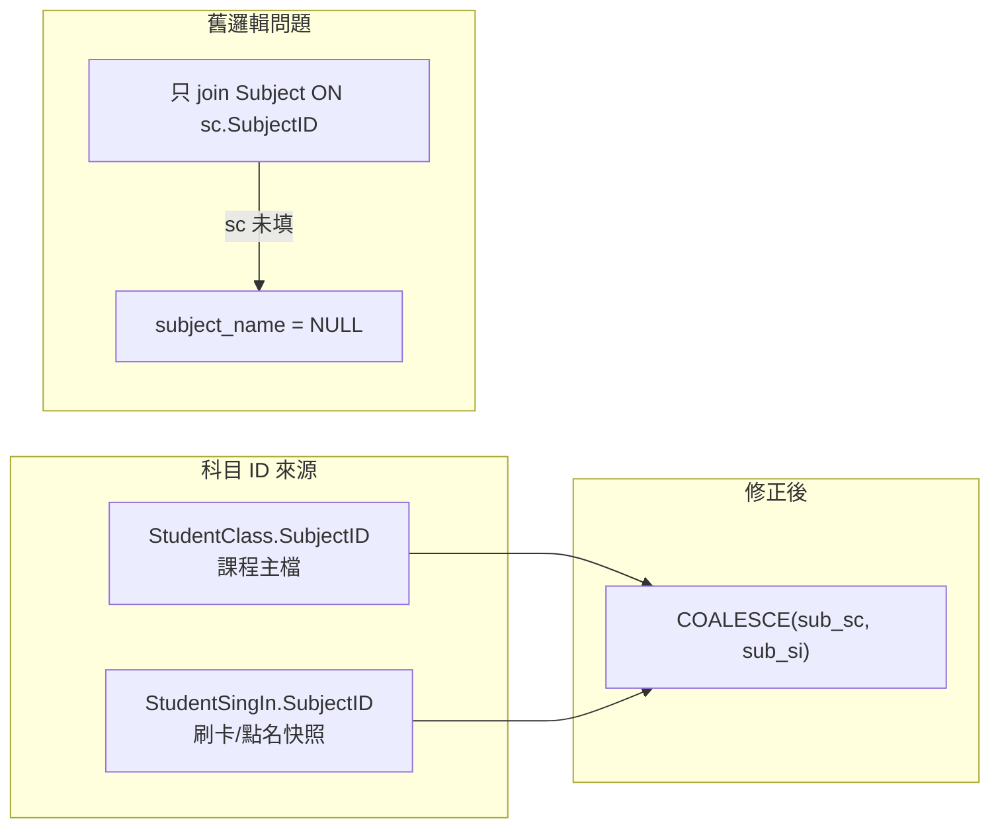

# 出缺勤紀錄「科目」欄位顯示異常 — 技術部門修復指南

## 1. 現象與影響範圍

| 項目 | 說明 |
|------|------|
| **使用者可見現象** | 出缺勤管理頁「今日出缺勤紀錄」表格中，「科目」欄僅少數列有科目名（如 English），其餘顯示「—」。 |
| **前端** | [frontend/src/pages/AttendancePage.vue](frontend/src/pages/AttendancePage.vue) 以 `record.subject_name` 顯示，空值時顯示 `—`（約第 172 行）。 |
| **API** | `GET /api/v1/attendance?date=YYYY-MM-DD&branch_id=…`（Laravel [AttendanceController::index](backend/app/Http/Controllers/AttendanceController.php)）。 |

無須改前端即可修復；問題在 API 如何組出 `subject_name`。

---

## 2. 根因分析（給 RD 對照）



- **歷史／資料面**：許多 `StudentClass` 列的 **`SubjectID` 為 NULL 或未對應 `Subject.id`**，但同一筆出缺勤 **`StudentSingIn.SubjectID` 在寫入時有值**（見 Model [StudentSignIn](backend/app/Models/StudentSignIn.php) 的 `SubjectID` fillable）。
- **程式面（已修正）**：`index` 主查詢原先只 `leftJoin Subject ON sub.id = sc.SubjectID`，**未使用 `si.SubjectID`**，導致主檔缺科目時 JOIN 失敗，回傳的 `subject_name` 為空。

**補充查詢（請假虛列）**：同檔案中「無 `StudentSingIn` 僅有 ClassSession 請假狀態」的 supplemental 查詢（約第 106–163 行）仍以 **`sc.SubjectID` → `sub.Subject_Name`** 為主；該路徑沒有 `si` 表可 fallback。若僅此類列缺科目，屬 **課程主檔未填科目**，需資料補強（見第 5 節）。

---

## 3. 建議程式修正（後端，已於工作區實作）

**檔案**：[backend/app/Http/Controllers/AttendanceController.php](backend/app/Http/Controllers/AttendanceController.php) — `index` 主查詢。

**作法**：

- 改為兩次 `leftJoin`：`Subject as sub_sc` on `sc.SubjectID`、`Subject as sub_si` on `si.SubjectID`。
- `select` 中科目名稱改為：`COALESCE(sub_sc.Subject_Name, sub_si.Subject_Name) as subject_name`。

**對照片段（約第 28–40 行）**：

```php
// Subject: prefer StudentClass (contract), fall back to snapshot on StudentSingIn
->leftJoin('Subject as sub_sc', 'sub_sc.id', '=', 'sc.SubjectID')
->leftJoin('Subject as sub_si', 'sub_si.id', '=', 'si.SubjectID')
// ...
DB::raw('COALESCE(sub_sc.Subject_Name, sub_si.Subject_Name) as subject_name'),
```

**技術部門動作**：確認此更已合併至部署分支（協作分支見 [AGENTS.md](AGENTS.md)）、部署後無 PHP/SQL 錯誤。若併同批次另有 **`frontend/src` 出缺勤頁／手機版面**調整，仍須依專案規則執行 `cd frontend && npm run deploy`；**僅後端 JOIN 修正**時不必為科目顯示單獨跑前端 deploy。

**資料庫**：若環境為自舊系統遷移、仍存在舊 `SubjectID`（1／14／15／21），請一併部署並執行 migration **`2026_04_12_200000_remap_orphaned_subject_ids`**（詳見 [`docs/CHANGELOG.md`](../../docs/CHANGELOG.md) 與 [`docs/AI_REGRESSION_LESSONS.md`](../../docs/AI_REGRESSION_LESSONS.md)）。

---

## 4. 驗證步驟（QA / 技術）

1. 以主任或老師登入，選有資料的**分校**與**當日日期**。
2. 開啟「出缺勤管理」，檢視「今日出缺勤紀錄」。
3. 對照 DB（或只打 API）：
   - `GET /api/v1/attendance?date=<今日>&branch_id=<分校ID>`  
   - 抽查：`StudentClass.SubjectID` 為空的列，若 `StudentSingIn.SubjectID` 有對應 `Subject.id`，JSON 中 **`subject_name` 應非空**。
4. 邊界：`super_admin` 與分校篩選、`teacher` 僅看自己學生之既有行為應不變（僅 JOIN 與 select 欄位調整）。

---

## 5. 資料主檔補強（選做，營運／DBA）

若修正後仍出現「—」：

- 表示 **`sc.SubjectID` 與 `si.SubjectID` 皆無法對應到 `Subject`**（皆空、0、或無效 id）。
- **建議**：在「學生課程」維護流程中補齊 `StudentClass.SubjectID`，以利報表、請假補列與其他僅讀主檔的功能一致。
- **可選 one-time SQL**（僅供技術評估後於維護窗執行；需依實際 schema 與備份政策調整）：

  - 思路：對 `StudentSingIn` 中 `SubjectID` 有效且 `StudentClass.SubjectID` 為空的列，將主檔 `SubjectID` 更新為與最近一筆簽到一致（或取眾數），**須先備份並在測試庫驗證**。

---

## 6. 可選後續（一致性，非本次必做）

| 區域 | 說明 |
|------|------|
| `endedSessions` / 待點名列表 | 同檔案內其他方法若僅用 `studentClass.SubjectID` 組 `subject_name`，長期可與 `index` 策略對齊，避免「待點名有科目、紀錄沒有」之類不一致（需個別檢視呼叫鏈）。 |
| Supplemental 請假列 | 無 `StudentSingIn` 時無法用 `si.SubjectID`；仍依賴 **`StudentClass.SubjectID`**。 |
| 測試 | 可新增 Feature test：`StudentClass.SubjectID` 為 NULL、`StudentSingIn.SubjectID` 有值時，`GET /api/v1/attendance` 回傳預期 `subject_name`（檔案可放 [backend/tests/Feature](backend/tests/Feature)）。 |

---

## 7. 風險與回歸注意

- **風險等級**：低（僅變更讀取路徑與 JOIN，不改寫入）。
- **注意**：若 `si.SubjectID` 與 `sc.SubjectID` 指向不同科目（極少見），畫面會顯示 **COALESCE 順序**：目前為 **主檔優先、簽到次之**；若業務要「一律以簽到為準」，需再調整 `COALESCE` 順序並與產品確認。

---

## 8. 交付檢查清單（技術部門勾選）

- [ ] 後端已部署含 `sub_sc` / `sub_si` 與 `COALESCE` 的 `AttendanceController::index`
- [ ] 手動或 API 驗證「主檔無科目、簽到有科目」列
- [ ] 仍為「—」的列已區分：雙邊皆無效 id → 排入資料補強
- [ ] （選）測試庫備份後執行主檔補齊腳本
